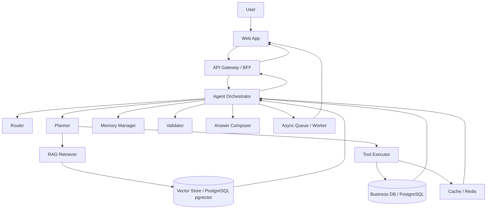
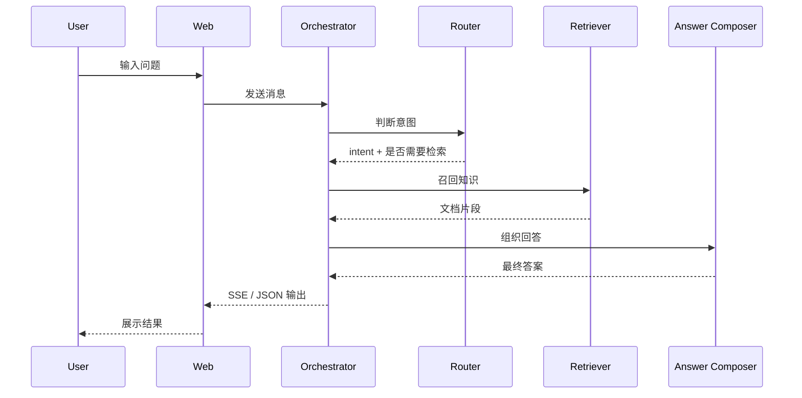
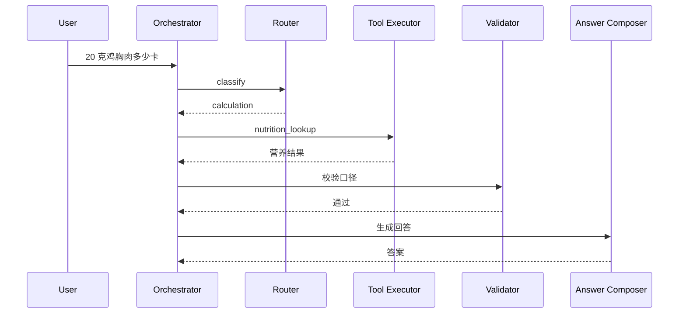
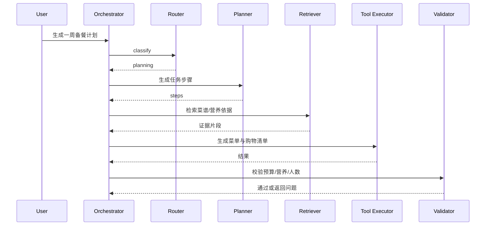
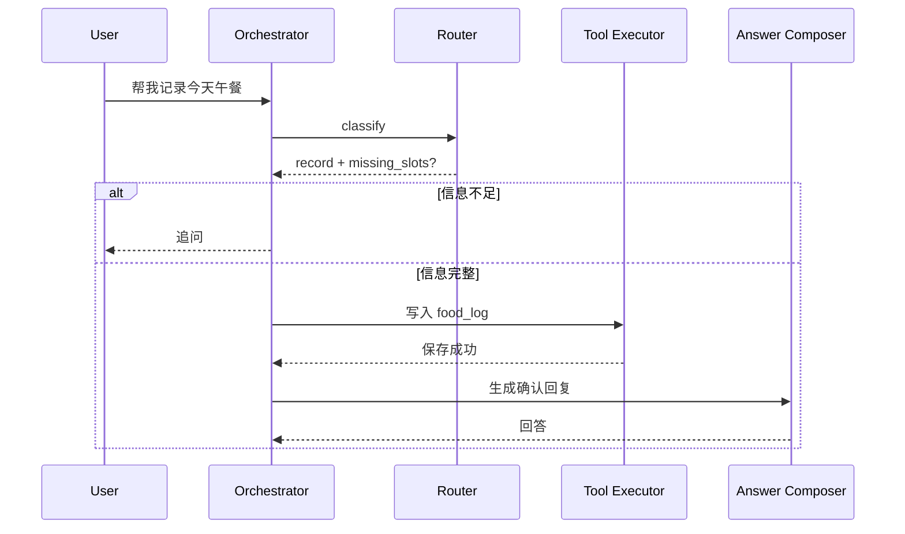
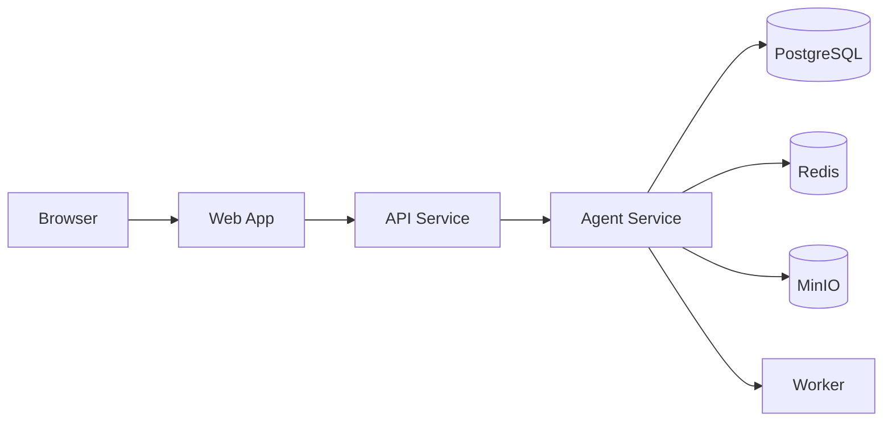
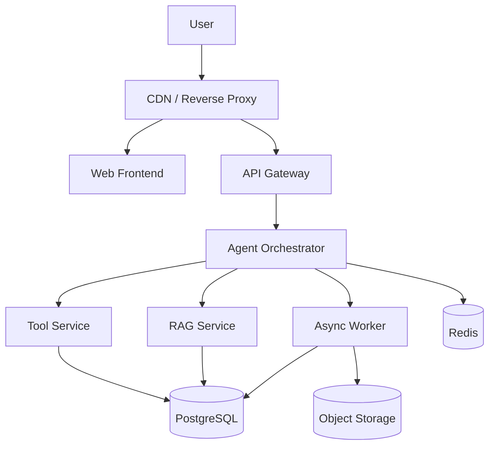

# CookHero Agent 架构设计

版本：v1.0  
对应总设计：[CookHero-Agent-Design-Spec.md](./CookHero-Agent-Design-Spec.md)  
对应产品文档：[PRD.md](./PRD.md)  
对应接口文档：[API-SPEC.md](./API-SPEC.md)  
对应技术选型：[TECH-STACK.md](./TECH-STACK.md)

---

## 1. 架构目标

本架构设计目标不是“把模块堆起来”，而是构建一个可持续演进的 Agent 业务系统，满足以下要求：

1. 支持多轮任务型交互
2. 支持 RAG 与工具调用协同
3. 支持复杂任务规划与执行
4. 支持异步任务和流式输出
5. 支持审计、追踪和回放
6. 支持后续扩展更多工具和 Agent

---

## 2. 架构设计原则

### 2.1 以 Agent 为总控

Agent 不直接替代所有服务，而是作为“任务编排中枢”，统一调度：

- 检索
- 工具
- 记忆
- 校验
- 汇总

### 2.2 以服务边界隔离复杂性

所有高复杂度能力都应该独立成模块，而不是塞进一个大函数里：

- Router 独立
- Planner 独立
- Retriever 独立
- Tool Executor 独立
- Memory Manager 独立
- Validator 独立

### 2.3 以可观测性为第一等公民

系统必须能解释：

- 为什么这样答
- 用了哪些知识
- 调了哪些工具
- 哪一步失败
- 任务是如何结束的

### 2.4 以工程可维护性优先

不追求最炫框架，而追求：

- 清晰接口
- 清晰状态
- 清晰责任边界
- 清晰版本演进

---

## 3. 总体架构

### 3.1 分层视图



### 3.2 逻辑职责

| 层级 | 职责 |
|---|---|
| Web App | 用户交互、流式显示、会话展示 |
| BFF / API Gateway | 鉴权、路由、限流、协议统一 |
| Agent Orchestrator | 意图识别、规划、执行、汇总 |
| RAG Retriever | 文档召回、重排、引用 |
| Tool Executor | 营养、日志、计划、统计工具 |
| Data Layer | 存储会话、消息、结果、日志 |
| Worker | 长任务、批处理、离线任务 |

---

## 4. 核心组件设计

### 4.1 Web App

#### 职责

- 会话列表
- 新建任务
- 输入消息
- 展示流式回答
- 展示工具轨迹
- 展示引用和结果卡片

#### 设计要求

- 支持响应式布局
- 支持右侧/底部工具面板
- 支持会话状态恢复
- 支持任务状态实时刷新

### 4.2 API Gateway / BFF

#### 职责

- 统一鉴权
- 请求校验
- 版本路由
- 聚合返回
- 流式协议转发

#### 为什么需要 BFF

Agent 系统前端展示内容多样，若前端直接打多个后端接口会变复杂。BFF 可以统一：

- 会话数据
- Agent 运行数据
- 工具状态
- 检索结果
- 用户画像

### 4.3 Agent Orchestrator

#### 职责

这是系统的总控层，负责：

- 接收用户输入
- 拉取上下文
- 调用 Router
- 生成执行计划
- 调用 Retriever
- 调用 Tool Executor
- 组织多轮执行
- 调用 Validator
- 生成最终回答

#### 关键要求

- 必须状态化
- 必须支持中断和恢复
- 必须记录每一步
- 必须支持失败回退

### 4.4 Router

#### 职责

- 判断任务意图
- 判断是否缺参
- 判断是否要追问
- 判断是否混合任务

#### 输出

- intent
- confidence
- need_rag
- need_tools
- need_clarification
- missing_slots

### 4.5 Planner

#### 职责

- 把复杂任务拆成步骤
- 确定执行顺序
- 标记每步依赖
- 标记每步产物

#### 工作方式

Planner 不是无限展开，而是“有限步规划”：

- 每次最多生成可执行的几步
- 每步必须可落地
- 每步要能验证

### 4.6 Retriever

#### 职责

- 从知识库召回相关内容
- 做向量检索与关键词检索
- 重排候选内容
- 输出引用证据

#### 检索输入来源

- 用户当前问题
- 上下文摘要
- 任务步骤目标
- 结构化过滤条件

### 4.7 Tool Executor

#### 职责

- 执行计算
- 执行查询
- 写入日志
- 生成计划
- 生成清单

#### 设计要求

- 工具必须 schema 化
- 输入必须可校验
- 输出必须可审计
- 支持超时和重试

### 4.8 Memory Manager

#### 职责

- 管理短期上下文
- 管理长期偏好
- 管理任务级记忆
- 管理会话摘要

#### 记忆分层

1. 当前轮消息
2. 当前任务执行状态
3. 当前会话摘要
4. 用户长期偏好

### 4.9 Validator

#### 职责

- 校验工具结果
- 校验计划是否满足约束
- 校验数值是否合理
- 校验回答是否符合 schema

#### 为什么必要

Agent 的输出经常需要在“生成”后再“验证”，否则容易出现：

- 数值错
- 约束漏
- 计划不合理
- 回答和工具结果不一致

### 4.10 Answer Composer

#### 职责

- 汇总结果
- 组织语言
- 输出结构化响应
- 生成可读解释

---

## 5. 数据流设计

### 5.1 标准问答流



### 5.2 计算类任务流



### 5.3 规划类任务流



### 5.4 记录类任务流



---

## 6. 服务边界

### 6.1 服务拆分建议

#### 6.1.1 Web Service

只负责：

- 页面渲染
- 流式展示
- 本地 UI 状态

#### 6.1.2 API Service

只负责：

- 会话接口
- 消息接口
- 用户接口
- 认证接口

#### 6.1.3 Agent Service

只负责：

- 路由
- 规划
- 调用工具
- 整合结果

#### 6.1.4 RAG Service

只负责：

- 文档索引
- 检索
- 重排
- 引用

#### 6.1.5 Tool Service

只负责：

- 营养查询
- 计算
- 数据统计
- 写入
- 生成计划

#### 6.1.6 Worker Service

只负责：

- 文档切分
- 索引构建
- 长任务执行
- 报告生成

### 6.2 不建议的边界设计

不建议把所有逻辑都塞进 API Service，因为会导致：

- 耦合严重
- 调试困难
- 扩展困难

---

## 7. 状态设计

### 7.1 Session 状态

- `active`
- `archived`
- `deleted`

### 7.2 AgentRun 状态

- `queued`
- `routed`
- `waiting_user`
- `planning`
- `retrieving`
- `executing`
- `validating`
- `completed`
- `failed`
- `canceled`

### 7.3 ToolCall 状态

- `pending`
- `running`
- `success`
- `failed`
- `timeout`

### 7.4 设计原则

- 所有状态变化都要落库
- 状态变化都要有时间戳
- 状态变化都要可回放

---

## 8. 可靠性设计

### 8.1 超时与重试

#### 原则

- 工具必须设置超时
- 网络错误可重试
- 参数错误不可重试
- 每个步骤有最大重试次数

### 8.2 降级策略

当某一步失败时：

1. 先尝试重试
2. 再尝试降级
3. 再尝试部分结果输出
4. 最后透明失败

### 8.3 回退策略

例如：

- 检索失败 -> 返回无引用回答或追问
- 工具失败 -> 返回失败原因，不伪造结果
- 计划失败 -> 先输出已确认约束和建议

---

## 9. 扩展性设计

### 9.1 新工具接入

新增工具只需要：

- 定义 schema
- 注册到 Tool Registry
- 增加权限
- 增加测试集

### 9.2 新 Agent 接入

可扩展到：

- 规划 Agent
- 分析 Agent
- 运营 Agent
- 知识问答 Agent

### 9.3 新知识库接入

新增知识库只需要：

- 定义数据源
- 切分策略
- embedding 策略
- 索引策略

---

## 10. 数据架构

### 10.1 事务数据

存放：

- 用户
- 会话
- 消息
- AgentRun
- ToolCall
- 食物日志
- 报告
- 计划

### 10.2 检索数据

存放：

- 文档
- chunk
- embedding
- 检索索引

### 10.3 缓存数据

存放：

- 热会话
- 热检索结果
- 短期上下文
- 幂等键

---

## 11. 部署架构

### 11.1 本地开发架构



### 11.2 生产部署架构



### 11.3 推荐部署原则

- 前端静态资源和 API 分离
- 异步任务和在线请求分离
- 数据库和缓存独立
- 对象存储独立

---

## 12. 安全架构

### 12.1 认证

- JWT Access Token
- Refresh Token
- 登录态续期

### 12.2 授权

- 用户级别隔离
- 管理员权限分层
- 工具权限控制

### 12.3 审计

每次关键动作必须审计：

- 写日志
- 删除数据
- 生成并保存计划
- 文档上传
- 管理员操作

---

## 13. 观测架构

### 13.1 日志

记录：

- request_id
- session_id
- run_id
- tool_name
- latency
- status

### 13.2 指标

核心指标：

- 请求成功率
- Agent 完成率
- 平均响应时延
- 工具成功率
- 检索命中率
- 追问率

### 13.3 Trace

每个 AgentRun 建议生成完整 trace：

- router
- planner
- retriever
- tool calls
- validator
- answer composer

---

## 14. 目录与代码组织建议

### 14.1 推荐项目结构

```text
/
  apps/
    web/
    api/
    worker/
  packages/
    shared/
    schemas/
    ui/
  docs/
    PRD.md
    API-SPEC.md
    PROMPT-AND-TOOLS.md
    TECH-STACK.md
    ARCHITECTURE.md
    CookHero-Agent-Design-Spec.md
  infra/
  scripts/
```

### 14.2 分层原则

- `apps` 放应用入口
- `packages` 放可复用模块
- `docs` 放设计文档
- `infra` 放部署配置
- `scripts` 放构建和维护脚本

---

## 15. 开发路线建议

### 15.1 第一阶段

- Web 页面
- 会话接口
- Agent 路由
- 基础工具
- 基础检索

### 15.2 第二阶段

- 计划生成
- 购物清单
- 饮食日志
- 数据分析
- 引用展示

### 15.3 第三阶段

- 偏好记忆
- 多步规划
- 任务回放
- 评测平台

---

## 16. 架构取舍结论

### 16.1 核心结论

这个系统最重要的不是“用什么模型”，而是：

- 是否有清晰的任务编排层
- 是否有稳定的工具层
- 是否有可信的检索层
- 是否有可回放的状态层

### 16.2 推荐落地方式

最实用的工程实现方式是：

- 前端 React + Vite
- 后端 FastAPI
- Agent 自研状态机
- 检索基于 PostgreSQL + pgvector
- 异步任务基于 Redis + Celery

这会让 CookHero 从第一天开始就具备工程可持续性。

