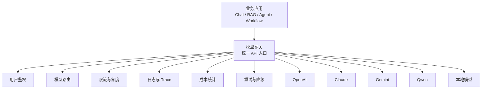

# CookHero 实现附录

版本：v2.0  
文档定位：这是 CookHero 项目的详细总规格，作为 PRD、架构、API、Prompt、技术选型等文档的“落地级补充”。如果你要开始拆研发任务、前后端接口、Agent 行为、测试用例和验收标准，优先读这份。

对应文档：

- [CookHero-系统设计与技术方案.md](./CookHero-系统设计与技术方案.md)
- [CookHero-产品需求文档.md](./CookHero-产品需求文档.md)
- [CookHero-接口与数据规范.md](./CookHero-接口与数据规范.md)
- [CookHero-智能体行为与工具协议.md](./CookHero-智能体行为与工具协议.md)

---

## 0. 文档使用方式

### 0.1 为什么需要这份文档

前面的文档已经说明了：

- 这是 Agent 还是 Agentic RAG
- 核心模块有哪些
- 应该用什么技术栈
- API 大概怎么设计

但这些还不够“工程落地”，因为真正开始开发时还会遇到：

- 首页每个区域具体是什么状态
- 用户输入后系统到底分几步
- 缺字段时追问什么
- 工具失败后如何降级
- 计划生成的结果长什么样
- 数据库字段怎么定义
- 每个接口返回什么错误码
- 如何评估这个 Agent 好不好

这份文档就是为这些问题准备的。

### 0.2 使用原则

1. 这份文档是“详细实现规格”，不是营销文案。
2. 每个功能都尽量给出输入、处理、输出、异常和验收。
3. 如果某个点在这里已经定义，就优先按这里执行。
4. 如果后续实现过程中发现不合理，可以反向修订这里，而不是临时改代码逻辑。

---

## 1. 产品边界与目标

### 1.1 产品一句话定义

CookHero 是一个面向餐饮与饮食管理场景的任务型 Agent 系统，支持自然语言交互、知识检索、工具调用、饮食记录、数据分析和多步规划。

### 1.2 核心目标

系统要完成的是“任务”，不是“聊天”。

具体目标：

- 用户说一句话，系统知道他想做什么
- 系统知道是直接回答、检索、计算、写入还是规划
- 系统在缺信息时会追问
- 系统能把复杂任务拆成步骤执行
- 系统能输出可执行结果、引用依据和下一步建议

### 1.3 不做什么

明确不做或不优先做：

- 泛搜索引擎
- 任意开放域闲聊
- 无约束的自动写入
- 完全黑盒式“自动帮你决定一切”
- 复杂多人协同编辑平台

### 1.4 成功标准

如果系统做到以下几点，就算第一阶段成功：

- 80% 以上常见任务能正确分类
- 记录类任务能安全写入
- 计算类任务能稳定给出正确结果
- 规划类任务能产出结构化方案
- 每个结果都能追踪来源或依据

---

## 2. 用户角色与权限

### 2.1 用户角色

| 角色 | 描述 | 权限 |
|---|---|---|
| 普通用户 | 使用 Agent 完成日常任务 | 创建会话、发消息、查看历史、写入自己的日志 |
| 进阶用户 | 需要分析和规划能力 | 使用分析、规划、导出等高级能力 |
| 管理员 | 管理知识库、工具和系统配置 | 上传文档、管理工具、查看系统日志 |

### 2.2 权限分层

#### 普通用户可做

- 新建会话
- 查看自己的历史会话
- 发起计算、问答、记录、分析、规划任务
- 查看自己的饮食记录和分析结果

#### 管理员可做

- 上传/删除知识文档
- 配置工具
- 查看运行日志
- 调整模型参数
- 配置 prompt 版本

### 2.3 权限原则

- 用户只能访问自己的数据
- 写入类操作必须受控
- 管理操作必须审计
- 系统操作与业务操作分离

---

## 3. 场景总表

### 3.1 场景分类

| 场景 | 输入示例 | 输出形式 | 需要能力 |
|---|---|---|---|
| 快速计算 | 20 克鸡胸肉多少卡 | 数值结果 | 工具 + 规则 |
| 食材问答 | 西兰花焯水多久 | 文本回答 | RAG |
| 饮食记录 | 帮我记录今天午餐 | 写入确认 | 写库工具 |
| 摄入分析 | 最近一周蛋白质摄入怎么样 | 图表+摘要 | 查询 + 统计 |
| 备餐规划 | 给 2 个人做一周菜单 | 分步计划+清单 | Planner + 工具 + RAG |
| 目标建议 | 我想减脂，怎么安排饮食 | 建议+约束 | 画像 + 规则 + RAG |

### 3.2 混合场景

混合场景指一个输入同时包含多个目标，例如：

- “先帮我分析这周摄入，再给我做下周备餐计划”
- “根据我昨天的午餐记录，顺便算一下总热量”

这种任务的处理规则：

1. 先拆成子任务
2. 决定是否共享上下文
3. 按依赖顺序执行
4. 最后合并输出

---

## 4. 页面级设计

### 4.1 首页

首页的目的不是“展示全部信息”，而是让用户快速发起任务。

#### 首页区域

1. 左侧栏
   - 历史会话列表
   - 新建会话
   - 最近会话加载

2. 顶部栏
   - 业务模块入口
   - 账户入口
   - 数据分析入口

3. 主视觉区
   - 产品 Logo
   - 当前模式说明
   - 快捷能力卡片

4. 输入区
   - 文本输入
   - 附件入口
   - 工具/Agent 状态

#### 首页状态

| 状态 | 描述 |
|---|---|
| 空态 | 没有会话时显示欢迎区和示例任务 |
| 已有会话 | 显示最近会话和继续入口 |
| 加载中 | 显示 skeleton 或 loading |
| 错误态 | 显示重试与错误说明 |

### 4.2 会话页

会话页是任务执行主界面。

#### 组成区域

- 消息流
- Agent 执行状态
- 工具调用轨迹
- 结果摘要卡
- 引用来源面板

#### 关键交互

- 用户可继续追问
- 用户可停止当前任务
- 用户可查看上一步工具调用结果
- 用户可展开查看引用

### 4.3 分析页

分析页用于展示结构化结果。

#### 展示内容

- 总摄入
- 分项摄入
- 趋势图
- 目标对比
- 异常点

### 4.4 规划页

规划页用于展示多天方案。

#### 展示内容

- 每日菜单
- 每餐结构
- 食材复用情况
- 购物清单
- 预算估算

---

## 5. 详细交互流程

### 5.1 标准任务执行流程

一个标准任务应按如下顺序执行：

1. 用户输入自然语言
2. 系统保存用户消息
3. Router 识别意图
4. 判断是否缺少参数
5. 如果缺参则追问
6. 如果不缺参则生成任务计划
7. 判断是否需要检索
8. 判断是否需要调用工具
9. 执行工具或检索
10. 校验结果
11. 生成最终输出
12. 保存 AgentRun 轨迹

### 5.2 追问流程

当任务缺少关键参数时，系统必须追问。

#### 追问规则

- 一次最多问 3 个关键问题
- 优先问“决定性参数”
- 不问可有可无的问题
- 追问必须能直接回答

#### 示例

用户输入：

> 给我做一周备餐计划

系统应该追问：

- 预算大概多少？
- 有忌口吗？
- 想偏减脂、增肌还是均衡饮食？

### 5.3 失败流程

如果任务执行失败：

1. 先判断是否是工具错误
2. 再判断是否是检索为空
3. 再判断是否是参数错误
4. 再判断是否需要降级
5. 最后透明告知用户原因

#### 不允许的行为

- 编造结果
- 编造引用
- 假装已执行成功

---

## 6. 任务类型详细规格

### 6.1 计算类任务

#### 定义

涉及明确数值计算、单位换算、比例换算、热量估算。

#### 输入特征

- 数字
- 单位
- 食材/对象
- 目标结果

#### 处理方式

1. 标准化单位
2. 查询营养信息或计算公式
3. 执行确定性计算
4. 返回结果和口径

#### 输出要求

- 结果数值
- 单位
- 计算依据
- 是否为估算

### 6.2 记录类任务

#### 定义

将用户饮食内容写入日志。

#### 必须信息

- 时间
- 食物名称
- 份量
- 单位

#### 规则

- 缺少关键字段必须追问
- 写入前必须确认
- 支持追加到已有记录

#### 输出要求

- 记录成功与否
- 记录 ID
- 摘要内容

### 6.3 分析类任务

#### 定义

对用户历史饮食数据做统计和趋势分析。

#### 处理流程

1. 查询指定时间范围
2. 聚合热量、蛋白质、脂肪、碳水
3. 与目标值比较
4. 识别趋势和异常
5. 输出结论和建议

#### 输出要求

- 总览
- 分项统计
- 趋势变化
- 建议
- 数据范围

### 6.4 规划类任务

#### 定义

生成多天或多餐的可执行方案。

#### 约束字段

- 人数
- 天数
- 预算
- 忌口
- 目标
- 厨具条件
- 烹饪时间

#### 处理方式

1. 收集约束
2. 检索菜谱和营养知识
3. 生成菜单草案
4. 校验成本和营养
5. 输出计划和清单

#### 输出要求

- 分日计划
- 每餐内容
- 食材清单
- 预算估算
- 执行建议

### 6.5 知识问答类任务

#### 定义

依赖知识库、标准流程或外部资料的问答。

#### 处理方式

1. 检索相关内容
2. 过滤低相关结果
3. 提取关键结论
4. 输出带引用回答

#### 输出要求

- 直接结论
- 来源依据
- 注意事项

---

## 7. 页面组件细化

### 7.1 左侧会话栏

#### 显示字段

- 会话标题
- 最近更新时间
- 会话类型
- 是否置顶
- 状态

#### 交互

- 点击切换会话
- 支持展开更多
- 支持加载历史
- 支持搜索会话

### 7.2 输入框区域

#### 组成

- 文本输入框
- 附件按钮
- 发送按钮
- 取消按钮
- 当前模式标签

#### 状态

- 可输入
- 正在发送
- 正在执行
- 等待追问
- 已取消

### 7.3 结果展示区

#### 结果块类型

- 结论块
- 过程块
- 引用块
- 表格块
- 图表块
- 提示块

---

## 8. 核心数据模型

### 8.1 Session

```json
{
  "id": "ses_001",
  "user_id": "usr_001",
  "title": "一周备餐计划",
  "type": "planning",
  "status": "active",
  "pinned": false,
  "created_at": "2026-06-01T00:00:00Z",
  "updated_at": "2026-06-01T00:10:00Z"
}
```

### 8.2 Message

```json
{
  "id": "msg_001",
  "session_id": "ses_001",
  "role": "user",
  "content": "给 2 个人制定一周备餐计划",
  "attachments": [],
  "created_at": "2026-06-01T00:00:00Z"
}
```

### 8.3 AgentRun

```json
{
  "id": "run_001",
  "session_id": "ses_001",
  "intent": "planning",
  "confidence": 0.95,
  "status": "executing",
  "plan_json": {},
  "result_json": {},
  "error_code": null,
  "created_at": "2026-06-01T00:00:00Z"
}
```

### 8.4 ToolCall

```json
{
  "id": "tool_001",
  "agent_run_id": "run_001",
  "tool_name": "nutrition_lookup",
  "input_json": {},
  "output_json": {},
  "status": "success",
  "latency_ms": 290,
  "retry_count": 0
}
```

### 8.5 UserProfile

```json
{
  "id": "usr_001",
  "name": "wyh",
  "diet_preferences": {
    "avoid": ["pork"],
    "goal": "fat_loss"
  },
  "timezone": "Asia/Shanghai",
  "language": "zh-CN"
}
```

### 8.6 FoodLog

```json
{
  "id": "log_001",
  "user_id": "usr_001",
  "meal_time": "2026-06-01T12:00:00+08:00",
  "items": [
    {
      "name": "鸡胸肉",
      "amount": 200,
      "unit": "g"
    }
  ],
  "nutrition_summary": {
    "calories": 220,
    "protein": 46
  }
}
```

### 8.7 MealPlan

```json
{
  "id": "plan_001",
  "people": 2,
  "days": 7,
  "goal": "balanced",
  "budget": 500,
  "days_plan": []
}
```

---

## 9. 状态机设计

### 9.1 Session 状态

| 状态 | 描述 | 进入条件 | 退出条件 |
|---|---|---|---|
| active | 正常使用中 | 新建会话 | 归档/删除 |
| archived | 已归档 | 用户归档 | 恢复 |
| deleted | 已删除 | 用户删除 | 不可逆 |

### 9.2 AgentRun 状态

| 状态 | 描述 |
|---|---|
| queued | 已排队 |
| routing | 路由中 |
| waiting_user | 等待追问 |
| planning | 计划生成中 |
| retrieving | 检索中 |
| executing | 工具执行中 |
| validating | 校验中 |
| composing | 输出组装中 |
| completed | 完成 |
| failed | 失败 |
| canceled | 已取消 |

### 9.3 ToolCall 状态

| 状态 | 描述 |
|---|---|
| pending | 待执行 |
| running | 执行中 |
| success | 成功 |
| failed | 失败 |
| timeout | 超时 |

### 9.4 设计约束

- 状态变化必须记录时间戳
- 状态变化必须能回放
- 状态变化必须可从日志追踪

---

## 10. Agent 决策树

### 10.1 一级决策

先判断：

- 是直接回答
- 是检索问答
- 是计算
- 是记录
- 是分析
- 是规划
- 是混合任务

### 10.2 二级决策

再判断：

- 是否缺参
- 是否要追问
- 是否要先检索
- 是否要调用工具
- 是否需要多步执行

### 10.3 三级决策

最后判断：

- 是否需要重试
- 是否需要降级
- 是否可以局部输出
- 是否必须中止

### 10.4 决策示例

用户输入：

> 分析我最近 7 天蛋白质摄入，并帮我做下周早餐计划

执行链路：

1. Router -> mixed
2. Planner -> 拆成分析与规划
3. Query -> 拉饮食日志
4. Analysis -> 汇总蛋白质
5. RAG -> 查早餐搭配知识
6. Tool -> 生成早餐方案
7. Validator -> 检查是否满足目标
8. Composer -> 合并输出

---

## 11. RAG 详细设计

### 11.1 知识源分类

| 知识源 | 示例 | 作用 |
|---|---|---|
| 菜谱文档 | 菜谱、烹饪指南 | 生成菜单、烹饪建议 |
| 营养文档 | 食材营养表 | 热量/蛋白查询 |
| 业务规则 | 饮食规则、产品规则 | 约束判断 |
| SOP 文档 | 操作步骤 | 功能问答 |

### 11.2 Chunk 切分建议

#### 菜谱

- 按“菜名 + 食材 + 步骤 + 营养”切分

#### 规则文档

- 按条款切分
- 每条款保留标题、编号、适用条件

#### FAQ

- 一问一答一块

### 11.3 检索策略

推荐采用三路能力组合：

1. 关键词召回：`Milvus + BM25`
2. 向量召回：`Milvus dense vector`
3. 结构化过滤：PostgreSQL 元数据过滤

再做重排。

#### 为什么选择 Milvus

- Milvus 官方支持 BM25 稀疏检索
- Milvus 官方支持 dense + sparse 的 hybrid search
- Java 生态已有官方 SDK，工程接入路径清晰
- 便于把语义检索和关键词召回收敛到同一底座

#### 推荐检索流程

1. query 标准化
2. query rewrite
3. Milvus BM25 关键词召回
4. Milvus dense 语义召回
5. 候选合并
5. rerank 重排
6. 引用组装
7. 返回 Agent

### 11.4 问题改写层

RAG 不建议直接拿原始问题去召回，建议先做问题改写。

#### 改写输入

- 用户原始问题
- 当前会话摘要
- 当前已确认约束
- 最近若干轮对话

#### 改写输出

- `original_query`
- `resolved_query`
- `keyword_query`
- `semantic_query`
- `filters`
- `confidence`

#### 改写实现建议

1. 先做上下文消歧
2. 提取核心实体和动作
3. 识别代词和省略项
4. 补全关键对象
5. 去掉口语噪声
6. 分别生成关键词和语义查询

#### 改写示例

用户输入：

> 这个要多久

改写为：

```json
{
  "original_query": "这个要多久",
  "resolved_query": "西兰花焯水多久合适",
  "keyword_query": "西兰花 焯水 时间",
  "semantic_query": "西兰花焯水多久合适",
  "filters": {
    "doc_type": "cooking_guide"
  },
  "confidence": 0.91
}
```

#### 改写规则

- 能继承上下文就不要重新猜
- 无法确定时优先追问
- 不要人为增加用户没说过的约束
- 改写结果要可审计

### 11.5 查询理解层增强

CookHero 建议把“问题改写层”升级为“查询理解层”。  
因为很多时候，单纯改写 query 还不够，最好先识别实体，再决定如何召回。

#### 11.5.1 这层要做什么

至少要做三件事：

1. 实体抽取
   - 抽人名、公司、时间、地点、项目名、产品名
   - 餐饮场景还可以抽菜品、食材、品牌、门店、营养指标

2. 实体归一化
   - 把别名、简称、口语化表达归一到统一标准
   - 把相对时间转成绝对时间范围

3. 实体驱动检索
   - 把实体用于关键词召回
   - 把时间用于 filter
   - 把关键实体用于候选排序加权

#### 11.5.2 为什么要这样做

- 用户输入通常口语化，不适合直接检索
- NER 能显著提升实体相关问题的召回率
- 时间归一化能把“昨天”“上周”变成可检索的条件
- 过滤 + 召回 + 排序一起做，比只靠向量召回更稳

#### 11.5.3 推荐检索策略

建议采用下面的组合：

- **BM25**：做关键词召回
- **Dense Embedding**：做语义召回
- **NER / 实体归一化**：做召回增强
- **时间解析**：做范围过滤
- **Rerank**：做最终重排

#### 11.5.4 推荐输出结构

```json
{
  "original_query": "帮我查一下张三上周在腾讯的会议纪要",
  "resolved_query": "张三 上周 腾讯 会议纪要",
  "keyword_query": "张三 腾讯 会议纪要",
  "semantic_query": "张三上周在腾讯的会议纪要",
  "entities": [
    {
      "type": "person",
      "text": "张三",
      "normalized_text": "张三",
      "confidence": 0.98
    },
    {
      "type": "company",
      "text": "腾讯",
      "normalized_text": "腾讯",
      "confidence": 0.96
    },
    {
      "type": "time",
      "text": "上周",
      "normalized_text": "2026-05-25~2026-05-31",
      "confidence": 0.94
    }
  ],
  "filters": {
    "time_range": {
      "start": "2026-05-25",
      "end": "2026-05-31"
    },
    "company": "腾讯"
  },
  "boost_terms": [
    "张三",
    "腾讯",
    "会议纪要"
  ],
  "confidence": 0.93
}
```

#### 11.5.5 使用边界

- NER 结果不能当最终真值，必须结合上下文
- 时间必须归一化，不能只保留相对表达
- 人名、公司、项目适合做增强，不一定适合做强过滤
- 实体召回不能替代语义召回

#### 11.5.6 适合做成的模块

建议拆成下面几个内部组件：

- `EntityExtractor`
- `EntityNormalizer`
- `TimeParser`
- `QueryRewriter`
- `QueryFilterBuilder`
- `QueryBoostBuilder`

### 11.6 ACL 过滤设计

CookHero 建议把 ACL 过滤作为检索链路中的硬约束层，而不是最后才补一个权限判断。

#### 11.6.1 为什么要做 ACL

如果系统里存在多租户、部门隔离、私有知识库、敏感文档、分级可见性等情况，就必须做 ACL。

ACL 的目标是：

- 防止越权召回
- 防止越权展示
- 防止模型在上下文中看到不该看的内容
- 防止“先检索到再过滤”造成潜在泄露

#### 11.6.2 ACL 放在什么位置

建议做成两层：

1. ACL Pre-filter
   - 在召回前缩小候选范围
   - 适合 BM25、Dense、Hybrid 一起使用

2. ACL Post-filter
   - 在召回和 rerank 后再兜底检查
   - 防止前置过滤漏掉异常候选

#### 11.6.3 ACL 推荐字段

文档、向量、知识片段都建议带这些权限字段：

- `tenant_id`
- `owner_user_id`
- `owner_department_id`
- `visibility`
- `allowed_roles`
- `allowed_users`
- `allowed_departments`
- `sensitivity_level`
- `acl_tags`

#### 11.6.4 ACL 与实体抽取的关系

- `NER` 负责识别“查什么”
- `ACL` 负责限制“能查什么”
- ACL 优先级高于 NER
- ACL 不能只放在最终答案阶段，要尽量前置

#### 11.6.5 ACL 与检索的推荐顺序

推荐顺序如下：

1. 解析用户身份和权限
2. 执行 ACL 预过滤
3. 做实体抽取和时间归一化
4. 做 BM25 + Dense Hybrid 召回
5. 做 rerank
6. 再做 ACL 兜底过滤
7. 最后生成答案

#### 11.6.6 推荐输出结构

建议查询理解层输出里带上 ACL 信息：

```json
{
  "original_query": "帮我查一下张三上周在腾讯的会议纪要",
  "resolved_query": "张三 上周 腾讯 会议纪要",
  "keyword_query": "张三 腾讯 会议纪要",
  "semantic_query": "张三上周在腾讯的会议纪要",
  "entities": [
    {
      "type": "person",
      "text": "张三",
      "normalized_text": "张三",
      "confidence": 0.98
    }
  ],
  "filters": {
    "time_range": {
      "start": "2026-05-25",
      "end": "2026-05-31"
    },
    "company": "腾讯"
  },
  "acl_filter": {
    "tenant_id": 10001,
    "visibility": "department",
    "allowed_departments": [12, 18],
    "allowed_roles": ["admin", "manager", "member"],
    "sensitivity_level_max": "medium"
  },
  "boost_terms": [
    "张三",
    "腾讯",
    "会议纪要"
  ],
  "confidence": 0.93
}
```

#### 11.6.7 常见问题

- 只做后过滤，可能已经把不该看的内容送进上下文
- ACL 过严会损失召回率
- ACL 过松会有泄露风险
- 最好的方式是“前置过滤 + 后置兜底”

### 11.7 记忆方案

建议把记忆拆成三层：

#### 1. 短期记忆

- 当前 session 最近消息
- 当前任务中间变量
- 当前计划状态

实现建议：

- 存 Redis 做热态
- 同步落数据库做回放
- 超过窗口后自动摘要

#### 2. 长期记忆

- 用户偏好
- 忌口
- 常用单位
- 目标
- 常用预算
- 常用人数

实现建议：

- 存数据库 `user_memory` 表
- 每条记忆带 `confidence`、`source`、`scope`、`expires_at`
- 显式记忆优先级最高
- 推断记忆需要低频复核

#### 3. 任务记忆

- 某次规划的约束
- 某次分析的结论
- 某次未完成任务的步骤

实现建议：

- 存在 `agent_runs` 和 `task_state` 中
- 只对当前任务有效
- 完成后保留为可回放记录

#### 记忆写入流程

1. 从对话中抽取候选记忆
2. 用规则或模型判断类型
3. 判断是否高置信度
4. 判断是否需要确认
5. 写入短期摘要或长期记忆
6. 记录来源和时间

#### 记忆冲突处理

- 当前用户明确说的 > 已确认短期约束 > 长期显式记忆 > 长期推断记忆 > 默认值
- 遇到冲突时，Agent 要说明原因，不要悄悄覆盖

### 11.6 知识库构建

CookHero 知识库不是简单的向量入库，而是一个完整的数据管道。

#### 构建步骤

1. 文档接入
2. 文档解析
3. 文本清洗
4. 切块
5. 元数据抽取
6. 向量化
7. 稀疏化
8. 写入 Milvus
9. 索引版本记录
10. 质量校验
11. 增量更新

#### 支持的数据源

- PDF
- Word
- Markdown
- HTML
- Excel
- 图片 OCR

#### 切块原则

- FAQ 一问一答
- SOP 按步骤
- 菜谱按食材/步骤/营养
- 规则按条款
- 表格按逻辑区域

#### 元数据建议

- `doc_id`
- `chunk_id`
- `source_type`
- `title`
- `section_path`
- `tags`
- `version`
- `updated_at`

#### 质量校验

- 是否切得过碎
- 是否重复
- 是否保留标题
- 是否能命中检索
- 是否适合回答引用

### 11.6 行为范式

CookHero 推荐采用 **Plan-Act-Observe-Reflect** 范式，并结合有限状态机执行。

#### 执行步骤

1. `Plan`：先拆步骤
2. `Act`：执行检索或工具
3. `Observe`：读取结果和状态
4. `Reflect`：判断是否继续、修正或终止

#### 为什么不是纯 ReAct

- 纯 ReAct 容易在复杂任务里循环发散
- 不利于任务回放与审计
- 不利于多步骤约束控制

#### 为什么不是纯 Workflow

- 纯 Workflow 不够灵活，遇到不确定问题容易卡死
- 无法很好处理追问、补参、动态分支

#### 推荐使用边界

- Router 负责分类
- Planner 负责拆步
- Executor 负责执行
- Validator 负责校验
- Composer 负责输出

#### 行为约束

- 每一步必须有明确目标
- 每一步必须有结果
- 每一步都要记录状态
- 失败后必须能回到上一步

---

## 12. 工具体系详细设计

### 12.1 工具注册要求

每个工具必须定义：

- 名称
- 描述
- 输入 schema
- 输出 schema
- 超时
- 是否幂等
- 是否可重试
- 权限要求

### 12.2 工具分类

| 类型 | 示例 | 特点 |
|---|---|---|
| 计算工具 | calculator | 结果确定 |
| 查询工具 | nutrition_lookup | 读操作为主 |
| 写入工具 | food_log_writer | 必须确认 |
| 生成工具 | meal_plan_generator | 结果需校验 |
| 校验工具 | plan_validator | 结果可验证 |

### 12.3 工具输入输出规范

#### 输入要求

- 参数必须可序列化
- 字段名必须稳定
- 不允许模糊字段

#### 输出要求

- 必须返回 success / error
- 必须返回可机器处理的数据
- 必须返回元信息（如来源、耗时）

### 12.4 工具失败处理

#### 可重试错误

- 网络超时
- 临时服务异常

#### 不可重试错误

- 参数错误
- 权限不足
- 用户主动取消

#### 失败后策略

1. 记录错误
2. 判断是否重试
3. 判断是否降级
4. 最后再通知用户

### 12.5 必要工具清单

CookHero 的工具不需要一开始就做很多，优先把“最小可用工具集”做稳。

#### 12.5.1 P0 必备工具

| 工具 | 作用 | 为什么必备 |
|---|---|---|
| `calculator` | 数值计算、单位换算、比例计算 | 饮食场景高频且必须确定性 |
| `time_parser` | 时间表达归一化 | 处理“昨天/上周/本月”等条件 |
| `entity_normalizer` | 食材、菜品、人名、公司名标准化 | 提升召回和查询一致性 |
| `knowledge_search` | 知识库召回 | 支撑 RAG 问答 |
| `database_query` | 结构化数据查询 | 支撑日志、分析、报表 |
| `food_log_writer` | 饮食记录写入 | 核心业务闭环 |
| `plan_validator` | 备餐计划、营养、预算校验 | 保证输出可执行、可约束 |
| `prompt_router` | 任务路由与 Prompt 选择 | 保证不同任务走不同 Prompt |

#### 12.5.2 P1 推荐工具

| 工具 | 作用 | 适合什么时候加 |
|---|---|---|
| `nutrition_lookup` | 营养信息查询 | 营养分析、摄入统计阶段 |
| `shopping_list_generator` | 购物清单生成 | 备餐规划成熟后 |
| `summary_generator` | 会话/任务摘要 | 长会话和记忆管理 |
| `acl_filter_tool` | ACL 过滤辅助 | 多租户和私有知识库稳定后 |
| `data_exporter` | 报表导出 | 需要交付结构化结果时 |

#### 12.5.3 P2 可选工具

| 工具 | 作用 | 风险 |
|---|---|---|
| `code_interpreter` | 沙箱运行代码 | 风险较高，需控制环境 |
| `browser_use` | 自动化网页操作 | 风险高，易受页面变化影响 |
| `workflow_runner` | 复杂流程编排 | 适合业务流程成熟后 |
| `human_approval` | 人工确认节点 | 高风险写操作时必需，但不是所有场景都要暴露给模型 |

#### 12.5.4 工具选型原则

- 先确定性，后生成式
- 先业务闭环，后增强能力
- 不要把工具做成模型的万能胶
- 每个工具只解决一个明确问题
- 工具必须有输入 schema、输出 schema、超时、权限、幂等性、审计

#### 12.5.5 最小可用工具集

如果要先做一个能上线验证的版本，建议至少先落地这 6 个：

1. `calculator`
2. `time_parser`
3. `knowledge_search`
4. `database_query`
5. `food_log_writer`
6. `plan_validator`

#### 12.5.6 为什么这 6 个最关键

- `calculator` 解决数值确定性问题
- `time_parser` 解决时间范围过滤
- `knowledge_search` 解决知识问答
- `database_query` 解决业务数据查询
- `food_log_writer` 解决核心业务写入
- `plan_validator` 解决结果约束和安全校验

---

## 13. Prompt 协议详细设计

### 13.1 System Prompt 规范

System Prompt 必须明确：

- 你的身份
- 你的任务边界
- 你的工具使用原则
- 你的输出原则
- 你的安全边界

### 13.2 Router Prompt

职责：识别任务类型并输出 JSON。

#### 必须输出字段

- intent
- confidence
- need_rag
- need_tools
- need_clarification
- missing_slots

### 13.3 Planner Prompt

职责：拆解复杂任务。

#### 必须输出字段

- goal
- steps
- dependencies
- missing_slots
- stop_condition

### 13.4 Answer Composer Prompt

职责：把执行结果组织成用户能看懂的最终答案。

#### 输出要求

- 先结论
- 再依据
- 再步骤
- 再下一步建议

### 13.5 Prompt 工程化目录

建议把 Prompt 当成独立工程资产管理，而不是散落在业务代码里。  
推荐目录结构如下：

```text
prompts/
├── rag_answer.md
├── intent_classification.md
├── code_review.md
├── resume_optimizer.md
├── report_generator.md
├── system/
│   ├── default_system.md
│   └── safety_rules.md
├── planner/
│   └── default_planner.md
├── router/
│   └── default_router.md
├── composer/
│   └── default_composer.md
└── experiments/
    └── prompt_a_b_test.md
```

#### 13.5.1 各文件职责

| 文件 | 作用 |
|---|---|
| `rag_answer.md` | 检索增强问答 |
| `intent_classification.md` | 意图分类 |
| `code_review.md` | 代码审查 |
| `resume_optimizer.md` | 简历优化 |
| `report_generator.md` | 报告生成 |
| `system/default_system.md` | 系统身份和边界 |
| `system/safety_rules.md` | 安全规则 |
| `planner/default_planner.md` | 复杂任务拆解 |
| `router/default_router.md` | 任务路由 |
| `composer/default_composer.md` | 最终答案组装 |

### 13.6 Prompt 元数据规范

每个 Prompt 文件建议都附带统一元数据，便于版本化和管理。

```yaml
name: rag_answer
version: v1.2.0
owner: ai-platform
status: stable
scope: cookhero
last_updated: 2026-06-02
```

建议元数据字段：

- `name`
- `version`
- `owner`
- `status`
- `scope`
- `last_updated`
- `test_cases`
- `metrics`

### 13.7 Prompt 版本策略

- 小修小补用补丁版本
- 策略调整用次版本
- 结构变化或输出协议变化用主版本
- 线上只认稳定版本，不允许临时覆盖

### 13.8 Prompt 测试体系

Prompt 也要测试，至少包括：

1. 样例测试
   - 输入固定样例，验证输出字段是否完整

2. 回归测试
   - 新版本不能破坏旧版本稳定样例

3. 对抗测试
   - 验证是否会越权、泄漏、胡编、失控输出

### 13.9 Prompt 发布与回滚

建议流程：

1. 修改 Prompt
2. 补测试样例
3. 本地验证
4. 小流量灰度
5. 监控指标
6. 全量发布
7. 保留上一版本以便回滚

### 13.10 Prompt 与上下文的分工

- Prompt 负责规则和行为约束
- Context 负责当前输入和资料
- Tool 负责确定性执行
- Retriever 负责知识补充

不要把所有信息都塞进 Prompt，也不要让 Prompt 代替工具和检索。

---

## 14. API 使用约束

### 14.1 请求约束

- 所有请求必须带 request id
- 写接口必须带幂等键
- 上传类接口必须限制类型和大小

### 14.2 响应约束

- 所有响应必须统一格式
- 错误必须有 code 和 message
- 流式接口必须有事件类型

### 14.3 运行时约束

- AgentRun 必须有生命周期
- 每个工具调用必须落审计
- 每次追问必须关联原任务

---

## 15. 异常与降级设计

### 15.1 异常类型

| 类型 | 示例 | 处理方式 |
|---|---|---|
| 参数异常 | 缺份量、缺人数 | 追问 |
| 检索为空 | 没查到知识 | 降级回答或追问 |
| 工具失败 | 营养库超时 | 重试或降级 |
| 校验失败 | 计划超预算 | 重新规划 |
| 模型异常 | 输出格式错误 | 重新生成 |

### 15.2 降级策略

#### 检索降级

如果知识库没命中：

- 返回“未找到足够依据”
- 允许使用保守建议

#### 工具降级

如果工具失败：

- 先重试
- 再返回部分结果
- 再透明告知

#### 规划降级

如果完整计划生成失败：

- 先输出已确认约束
- 再给局部建议

---

## 16. 评估与验收

### 16.1 评估维度

| 维度 | 说明 |
|---|---|
| 正确性 | 结果是否正确 |
| 完整性 | 是否覆盖所有约束 |
| 可执行性 | 用户是否能直接用 |
| 可解释性 | 是否有依据和引用 |
| 稳定性 | 重复输入是否一致 |
| 效率 | 是否过度调用工具 |

### 16.2 任务测试集

建议建立至少 5 类测试集：

- 计算类
- 记录类
- 分析类
- 规划类
- 知识问答类

每类至少包括：

- 简单样例
- 边界样例
- 缺参样例
- 失败样例
- 混合样例

### 16.3 验收标准

系统上线前必须通过：

- 路由准确率测试
- 工具调用测试
- 追问测试
- 规划校验测试
- 流式输出测试
- 失败恢复测试

### 16.4 Java 后端实现建议

如果后端采用 Java，建议按下面方式落地：

#### 服务划分

- `api`：对外 Controller、鉴权入口、SSE 输出
- `orchestrator`：Agent 编排、任务状态机、计划执行
- `retriever`：知识检索、重排、引用组装
- `tool`：确定性工具、外部系统集成
- `worker`：异步任务、文档处理、批量分析
- `repository`：数据库访问层

#### 推荐 Spring 生态

- `Spring Boot 3`
- `Spring WebFlux`
- `Spring Security`
- `Spring Validation`
- `Spring Data JPA / JDBC`
- `Spring AI`
- `RocketMQ Starter`
- `Spring Scheduler` 或 `Quartz`

#### 代码组织建议

```text
com.cookhero
  ├── api
  ├── application
  ├── domain
  ├── infrastructure
  ├── orchestrator
  ├── retriever
  ├── tool
  ├── worker
  ├── security
  └── shared
```

#### 关键实现原则

- Controller 不写业务逻辑
- Orchestrator 只做编排，不做底层 IO
- Tool 只负责确定性执行
- Retriever 只负责召回和证据整理
- Validator 只负责规则校验，不负责生成文本

---

## 17. 迭代路线

### 17.1 Phase 1

- 首页
- 会话
- 基础对话
- 计算工具
- 基础检索

### 17.2 Phase 2

- 饮食记录
- 历史查询
- 摄入分析
- 引用展示

### 17.3 Phase 3

- 多步规划
- 购物清单
- 偏好记忆
- 校验器

### 17.4 Phase 4

- 多 Agent
- 高级分析
- 平台化工具管理
- 评测与回放平台

---

## 18. 最终落地建议

如果你想把这个项目做成真正能开发的工程系统，推荐按这个顺序推进：

1. 先定这份详细总规格
2. 再根据规格拆 PRD、API、Prompt、架构
3. 再根据规格拆数据库和接口
4. 再开始做前后端骨架
5. 最后才接模型和知识库

这样做的好处是：

- 不会一上来就被 Agent 逻辑拖进黑盒
- 每个模块都能单独验收
- 后续迭代不会推翻重来

---

## 19. 能力扩展层落地清单

这一节是给研发直接用的。它把“能力扩展层”从概念翻成可实现对象，目标是让你可以直接按这份清单去建表、写接口、做注册、做审计和做验收。

### 19.1 能力层的定义

能力扩展层不是“模型能力”，而是“模型可调用的外部动作能力集合”。  
它的核心原则只有一句话：

> 模型负责判断，能力层负责执行。

所以，这一层里不要塞太多推理逻辑，也不要把业务规则写成散落在 Prompt 里的自然语言片段，而要把每个能力都做成结构化对象。

### 19.2 推荐的能力分类

#### 19.2.1 原子能力

最小颗粒度能力，通常可以直接单测：

- 计算
- 单位换算
- 时间处理
- 字段标准化
- 文本清洗
- JSON 解析
- 文件读取

#### 19.2.2 协议化能力

需要和外部系统交互，但最好通过统一协议封装：

- MCP 数据查询
- 只读 SQL 查询
- 文档检索
- 搜索接口
- 第三方业务系统接口

#### 19.2.3 复合能力

由多个原子能力或协议化能力组合而成：

- 一周备餐生成
- 购物清单生成
- 营养分析
- 多步问题拆解
- 报告生成

#### 19.2.4 高风险能力

需要额外限制或人工确认：

- 浏览器自动化
- 写数据库
- 发送消息
- 提交审批
- 下载或上传文件
- 支付相关动作

### 19.3 能力注册表字段建议

建议把所有能力统一登记到一张能力注册表中，核心字段如下：

| 字段名 | 含义 | 是否必填 |
|---|---|---|
| `capability_id` | 能力唯一 ID | 是 |
| `capability_name` | 能力名称 | 是 |
| `capability_type` | 能力类型，如 `tool`、`mcp`、`sql_agent`、`skill`、`workflow` | 是 |
| `description` | 能力说明 | 是 |
| `input_schema` | 输入参数结构 | 是 |
| `output_schema` | 输出结果结构 | 是 |
| `risk_level` | 风险等级：low / medium / high | 是 |
| `auth_scope` | 可访问的数据范围或权限范围 | 是 |
| `approval_required` | 是否需要人工确认 | 是 |
| `timeout_ms` | 超时时间 | 是 |
| `retry_policy` | 重试策略 | 否 |
| `idempotent` | 是否幂等 | 否 |
| `rate_limit` | 限流策略 | 否 |
| `version` | 能力版本号 | 是 |
| `enabled` | 是否启用 | 是 |
| `owner` | 所属模块或负责人 | 否 |
| `audit_level` | 审计级别 | 是 |

### 19.4 能力调用链路

推荐链路固定为：

1. Router 识别任务意图
2. Planner 选择能力候选集
3. Capability Router 做最终路由
4. 权限与风险校验
5. 参数补全与 schema 校验
6. Capability Executor 真正执行
7. 返回结构化结果
8. Capability Audit Service 落库

这一条链路不要省略，不要让模型直接绕过执行器访问数据库、文件系统或浏览器。

### 19.5 SQL Agent 的特别说明

CookHero 里最值得单独强调的一项能力就是 SQL Agent。  
它适合解决“模型需要判断查哪个库、怎么拼查询、怎么根据 schema 生成只读 SQL”的问题。

这里有几个硬规则：

- LLM 不直接持有 JDBC
- LLM 不直接访问数据库连接池
- LLM 只负责选择数据源、理解 schema、生成 SQL 草稿
- 后端负责 SQL 校验、权限控制、审计和执行
- 默认只开放只读查询

推荐给 SQL Agent 配套的能力：

- `list_datasources`
- `describe_datasource`
- `search_schema`
- `validate_sql`
- `run_readonly_sql`
- `explain_sql`

### 19.6 第一批建议先做的能力

如果要做 MVP，建议第一批能力只选下面这些：

- 热量换算
- 单位换算
- 时间计算
- 食材标准化
- 饮食日志写入
- 用户饮食日志查询
- 营养数据查询
- 一周备餐生成
- 购物清单生成
- 只读 SQL 查询

先把这些能力打磨稳定，再扩展浏览器自动化、代码沙箱和更复杂的工作流。

### 19.7 验收标准

一个能力如果要算合格，至少要满足：

- 输入输出结构固定
- 参数校验明确
- 错误码明确
- 超时可控
- 有审计日志
- 有版本号
- 有权限边界
- 能单独测试
- 能单独禁用

---

## 20. 模型调用服务封装

这一节对应系统设计里的 `ModelService`。它解决的问题是：**业务模块不要直接打供应商 API，而是统一通过模型调用封装层访问模型能力。**

### 20.1 为什么必须封装

如果不封装，业务代码里会出现很多重复问题：

- 每个地方都要自己写 API 调用
- 每个地方都要自己处理重试和超时
- 每个地方都要自己做日志和脱敏
- 每个地方都要自己算 token 和成本
- 每个地方都要自己处理供应商切换

结果就是：

- 代码分散
- 难以测试
- 难以统计成本
- 难以切模型
- 难以统一治理

### 20.2 推荐抽象

建议把模型接入层拆成下面几个对象：

#### 20.2.1 `ModelService`

统一对外入口，业务模块只调用它。

职责：

- 普通对话
- 流式输出
- 结构化输出
- 工具调用
- Embedding
- Rerank

#### 20.2.2 `ProviderRouter`

根据场景决定调用哪个模型供应商。

可选决策维度：

- 模型类型
- 任务类型
- 租户配置
- 成本优先级
- 可用性
- 上游健康状态

#### 20.2.3 `ProviderAdapter`

把统一接口翻译成供应商接口。

例如：

- OpenAI Adapter
- Claude Adapter
- Gemini Adapter
- Qwen Adapter

#### 20.2.4 `RetryPolicy`

统一处理超时、限流和网络抖动。

规则建议：

- 只对幂等调用重试
- 采用指数退避
- 限制最大重试次数
- 失败要有明确错误码

#### 20.2.5 `ModelCallLogger`

记录一次模型调用的完整链路信息。

建议字段：

- 请求 ID
- Trace ID
- 用户 ID
- 租户 ID
- 模型名
- 供应商
- 输入摘要
- 输出摘要
- token 用量
- 耗时
- 错误信息

#### 20.2.6 `CostMeter`

统计成本。

至少要支持：

- 单次请求成本
- 日成本
- 租户成本
- 场景成本
- 模型成本排行

### 20.3 推荐接口

建议 `ModelService` 对外至少提供这些方法：

```text
chat
chatStream
structuredOutput
toolCall
embed
rerank
```

### 20.4 统一返回结构

建议模型调用统一返回下面这些信息：

| 字段 | 说明 |
|---|---|
| `requestId` | 单次调用 ID |
| `traceId` | 链路追踪 ID |
| `provider` | 供应商 |
| `modelName` | 模型名 |
| `content` | 返回内容 |
| `usage` | token 用量 |
| `latencyMs` | 调用耗时 |
| `cost` | 成本 |
| `status` | 成功 / 失败 / 降级 |
| `error` | 错误信息 |

### 20.5 调用流程

推荐调用链路如下：

1. 业务模块调用 `ModelService`
2. `ModelService` 根据场景选择请求类型
3. `ProviderRouter` 选择具体供应商
4. `RetryPolicy` 和超时策略生效
5. `ProviderAdapter` 发起请求
6. `ModelCallLogger` 记录日志
7. `CostMeter` 统计成本
8. 结果返回业务模块

### 20.6 失败处理

建议至少覆盖这些失败场景：

- 上游超时
- 上游限流
- 上游返回非法结构化结果
- 上游服务不可用
- 成本超限
- 请求体过长

建议策略：

- 先重试
- 再降级
- 再切换备选模型
- 最后返回明确错误

### 20.7 CookHero 落地范围

CookHero 里建议统一走 `ModelService` 的地方包括：

- 客服问答
- 知识库问答
- Agent 规划
- 问题改写
- 营养总结
- 计划生成
- 文本抽取
- Embedding
- Rerank

### 20.8 验收标准

一个合格的 `ModelService` 至少要满足：

- 业务代码不直接依赖供应商 SDK
- 所有请求都能记录日志
- 所有请求都能统计成本
- 支持流式和非流式输出
- 支持结构化输出
- 支持模型切换
- 支持重试和降级
- 支持统一错误码

---

## 21. 模型网关与中转层

这一节对应系统设计里的 `Model Gateway / Relay`。  
它的位置在 `ModelService` 和具体供应商之间，专门负责多模型路由、密钥托管、配额控制、协议转换、审计和降级。

### 21.1 为什么还需要这一层

如果只有 `ModelService`，你仍然会遇到这些问题：

- 不同业务场景需要不同模型，但切换规则容易散落
- 不同租户需要不同额度和不同供应商
- 不同供应商协议不一致，适配逻辑会越来越乱
- API Key 容易散落在配置文件、环境变量或代码里
- 成本统计和审计很难统一

所以，`ModelService` 解决“统一调用入口”，而模型网关解决“统一治理中枢”。

### 21.2 这一层的核心职责

#### 21.2.1 模型路由

按场景选择模型：

- 复杂推理走高能力模型
- 简单抽取走低成本模型
- 检索重排走专用 rerank 模型
- Embedding 走专用向量模型

#### 21.2.2 Key 管理

建议统一管理所有模型凭证：

- 不要让业务模块直接持有 Key
- 不要把 Key 写死在代码里
- 不要让不同租户共用一把钥匙

建议支持：

- 按租户隔离
- 按环境隔离
- 按供应商隔离
- 支持轮换和禁用

#### 21.2.3 配额控制

建议至少控制这些维度：

- 每用户 QPS
- 每租户 QPS
- 每用户日 token
- 每租户日 token
- 每用户日成本
- 每租户日成本

#### 21.2.4 协议转换

不同模型供应商的接口风格不一样，模型网关负责把这些差异抹平。

需要统一的内容包括：

- 请求结构
- 消息格式
- 流式输出
- 工具调用格式
- 错误码
- JSON 结构化输出

#### 21.2.5 审计和账单

每次调用都要能记录：

- 谁调用的
- 调了哪个模型
- 走了哪个路由
- 用了多少 token
- 花了多少钱
- 成功还是失败

#### 21.2.6 降级与熔断

如果上游模型出问题，网关应该能自动处理：

- 超时后重试
- 错误率高时熔断
- 成本超限时切低成本模型
- 某供应商不可用时自动切换

### 21.3 推荐组件

建议至少拆成这些组件：

| 组件 | 职责 |
|---|---|
| `ModelRouteTable` | 路由规则配置 |
| `PolicyEngine` | 计算本次可用模型 |
| `CredentialVault` | 凭证和 Key 管理 |
| `QuotaManager` | 额度和限流控制 |
| `ProtocolAdapter` | 协议转换 |
| `AuditSink` | 审计落库 |
| `BillingRecorder` | 成本统计 |
| `FallbackManager` | 降级和熔断 |

### 21.4 推荐调用流程

1. 业务模块调用 `ModelService`
2. `ModelService` 进入模型网关
3. 模型网关读取租户与场景策略
4. 检查 Key、额度、速率和健康状态
5. 选择模型与供应商
6. 通过适配器发起请求
7. 记录审计与成本
8. 返回统一结果

### 21.5 统一返回字段

建议模型网关返回时额外带上这些信息：

| 字段 | 说明 |
|---|---|
| `routeId` | 本次路由 ID |
| `provider` | 供应商 |
| `modelName` | 模型名 |
| `policyName` | 采用的策略名 |
| `quotaHit` | 是否触发配额 |
| `fallbackUsed` | 是否启用降级 |
| `auditId` | 审计记录 ID |
| `billingId` | 账单记录 ID |

### 21.6 和 ModelService 的关系

建议按这个理解：

- `ModelService` 面向业务，负责统一调用入口
- 模型网关面向治理，负责统一控制和分发
- `ProviderAdapter` 面向供应商，负责协议适配

如果系统还小，可以先把模型网关写在 `ModelService` 内部。  
如果后续供应商很多、租户很多、策略很多，再把它拆成独立服务。

### 21.7 CookHero 的落地建议

CookHero 里模型网关最应该接管的内容：

- 聊天模型路由
- Agent 规划模型路由
- 问题改写模型路由
- Embedding 路由
- Rerank 路由
- 成本控制
- Key 管理

### 21.8 验收标准

一个合格的模型网关至少要满足：

- 业务代码看不到供应商 Key
- 业务代码不需要关心模型路由
- 支持多供应商
- 支持限流和配额
- 支持协议转换
- 支持成本统计
- 支持审计
- 支持降级和熔断

### 21.9 参考架构

用户给出的这张图可以直接作为 CookHero 的模型网关参考架构。  
这类架构最重要的特点是：**业务应用和模型供应商解耦，中间由模型网关统一治理。**



### 21.10 这张图在实现上的含义

- `业务应用` 只依赖 `ModelService`
- `ModelService` 再进入模型网关
- 模型网关统一做权限、路由、限流、日志、成本和重试
- 网关根据策略把请求转发给不同模型供应商
- 业务模块不直接接触供应商 SDK，也不直接管理 Key

### 21.11 推荐实现原则

- 先做内部模块，不要一上来独立成微服务
- 先支持 2 到 3 个供应商，再扩展更多模型
- 先把路由、审计、限流、成本做稳定，再考虑更复杂的策略引擎
- 本地模型要作为独立后端目标保留，方便后续私有化或降本

### 21.12 典型落地方式

如果按 CookHero 的规模来做，建议优先采用：

1. `业务模块`
2. `ModelService`
3. `模型网关`
4. `Provider Adapter`
5. `OpenAI / Claude / Gemini / Qwen / 本地模型`

这条链路足够清晰，也足够工程化。

### 21.13 模型网关数据库设计示例

下面这组表是根据你给的“用户表 / 模型配置表 / 调用日志表”参考图整理出来的。  
由于 CookHero 当前主库倾向于 PostgreSQL，所以下面采用 PostgreSQL 风格写法，但整体设计思想和截图是一致的。

#### 21.13.1 `users`

```sql
CREATE TABLE users (
    id BIGSERIAL PRIMARY KEY,
    username VARCHAR(100) NOT NULL UNIQUE,
    password_hash VARCHAR(255) NOT NULL,
    display_name VARCHAR(100),
    email VARCHAR(200),
    role VARCHAR(50) NOT NULL DEFAULT 'user',
    status VARCHAR(20) NOT NULL DEFAULT 'active',
    last_login_at TIMESTAMP NULL,
    created_at TIMESTAMP NOT NULL DEFAULT NOW(),
    updated_at TIMESTAMP NOT NULL DEFAULT NOW()
);
```

建议说明：

- `username` 和 `password_hash` 是基础登录字段
- `role` 用于控制是否允许管理模型配置
- `status` 用于禁用账号

#### 21.13.2 `model_providers`

```sql
CREATE TABLE model_providers (
    id BIGSERIAL PRIMARY KEY,
    provider_name VARCHAR(100) NOT NULL,
    provider_code VARCHAR(50) NOT NULL UNIQUE,
    model_name VARCHAR(100) NOT NULL,
    model_type VARCHAR(30) NOT NULL,
    base_url VARCHAR(255) NOT NULL,
    api_key_encrypted TEXT NOT NULL,
    api_version VARCHAR(50),
    timeout_ms INT NOT NULL DEFAULT 60000,
    max_retries INT NOT NULL DEFAULT 2,
    priority INT NOT NULL DEFAULT 100,
    cost_per_1k_input_tokens DECIMAL(12, 6) NOT NULL DEFAULT 0,
    cost_per_1k_output_tokens DECIMAL(12, 6) NOT NULL DEFAULT 0,
    status VARCHAR(20) NOT NULL DEFAULT 'active',
    remark TEXT,
    created_by BIGINT,
    created_at TIMESTAMP NOT NULL DEFAULT NOW(),
    updated_at TIMESTAMP NOT NULL DEFAULT NOW()
);
```

建议说明：

- `provider_code` 用于程序识别，避免直接依赖显示名称
- `api_key_encrypted` 必须是加密后的密钥
- `priority` 用于路由优先级
- `cost_per_1k_input_tokens` 和 `cost_per_1k_output_tokens` 用于成本统计

#### 21.13.3 `model_usage_logs`

```sql
CREATE TABLE model_usage_logs (
    id BIGSERIAL PRIMARY KEY,
    request_id VARCHAR(100) NOT NULL UNIQUE,
    trace_id VARCHAR(100),
    user_id BIGINT,
    tenant_id BIGINT,
    provider_name VARCHAR(100) NOT NULL,
    provider_code VARCHAR(50) NOT NULL,
    model_name VARCHAR(100) NOT NULL,
    model_type VARCHAR(30) NOT NULL,
    input_tokens INT NOT NULL DEFAULT 0,
    output_tokens INT NOT NULL DEFAULT 0,
    total_tokens INT NOT NULL DEFAULT 0,
    latency_ms INT NOT NULL DEFAULT 0,
    cost DECIMAL(12, 6) NOT NULL DEFAULT 0,
    status VARCHAR(20) NOT NULL,
    error_message TEXT,
    route_name VARCHAR(100),
    prompt_hash VARCHAR(128),
    response_hash VARCHAR(128),
    created_at TIMESTAMP NOT NULL DEFAULT NOW()
);
```

建议说明：

- `request_id` 用于唯一定位一次调用
- `trace_id` 用于链路追踪
- `tenant_id` 用于多租户统计
- `prompt_hash` 和 `response_hash` 适合做脱敏后回放和重复请求排查

#### 21.13.4 `model_route_rules`

如果你要在模型网关里做真正可治理的路由，建议加这张表。

```sql
CREATE TABLE model_route_rules (
    id BIGSERIAL PRIMARY KEY,
    rule_name VARCHAR(100) NOT NULL UNIQUE,
    enabled BOOLEAN NOT NULL DEFAULT TRUE,
    priority INT NOT NULL DEFAULT 100,
    tenant_id BIGINT,
    user_role VARCHAR(50),
    scene VARCHAR(100),
    model_type VARCHAR(30),
    provider_code VARCHAR(50),
    max_cost DECIMAL(12, 6),
    max_latency_ms INT,
    fallback_provider_code VARCHAR(50),
    remark TEXT,
    created_at TIMESTAMP NOT NULL DEFAULT NOW(),
    updated_at TIMESTAMP NOT NULL DEFAULT NOW()
);
```

这张表的作用是：

- 按场景选择模型
- 按租户单独配置策略
- 控制成本和延迟
- 配置备选模型

#### 21.13.5 设计原则

- 不要把 Key 明文存表
- 不要让业务层直接读写这些表
- 不要把日志和配置混在一张表里
- 不要省略路由策略表，否则后面只能靠代码硬编码


只要其中任意一项没做到，这个能力就不适合直接暴露给 Agent 自由调用。
