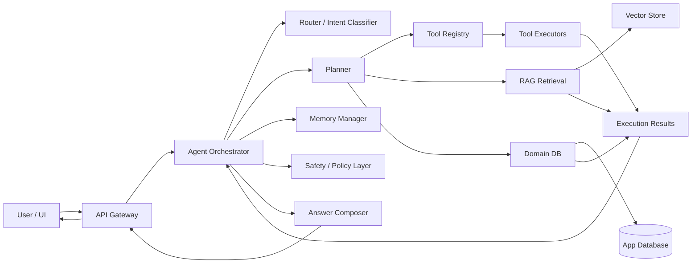
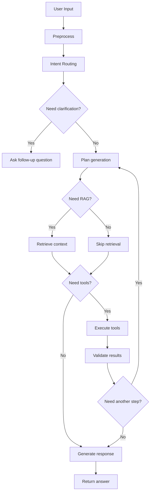

# CookHero 总体设计

> 目标：基于截图中的交互形态，设计一个可落地、可扩展、可评估的智能 Agent 系统。本文不是简单的“聊天机器人方案”，而是一份面向实现的系统设计文档，重点解决：
> 1. 这是一个什么类型的系统；
> 2. 为什么它不是纯 RAG；
> 3. Agent 如何决策、调用工具、检索知识、执行任务；
> 4. 如何把 UI、后端、知识库、工具编排、记忆、评估串成完整链路；
> 5. 如何按阶段实现，避免一上来做成不可维护的“AI 大杂烩”。

---

## 1. 产品定位

### 1.1 这是什么

从截图看，这个产品更适合定义为：

- **Agent 主导的任务型智能应用**
- **Agent + RAG 的混合系统**
- **面向餐饮/营养/菜单/运营的垂直智能助手**

不是纯 RAG 的原因是：

- 用户不只是“问答”，而是“做事”
- 系统有明显的 **任务入口**、**工具入口**、**历史会话**、**复杂规划** 提示
- 页面底部展示 `Tools / Agents`
- 中间有 `Calculation / Data Analysis / Complex Planning`

这说明系统的核心不是“检索后回答”，而是：

1. 先理解任务；
2. 判断是否需要检索知识；
3. 判断是否需要调用工具；
4. 可能需要多步推理、规划、校验；
5. 最后输出结构化结果或可执行方案。

### 1.2 这不是哪些系统

为了避免设计偏差，这里明确排除三类容易混淆的系统：

- **纯 Chatbot**：只负责语言生成，没有工具和任务编排。
- **纯 RAG**：固定流程是“检索 -> 拼上下文 -> 生成”，没有动态规划和工具执行。
- **纯 Workflow Bot**：虽然能调用工具，但每一步都是预设流程，没有“智能判断”和“动态分支”。

### 1.3 最终产品目标

这个 Agent 的最终目标不是“会说话”，而是：

- 能处理餐饮相关复杂任务
- 能把自然语言需求转成结构化动作
- 能根据场景自动选择：
  - 查知识库
  - 做数值计算
  - 查数据库
  - 生成方案
  - 拆解步骤
  - 追问缺失信息
- 能提供可解释、可追踪、可复盘的任务结果

---

## 2. 总体设计原则

### 2.1 设计原则

1. **Agent 负责决策，不负责一切**
   - Agent 是“总控”
   - 真正执行由工具、检索、数据库、规则引擎完成

2. **RAG 只负责知识补充，不负责任务编排**
   - RAG 适合查菜谱、营养数据、标准流程、内部知识
   - 不适合承担复杂多轮决策

3. **输出必须结构化**
   - 任务结果建议支持 JSON / 表格 / 分步骤卡片
   - UI 只是表现层，核心结果要可机器读取

4. **每个能力必须可观测**
   - 检索命中了什么
   - 调用了什么工具
   - 为什么选择这个工具
   - 哪一步失败
   - 最终依据是什么

5. **先做可控，再做智能**
   - 先把确定性规则和工具接好
   - 再让 Agent 学会在这些能力上做动态编排

6. **优先支持“餐饮垂直任务”**
   - 不要先做成通用 AI 平台
   - 先把场景打穿，再抽象成通用框架

### 2.2 成功标准

一个合格版本应该满足：

- 用户输入一句话，可以自动识别任务类型
- 系统能决定是否检索知识库
- 系统能决定是否调用计算、统计、查询、生成、规划工具
- 对复杂任务能输出分步执行方案
- 对缺少信息能追问，而不是胡猜
- 对结果能给出来源、依据和校验信息
- 页面上能看到任务状态、工具轨迹和历史记录

---

## 3. 核心问题的答案树

下面用“决策树”的方式，把这个 Agent 的核心设计拆开。

### 3.1 第 1 层：用户到底想做什么

输入一句自然语言后，先做意图分流：

- **问答类**
  - 例如：某食材怎么保存？
  - 需要：检索知识 + 语言回答

- **计算类**
  - 例如：20 克鸡肉多少卡路里？
  - 需要：数值换算 + 计算工具 + 可选检索

- **记录类**
  - 例如：帮我记录今天午餐
  - 需要：写入用户饮食日志

- **分析类**
  - 例如：分析我最近一周蛋白质摄入
  - 需要：查询数据 + 统计分析 + 可视化

- **规划类**
  - 例如：给 2 个人做一周备餐计划
  - 需要：约束收集 + 规划 + 工具调用 + 结果拆分

- **多步复杂任务**
  - 例如：根据库存和预算生成三天菜单并输出购物清单
  - 需要：多轮推理 + 多工具协作 + 中间结果校验

### 3.2 第 2 层：这个任务需要哪些能力

对于任意任务，Agent 先判断是否需要以下能力：

- 检索知识
- 调用计算器
- 查询用户数据
- 调用营养库
- 生成菜单
- 生成购物清单
- 校验约束
- 生成总结报告
- 追问缺失参数

### 3.3 第 3 层：是否可以直接回答

如果满足以下条件，可以直接回复：

- 问题是固定事实
- 不依赖用户私有数据
- 不依赖实时状态
- 不涉及复杂约束

如果不满足，则进入 Agent 执行层。

### 3.4 第 4 层：是否需要检索

如果任务涉及：

- 内部知识
- 菜品标准
- 营养成分
- 食材替代
- 业务规则
- 操作指南

则先检索再回答。

如果任务涉及：

- 用户历史记录
- 当前库存
- 已保存计划
- 设备状态

则先查数据库或业务系统，再决定下一步。

### 3.5 第 5 层：是否需要工具执行

如果任务包含：

- 数字计算
- 单位换算
- 数据筛选
- 计划编排
- 图表统计
- 约束求解

则必须调用工具，不应只靠模型直接口算。

---

## 4. 推荐的系统形态

### 4.1 总体架构



### 4.2 推荐分层

#### 4.2.1 表现层

- Web UI
- 会话列表
- 新建 Agent Session
- 快捷任务卡片
- 工具状态面板
- 结果卡片和引用展示

#### 4.2.2 接入层

- REST / SSE / WebSocket
- 鉴权
- 会话管理
- 请求限流
- 任务状态订阅

#### 4.2.3 Agent 编排层

- 意图识别
- 任务分解
- 计划生成
- 工具路由
- 结果合并
- 失败重试
- 终止条件判断

#### 4.2.4 能力层

- RAG 检索
- 结构化计算
- 用户数据查询
- 业务规则查询
- 菜单生成
- 营养分析
- 购物清单生成

#### 4.2.5 数据层

- 会话库
- 消息库
- 用户饮食日志
- 知识文档库
- 向量库
- 操作审计库

---

## 5. 关键模块设计

### 5.1 Agent Orchestrator

这是系统的大脑，负责：

- 接收用户输入
- 维护上下文
- 决定是否路由到检索、工具或直接回答
- 控制执行轮次
- 组织最终输出

它不直接做所有事情，而是调度：

- Router
- Planner
- Retriever
- Tool Executor
- Memory Manager

### 5.2 Router / Intent Classifier

Router 的职责是快速判断当前任务属于哪类：

- 问答
- 计算
- 记录
- 分析
- 规划
- 多步骤任务

推荐输出结构：

```json
{
  "intent": "planning",
  "confidence": 0.92,
  "sub_intents": ["menu_generation", "shopping_list", "budget_constraint"],
  "need_rag": true,
  "need_tools": true,
  "need_clarification": false,
  "missing_slots": []
}
```

Router 不是最终答案生成器，只负责分流。

### 5.3 Planner

Planner 是 Agent 的任务规划器，负责把一个复杂任务拆成可执行步骤。

示例：

用户说：

> 给 2 个人制定一周备餐计划

Planner 输出可能是：

1. 收集约束
   - 是否有预算限制
   - 是否有忌口
   - 是否偏向减脂、增肌还是普通饮食
2. 查询营养规则
3. 生成 7 天菜单草案
4. 校验热量、蛋白质、食材复用率
5. 输出购物清单
6. 生成可执行建议

Planner 推荐支持两种模式：

- **单步计划**：问题简单，直接调用一个工具即可
- **多步计划**：问题复杂，允许多轮执行与修正

### 5.4 Retriever / RAG Layer

RAG 不应该是一个“单点召回”模块，而应该是一个完整检索层：

- 文档切分
- Embedding
- 向量检索
- 关键词召回
- 重排序
- 片段合并
- 引用追踪

建议做成混合检索：

- **向量检索**：适合语义相似
- **关键词检索**：适合术语、食材名、规则名
- **结构化查询**：适合营养表、配方表、菜单表

### 5.5 Tool Executor

工具执行层要做到“工具即服务”。

每个工具都要有：

- 名称
- 输入 schema
- 输出 schema
- 超时
- 重试策略
- 幂等性说明
- 权限等级

建议至少包括：

- `calculator`
- `unit_converter`
- `nutrition_lookup`
- `meal_plan_generator`
- `shopping_list_generator`
- `user_food_log_writer`
- `user_food_log_query`
- `report_analyzer`
- `document_search`

### 5.6 Memory Manager

Memory 不是“把所有对话都塞进去”，而是分层记忆：

#### 5.6.1 短期记忆

- 当前 session 最近若干轮消息
- 当前任务中的中间变量
- 当前计划状态

#### 5.6.2 长期记忆

- 用户偏好
- 忌口
- 常用单位
- 目标类型
- 历史计划偏好

#### 5.6.3 任务记忆

- 某次计划生成的约束
- 某次分析的结果
- 某次未完成任务的剩余步骤

### 5.7 Safety / Policy Layer

系统必须具备最基本的安全和质量控制：

- 不确定时要追问，不要编造
- 涉及健康、营养、医疗边界时要提示非诊断性质
- 不要伪造数据来源
- 工具失败时要透明说明
- 对用户数据写操作必须校验权限

---

## 6. Agent 工作流设计

### 6.1 总流程



### 6.2 执行轮次建议

建议采用“有限循环”：

- 最多 3 到 5 轮内部执行
- 每轮必须有明确产物
- 若连续两轮没有新信息，立即收敛
- 工具失败超过阈值后转人工可解释错误

### 6.3 终止条件

Agent 结束任务的条件应该明确：

- 已有足够信息生成结果
- 已完成所有必要工具调用
- 用户要求停止
- 连续失败且无法继续推进
- 进入明确的澄清提问流程

---

## 7. 面向截图界面的交互设计

### 7.1 左侧栏

用途：

- 展示最近 Agent Session
- 支持新建任务
- 提供会话加载
- 支持会话分组或过滤

建议字段：

- session_title
- last_active_time
- session_type
- status
- pinned

### 7.2 顶部导航

用途：

- 模块切换
- 账户入口
- 全局搜索
- 数据面板入口

建议模块：

- 饮食管理
- 知识库
- 数据分析
- 设置

### 7.3 中间主区域

用途：

- 显示 Agent 当前能力概览
- 显示推荐操作卡片
- 显示快捷入口 prompt

建议 UI 内容：

- 主 Logo
- 三个核心能力卡片
  - 计算
  - 数据分析
  - 复杂规划
- 示例问题快捷按钮

### 7.4 底部输入区

用途：

- 提交自然语言任务
- 支持附件
- 支持工具开关
- 支持 Agent 模式切换

建议输入框上方显示：

- 当前可用工具
- 当前启用 Agent 数量
- 当前模式

### 7.5 输出结果区

建议每次 Agent 返回时分成 4 个层次：

1. 简洁结论
2. 过程摘要
3. 证据引用
4. 可执行动作

这样既满足普通用户，也方便专业用户复核。

---

## 8. 数据模型设计

### 8.1 核心实体

#### 8.1.1 User

- id
- name
- avatar
- locale
- timezone
- preferences

#### 8.1.2 Session

- id
- user_id
- title
- type
- status
- created_at
- updated_at

#### 8.1.3 Message

- id
- session_id
- role
- content
- structured_payload
- created_at

#### 8.1.4 AgentRun

- id
- session_id
- user_message_id
- intent
- status
- plan_json
- result_json
- error_code
- created_at

#### 8.1.5 ToolCall

- id
- agent_run_id
- tool_name
- input_json
- output_json
- status
- latency_ms
- created_at

#### 8.1.6 Document

- id
- title
- source_type
- source_uri
- tags
- created_at

#### 8.1.7 KnowledgeChunk

- id
- document_id
- chunk_text
- embedding_id
- metadata_json

#### 8.1.8 UserFoodLog

- id
- user_id
- meal_time
- items_json
- calories
- protein
- fat
- carbs
- notes

### 8.2 推荐数据库拆分

- **事务库**
  - 用户、会话、消息、日志、任务状态
- **向量库**
  - 文档切片 embedding
- **分析库**
  - 任务行为统计
  - 用户习惯统计
- **缓存层**
  - 热点会话
  - 热点知识检索结果

---

## 9. 工具协议设计

### 9.1 工具统一协议

每个工具建议遵循统一协议：

```json
{
  "tool_name": "nutrition_lookup",
  "description": "根据食材、克重、单位查询营养信息",
  "input_schema": {
    "type": "object",
    "properties": {
      "ingredient": { "type": "string" },
      "amount": { "type": "number" },
      "unit": { "type": "string" }
    },
    "required": ["ingredient", "amount", "unit"]
  },
  "output_schema": {
    "type": "object",
    "properties": {
      "calories": { "type": "number" },
      "protein": { "type": "number" },
      "fat": { "type": "number" },
      "carbs": { "type": "number" },
      "source": { "type": "string" }
    }
  }
}
```

### 9.2 工具结果必须满足

- 可验证
- 可追踪
- 可重放
- 可缓存
- 可失败回退

### 9.3 工具优先级

建议按优先级设计：

1. 结构化数据库工具
2. 确定性计算工具
3. 知识库检索工具
4. 生成型工具

原因是：

- 越确定的工具越可靠
- 越靠后的工具越依赖模型主观生成

---

## 10. RAG 设计细则

### 10.1 什么时候必须检索

以下场景强制检索：

- 涉及内部业务规则
- 涉及营养成分标准
- 涉及食品安全说明
- 涉及用户知识库
- 涉及 SOP / 使用说明

### 10.2 什么时候不必检索

以下场景可直接计算或直接回答：

- 已知公式换算
- 纯逻辑分析
- 用户提供完整数据且无需外部知识

### 10.3 检索策略

推荐组合：

- 关键词召回
- 向量召回
- 结构化过滤
- rerank 重排

### 10.4 Chunk 策略

按内容类型分别切分：

- FAQ：按 Q&A 单元切
- 菜谱：按“食材/步骤/营养”切
- 规则文档：按条款切
- 数据表说明：按字段说明切

### 10.5 引用策略

每个回答尽量带：

- 来源文档
- 片段位置
- 可信度说明

这样用户能知道“为什么这么说”。

---

## 11. Prompt 与上下文设计

### 11.1 System Prompt 角色定义

System Prompt 应明确 Agent 的职责边界：

- 你是一个餐饮任务型 Agent
- 你的目标是完成任务，不是闲聊
- 遇到信息不足必须追问
- 涉及数值必须调用工具或严格校验
- 涉及知识必须优先检索
- 结果必须结构化、可执行、可解释

### 11.2 Context 组织方式

上下文建议分层输入：

1. 系统规则
2. 当前用户画像
3. 当前会话摘要
4. 最近消息
5. 检索结果
6. 工具结果
7. 当前执行计划

不要把所有历史原文都塞进去。

### 11.3 输出格式约束

建议 Agent 输出统一格式：

```json
{
  "answer_summary": "一句话结论",
  "steps": [
    "步骤1",
    "步骤2"
  ],
  "references": [
    {
      "title": "来源标题",
      "snippet": "引用片段"
    }
  ],
  "next_actions": [
    "如果你愿意，我可以继续..."
  ]
}
```

这样便于前端渲染成卡片、表格、列表。

---

## 12. 典型场景设计

### 12.1 场景 A：计算类

用户：

> 计算 20 克鸡胸肉的卡路里

流程：

1. Router 识别为 calculation
2. Planner 判断需要营养库
3. 调用 nutrition_lookup
4. 返回营养值
5. 输出结果并注明口径

关键点：

- 统一克重换算
- 单位不确定时追问
- 数据来源优先使用权威营养表

### 12.2 场景 B：记录类

用户：

> 帮我记录一下今天的午餐

流程：

1. Router 识别为 record
2. 判断是否缺少菜品、数量、时间
3. 若缺失则追问
4. 若完整则写入 food log
5. 返回记录结果

关键点：

- 记录前必须确认
- 不要自动脑补菜品和份量

### 12.3 场景 C：分析类

用户：

> 分析我最近一周蛋白质摄入

流程：

1. 查询用户最近 7 天饮食日志
2. 汇总蛋白质摄入
3. 与目标值对比
4. 输出趋势和建议

关键点：

- 支持表格和趋势图
- 支持异常值检测

### 12.4 场景 D：规划类

用户：

> 给 2 个人制定一周备餐计划

流程：

1. 收集预算、忌口、目标、设备条件
2. 查询菜谱与营养库
3. 生成 7 天计划
4. 校验热量、蛋白质、食材复用率
5. 输出购物清单

关键点：

- 这是典型 Agentic RAG 场景
- 不是一次检索能解决的
- 必须具备计划-执行-校验循环

---

## 13. 状态机设计

### 13.1 Session 状态

- `idle`
- `collecting_info`
- `planning`
- `retrieving`
- `executing_tools`
- `summarizing`
- `completed`
- `failed`

### 13.2 AgentRun 状态

- `created`
- `routed`
- `planned`
- `waiting_user`
- `running_tools`
- `validating`
- `finalizing`
- `done`
- `error`

### 13.3 状态切换原则

- 每次切换都写审计日志
- 每次失败都保留失败原因
- 每次工具结果都可回放

---

## 14. 可观测性与评估

### 14.1 必须埋点

- 用户输入长度
- 意图分类结果
- 检索命中数
- 工具调用次数
- 每次工具延迟
- 最终回答长度
- 是否追问
- 是否人工介入

### 14.2 评估指标

#### 14.2.1 任务成功率

用户的问题是否最终被正确完成。

#### 14.2.2 检索命中率

正确答案是否来自正确知识片段。

#### 14.2.3 工具调用准确率

工具是否被正确调用，参数是否正确。

#### 14.2.4 追问质量

缺参时是否问到了关键问题，是否避免了无效追问。

#### 14.2.5 最终可执行性

输出是否能直接执行，而不是停留在空泛建议。

### 14.3 离线评测集

建议建立测试集：

- 计算类 50 条
- 记录类 50 条
- 分析类 50 条
- 规划类 50 条
- 边界情况 50 条

每条包括：

- 输入
- 期望意图
- 期望工具
- 期望输出结构
- 错误示例

---

## 15. 推荐技术栈

### 15.1 前端

- React / Next.js / Vue 任一
- 会话型布局
- 流式输出
- 卡片化结果展示
- 工具轨迹面板

### 15.2 后端

- Java 21 / Spring Boot 3 / Spring WebFlux
- 支持 SSE 或 WebSocket
- 任务异步执行
- 状态持久化

### 15.3 存储

- PostgreSQL：主业务库
- Redis：缓存与短期状态
- Vector DB：向量检索
- 对象存储：文档与附件

### 15.4 AI 编排

- 支持 tool calling 的模型
- 支持结构化输出
- 支持函数调用与多轮推理

---

## 16. 实现路线图

### 阶段 1：最小可用版

目标：

- 能聊天
- 能识别 3 到 5 种意图
- 能调用 2 到 3 个核心工具
- 能做基础检索

交付物：

- 会话界面
- Agent Orchestrator
- 基础工具注册
- 简单 RAG

### 阶段 2：业务打通版

目标：

- 支持记录、计算、分析、规划
- 支持用户日志
- 支持引用和结果审计

交付物：

- 饮食日志写入/查询
- 营养查询工具
- 备餐计划工具
- 任务状态面板

### 阶段 3：增强智能版

目标：

- 多轮任务编排
- 自动追问
- 结果校验
- 个性化偏好记忆

交付物：

- Memory Manager
- Planner
- 自动约束收集
- 长期偏好学习

### 阶段 4：平台化版

目标：

- 支持接入新工具
- 支持多 Agent
- 支持团队级知识库
- 支持监控与评测平台

交付物：

- Tool Registry 平台化
- Agent 模板化
- 评测与回放系统

---

## 17. 推荐的“更好实现”策略

这是本文最关键的一部分：不是“怎么做”，而是“怎么做得更好”。

### 17.1 不要一开始就追求通用 Agent

先做垂直场景，原因：

- 通用 Agent 容易失控
- 工具组合复杂
- 评估标准不清晰
- 业务价值不聚焦

推荐先聚焦：

- 食物营养计算
- 饮食记录
- 周计划生成
- 摄入分析

### 17.2 不要让 LLM 直接决定所有事情

应该把高风险决策下放给确定性模块：

- 单位换算走工具
- 数值统计走代码
- 用户写入走校验
- 业务规则走规则引擎

LLM 负责：

- 理解
- 规划
- 解释
- 汇总

### 17.3 不要把 RAG 当成“万能知识补丁”

RAG 只解决知识查找，不解决：

- 任务分解
- 约束推理
- 结果校验
- 状态管理

所以要把 RAG 放在 Agent 的一个步骤里，而不是整个系统。

### 17.4 不要把“会话历史”当成“记忆系统”

记忆需要分层，不然会出现：

- 上下文过长
- 旧信息污染新任务
- 偏好混乱
- 难以追踪

### 17.5 不要忽略“解释性”

用户最终不是只想要答案，而是想知道：

- 这个答案怎么来的
- 依据是什么
- 有哪些假设
- 哪些地方可能不确定

解释性是 Agent 产品可信度的核心。

---

## 18. 建议的开发顺序

### 第一步

搭一个最简会话框架：

- 新建会话
- 发送消息
- 流式输出
- 保存消息历史

### 第二步

接入 Router：

- 判断 intent
- 判断是否需要追问
- 判断是否调用工具

### 第三步

接入 2 到 3 个核心工具：

- 计算器
- 营养查询
- 饮食日志写入

### 第四步

加入 RAG：

- 文档切片
- 向量检索
- 引用返回

### 第五步

加入 Planner：

- 多步任务拆解
- 执行状态记录
- 结果验证

### 第六步

加入评测与监控：

- 成功率
- 延迟
- 工具调用质量
- 追问质量

---

## 19. 最终建议

如果你要做截图这种产品，我的建议是：

- **产品定义上：Agent 为主，RAG 为辅**
- **架构上：Agentic RAG**
- **工程上：先垂直，后平台**
- **能力上：先确定性工具，再生成式规划**
- **数据上：强结构化存储，强审计**
- **体验上：输出要可解释、可追踪、可执行**

一句话总结：

> 这个系统不是“一个会回答问题的模型”，而是“一个能围绕餐饮任务进行规划、检索、计算、分析和执行的智能任务中枢”。

---

## 20. 下一步建议

如果你要继续往下做，建议直接拆成三份文档：

1. **产品需求文档 PRD**
2. **后端接口与数据结构文档**
3. **Agent Prompt 与工具协议文档**

这样就可以从“设计”直接进入“实现”。
