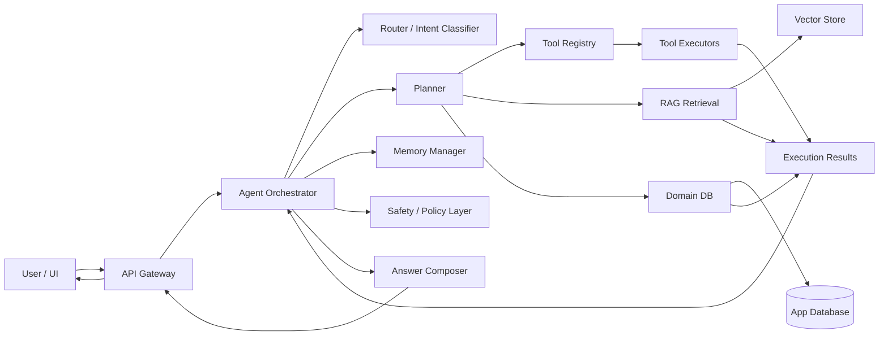
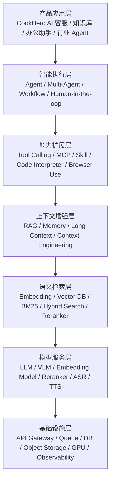
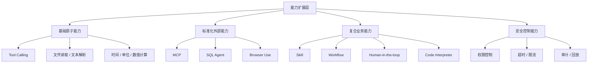
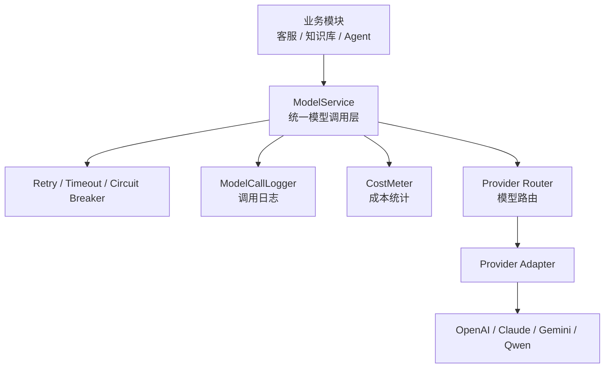
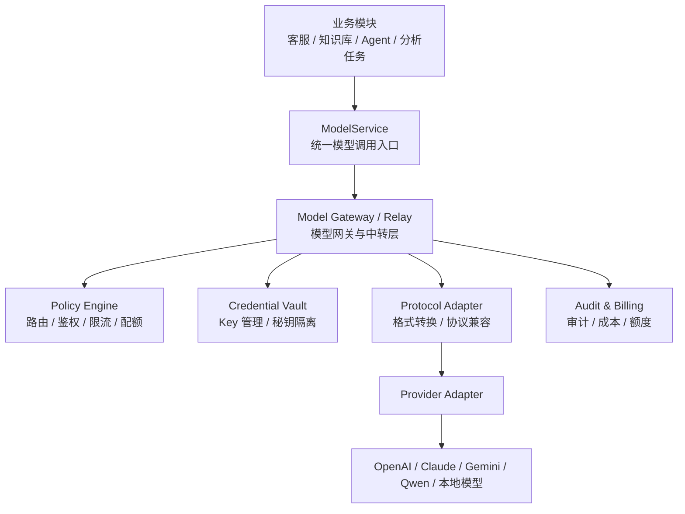
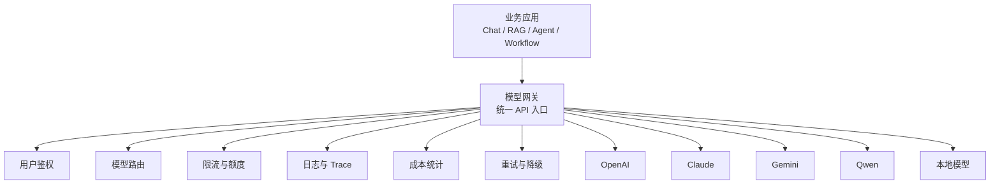
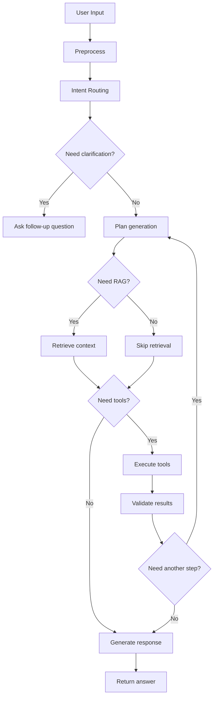

# CookHero 系统设计与技术方案

> 目标：基于截图中的交互形态，设计一个可落地、可扩展、可评估的智能 Agent 系统。本文不是简单的“聊天机器人方案”，而是一份面向实现的系统设计文档，重点解决：
> 1. 这是一个什么类型的系统；
> 2. 为什么它不是纯 RAG；
> 3. Agent 如何决策、调用工具、检索知识、执行任务；
> 4. 如何把 UI、后端、知识库、工具编排、记忆、评估串成完整链路；
> 5. 如何按阶段实现，避免一上来做成不可维护的“AI 大杂烩”。
>
> 本文已合并原“架构设计”和“技术选型”的内容，作为项目唯一的总技术文档。

---

## 1. 产品定位

### 1.1 这是什么

从截图看，这个产品更适合定义为：

- **Agent 主导的任务型智能应用**
- **Agent + RAG 的混合系统**
- **面向餐饮/营养/菜单/运营的垂直智能助手**

不是纯 RAG 的原因是：

- 用户不只是“问答”，而是“做事”
- 系统有明显的 **任务入口**、**工具入口**、**历史会话**、**复杂规划** 提示
- 页面底部展示 `Tools / Agents`
- 中间有 `Calculation / Data Analysis / Complex Planning`

这说明系统的核心不是“检索后回答”，而是：

1. 先理解任务；
2. 判断是否需要检索知识；
3. 判断是否需要调用工具；
4. 可能需要多步推理、规划、校验；
5. 最后输出结构化结果或可执行方案。

### 1.2 这不是哪些系统

为了避免设计偏差，这里明确排除三类容易混淆的系统：

- **纯 Chatbot**：只负责语言生成，没有工具和任务编排。
- **纯 RAG**：固定流程是“检索 -> 拼上下文 -> 生成”，没有动态规划和工具执行。
- **纯 Workflow Bot**：虽然能调用工具，但每一步都是预设流程，没有“智能判断”和“动态分支”。

### 1.3 最终产品目标

这个 Agent 的最终目标不是“会说话”，而是：

- 能处理餐饮相关复杂任务
- 能把自然语言需求转成结构化动作
- 能根据场景自动选择：
  - 查知识库
  - 做数值计算
  - 查数据库
  - 生成方案
  - 拆解步骤
  - 追问缺失信息
- 能提供可解释、可追踪、可复盘的任务结果

---

## 2. 总体设计原则

### 2.1 设计原则

1. **Agent 负责决策，不负责一切**
   - Agent 是“总控”
   - 真正执行由工具、检索、数据库、规则引擎完成

2. **RAG 只负责知识补充，不负责任务编排**
   - RAG 适合查菜谱、营养数据、标准流程、内部知识
   - 不适合承担复杂多轮决策

3. **输出必须结构化**
   - 任务结果建议支持 JSON / 表格 / 分步骤卡片
   - UI 只是表现层，核心结果要可机器读取

4. **每个能力必须可观测**
   - 检索命中了什么
   - 调用了什么工具
   - 为什么选择这个工具
   - 哪一步失败
   - 最终依据是什么

5. **先做可控，再做智能**
   - 先把确定性规则和工具接好
   - 再让 Agent 学会在这些能力上做动态编排

6. **优先支持“餐饮垂直任务”**
   - 不要先做成通用 AI 平台
   - 先把场景打穿，再抽象成通用框架

### 2.2 成功标准

一个合格版本应该满足：

- 用户输入一句话，可以自动识别任务类型
- 系统能决定是否检索知识库
- 系统能决定是否调用计算、统计、查询、生成、规划工具
- 对复杂任务能输出分步执行方案
- 对缺少信息能追问，而不是胡猜
- 对结果能给出来源、依据和校验信息
- 页面上能看到任务状态、工具轨迹和历史记录

---

## 3. 核心问题的答案树

下面用“决策树”的方式，把这个 Agent 的核心设计拆开。

### 3.1 第 1 层：用户到底想做什么

输入一句自然语言后，先做意图分流：

- **问答类**
  - 例如：某食材怎么保存？
  - 需要：检索知识 + 语言回答

- **计算类**
  - 例如：20 克鸡肉多少卡路里？
  - 需要：数值换算 + 计算工具 + 可选检索

- **记录类**
  - 例如：帮我记录今天午餐
  - 需要：写入用户饮食日志

- **分析类**
  - 例如：分析我最近一周蛋白质摄入
  - 需要：查询数据 + 统计分析 + 可视化

- **规划类**
  - 例如：给 2 个人做一周备餐计划
  - 需要：约束收集 + 规划 + 工具调用 + 结果拆分

- **多步复杂任务**
  - 例如：根据库存和预算生成三天菜单并输出购物清单
  - 需要：多轮推理 + 多工具协作 + 中间结果校验

### 3.2 第 2 层：这个任务需要哪些能力

对于任意任务，Agent 先判断是否需要以下能力：

- 检索知识
- 调用计算器
- 查询用户数据
- 调用营养库
- 生成菜单
- 生成购物清单
- 校验约束
- 生成总结报告
- 追问缺失参数

### 3.3 第 3 层：是否可以直接回答

如果满足以下条件，可以直接回复：

- 问题是固定事实
- 不依赖用户私有数据
- 不依赖实时状态
- 不涉及复杂约束

如果不满足，则进入 Agent 执行层。

### 3.4 第 4 层：是否需要检索

如果任务涉及：

- 内部知识
- 菜品标准
- 营养成分
- 食材替代
- 业务规则
- 操作指南

则先检索再回答。

如果任务涉及：

- 用户历史记录
- 当前库存
- 已保存计划
- 设备状态

则先查数据库或业务系统，再决定下一步。

### 3.5 第 5 层：是否需要工具执行

如果任务包含：

- 数字计算
- 单位换算
- 数据筛选
- 计划编排
- 图表统计
- 约束求解

则必须调用工具，不应只靠模型直接口算。

---

## 4. 推荐的系统形态

### 4.1 总体架构



### 4.2 推荐分层

#### 4.2.1 表现层

- Web UI
- 会话列表
- 新建 Agent Session
- 快捷任务卡片
- 工具状态面板
- 结果卡片和引用展示

#### 4.2.2 接入层

- REST / SSE / WebSocket
- 鉴权
- 会话管理
- 请求限流
- 任务状态订阅

#### 4.2.3 Agent 编排层

- 意图识别
- 任务分解
- 计划生成
- 工具路由
- 结果合并
- 失败重试
- 终止条件判断

#### 4.2.4 能力层

- RAG 检索
- 结构化计算
- 用户数据查询
- 业务规则查询
- 菜单生成
- 营养分析
- 购物清单生成

#### 4.2.5 数据层

- 会话库
- 消息库
- 用户饮食日志
- 知识文档库
- 向量库
- 操作审计库

### 4.3 AI 大模型应用技术分层

CookHero 建议采用更通用的 AI 应用分层模型，这样后续无论增加新 Agent、新工具还是新模型，都能保持工程边界清晰。



#### 4.3.1 各层含义

**1. 产品应用层**

- 直接面向用户的业务界面
- 本项目对应：饮食管理、知识库、数据分析、备餐规划、记录助手

**2. 智能执行层**

- 负责任务编排与策略选择
- 本项目对应：Agent、Multi-Agent、Workflow、Human-in-the-loop

**3. 能力扩展层**

- 负责把智能决策转成实际动作
- 本项目对应：Tool Calling、MCP、Skill、Code Interpreter、Browser Use、SQL Agent

**4. 上下文增强层**

- 负责给模型“补上下文”
- 本项目对应：RAG、Memory、Long Context、Context Engineering

**5. 语义检索层**

- 负责知识召回与排序
- 本项目对应：Milvus BM25 + dense vector + hybrid search + reranker

**6. 模型服务层**

- 负责基础模型能力输出
- 本项目对应：ModelService、模型网关/中转层、LLM、Embedding Model、Reranker，后续可扩展 VLM、ASR、TTS

**7. 基础设施层**

- 负责系统运行底座
- 本项目对应：API Gateway、RocketMQ、PostgreSQL、Milvus、Redis、MinIO、GPU、Observability

#### 4.3.2 CookHero 的层级映射

| 分层 | CookHero 对应能力 |
|---|---|
| 产品应用层 | 饮食管理、知识库、数据分析、备餐规划 |
| 智能执行层 | Agent、Multi-Agent、Workflow、HITL |
| 能力扩展层 | Tool Calling、MCP、Skill、SQL Agent、Code Interpreter、Browser Use（可选） |
| 上下文增强层 | RAG、Memory、会话摘要、问题改写 |
| 语义检索层 | Milvus + BM25 + dense + rerank |
| 模型服务层 | ModelService、模型网关/中转层、LLM、Embedding、Reranker，后续扩展 VLM/ASR/TTS |
| 基础设施层 | Spring Boot、RocketMQ、PostgreSQL、Redis、MinIO、监控告警 |

#### 4.3.3 为什么这套分层适合 CookHero

- 层与层之间边界清楚，不会把所有逻辑堆到 Agent 里
- 便于后续单独替换模型、检索、工具和消息系统
- 便于把 MCP 数据查询、Milvus 知识检索、记忆系统并行演进
- 便于做权限、安全、审计和回放

#### 4.3.4 基础设施层清单

基础设施层负责支撑整个 AI 应用运行，推荐按下面的模块来定义：

| 模块 | 作用 | 是否必备 |
|---|---|---|
| API Gateway | 统一模型调用入口、鉴权、限流、日志 | 必备 |
| Database | 存储用户、会话、任务、业务数据 | 必备 |
| Vector Database / Milvus | 存储 Embedding、BM25 稀疏向量、混合检索索引 | 必备 |
| Object Storage | 存储 PDF、图片、音频、文档等文件 | 必备 |
| Queue / RocketMQ | 处理异步任务，例如文档解析、索引、批量分析 | 必备 |
| Cache / Redis | 缓存 Prompt、检索结果、会话摘要、模型输出 | 必备 |
| GPU Server | 私有化部署模型、Embedding、Reranker、VLM 等 | 可选 |
| Observability | 记录 Trace、日志、Token、成本、错误 | 必备 |

#### 4.3.5 常见落地方式

对于大多数 AI 应用，通常不需要一开始就自建 GPU，也不一定要自己训练模型。
更常见的做法是：

- 业务后端 + 模型 API + RAG + 工具调用 + 工作流
- 需要时再补 GPU、私有模型或更重的推理服务

#### 4.3.6 CookHero 的基础设施映射

| 基础设施模块 | CookHero 对应实现 |
|---|---|
| API Gateway | Spring Boot API / BFF |
| Database | PostgreSQL |
| Vector Database | Milvus |
| Object Storage | MinIO / S3 |
| Queue | RocketMQ |
| Cache | Redis |
| GPU Server | 后续可选，用于私有模型或本地推理 |
| Observability | OpenTelemetry + Prometheus + Grafana + Sentry |

#### 4.3.7 能力扩展层设计

能力扩展层是 Agent 真正“做事”的入口。它不负责生成答案，而是负责把模型的判断转换成可执行、可审计、可控、可替换的动作。  
如果这一层设计不好，系统就会退化成“把所有逻辑都写进 Prompt 里”的黑盒；如果这一层设计得好，Agent 的能力就可以像积木一样逐步叠加。

##### 4.3.7.1 这一层的设计目标

- 把外部动作统一封装成标准能力，避免模型直接接触底层资源
- 让模型只看到“能力描述”，而不是 JDBC、HTTP、Shell、浏览器脚本等实现细节
- 所有能力都必须具备输入 schema、输出 schema、权限边界、超时、限流、审计
- 能力可以独立启停、版本化、灰度、回滚和替换
- 同一类能力要尽量复用统一协议，避免每接一个系统就写一套特例

##### 4.3.7.2 能力树



##### 4.3.7.3 各类能力的定位

| 能力 | 核心作用 | 适合场景 | 风险级别 | CookHero 优先级 |
|---|---|---|---|---|
| Tool Calling | 把模型输出转成确定性函数调用 | 计算、单位转换、格式化、简单校验 | 低 | P0 |
| MCP | 用统一协议封装外部系统 | 数据库、文件系统、搜索、第三方服务 | 中 | P0 |
| SQL Agent | 受控地生成和执行只读 SQL | 用户饮食日志、报表库、统计库、业务库查询 | 中 | P0 |
| Skill | 把“提示词 + 工具链 + 约束 + 样例”封装成可复用能力包 | 一周备餐、购物清单、营养总结、报告生成 | 中 | P1 |
| Workflow | 用固定状态机编排多步任务 | 高确定性流程、合规流程、批量任务 | 中 | P1 |
| Human-in-the-loop | 在关键节点引入人工确认 | 写入、发送、提交、发布、支付、敏感操作 | 低到中 | P1 |
| Code Interpreter | 在沙箱里执行受控代码 | 批量分析、画图、模拟、复杂计算 | 中到高 | P2 |
| Browser Use | 操作网页完成外部任务 | 没有 API 的站点、公开网页采集、表单填写 | 高 | P2 |

##### 4.3.7.4 推荐的实现顺序

能力扩展层不要一开始就把所有能力都做满，推荐按“从确定性到复杂性”的顺序落地：

1. **先做 Tool Calling**
   - 先把最稳定、最容易测试的原子能力跑通
   - 例如计算、格式化、单位换算、字段校验

2. **再做 MCP**
   - 把外部系统接入成标准工具
   - 统一工具协议、统一元数据、统一审计

3. **接着做 SQL Agent**
   - 这是业务价值很高的一层
   - 让 Agent 能通过“选数据源 + 看 schema + 生成只读 SQL + 校验 + 执行”完成结构化查询

4. **然后做 Skill**
   - 将常见任务封装成可复用能力包
   - 例如“生成一周备餐计划”“分析近 7 天摄入”“生成购物清单”

5. **再做 Workflow 和 Human-in-the-loop**
   - 把高确定性场景做成显式流程
   - 把高风险节点交给用户确认

6. **最后补 Code Interpreter 和 Browser Use**
   - 这两类能力更强，但也更不稳定、更高风险
   - 只在前面的能力无法解决时启用

##### 4.3.7.5 能力调用的生命周期

任何一项能力都建议走统一生命周期，而不是“模型想到了就直接调”：

1. **识别任务类型**
   - 先判断当前请求是问答、计算、查询、规划、写入，还是外部操作

2. **选择能力**
   - 由 Router 或 Planner 选出候选能力
   - 不是让模型无限制地自由发挥

3. **组装参数**
   - 根据能力 schema 填参数
   - 参数缺失时先追问，不要瞎猜

4. **权限校验**
   - 校验当前用户、租户、角色、数据范围和风险等级

5. **执行能力**
   - 由能力执行器真正调用数据库、工具、代码沙箱或浏览器

6. **结构化回传**
   - 返回结果、来源、耗时、状态、错误信息、校验信息

7. **审计与回放**
   - 记录谁在什么时间调用了什么能力
   - 保证后续可追踪、可回放、可排障

##### 4.3.7.6 能力边界与安全规则

- **读写分离**
  - 默认只开放读能力
  - 写操作、提交操作、发送操作、删除操作必须单独授权

- **只读 SQL**
  - SQL Agent 只允许 `SELECT` 和 `WITH ... SELECT`
  - 强制 `LIMIT`
  - 强制超时
  - 强制租户过滤
  - 强制字段白名单
  - 禁止 `INSERT / UPDATE / DELETE / DROP / ALTER / TRUNCATE`

- **浏览器白名单**
  - Browser Use 只允许访问白名单站点
  - 账号登录、表单提交、下载上传、支付等动作必须人工确认

- **代码沙箱**
  - Code Interpreter 必须在沙箱运行
  - 限制 CPU、内存、磁盘、网络和执行时间

- **统一审计**
  - 所有能力调用都要记录 trace id、user id、session id、tool id、参数摘要、结果摘要、错误原因

- **默认拒绝**
  - 未登记、未授权、未版本化、未审计的能力默认不能被 Agent 调用

##### 4.3.7.7 CookHero 的能力映射

| 能力 | CookHero 场景 | 具体实现建议 |
|---|---|---|
| Tool Calling | 热量换算、单位转换、食材标准化、日期计算 | 先做成纯函数工具，便于单测和回放 |
| MCP | 食材库、菜品库、用户偏好库、规则库、报表服务 | 统一成 MCP Server，后端持有连接，模型只看接口 |
| SQL Agent | 用户饮食日志查询、摄入分析、趋势报表、经营数据查询 | LLM 只负责选库和写只读 SQL，校验和执行由后端负责 |
| Skill | 生成一周备餐计划、生成购物清单、生成营养建议 | 把 prompt、工具、约束、模板和校验封装成一个能力包 |
| Workflow | “分析 -> 生成 -> 校验 -> 确认 -> 保存” | 用状态机或编排器实现，适合强约束流程 |
| Human-in-the-loop | 写入记录、提交方案、发送通知、外部操作确认 | 在敏感节点插入确认卡片或审批步骤 |
| Code Interpreter | 批量导入数据、趋势图、模拟摄入、统计分析 | 沙箱运行，结果结构化返回 |
| Browser Use | 没有 API 的公开网页、食材价格页面、公开食谱页 | 限定域名、限定动作、限定时长 |

##### 4.3.7.8 CookHero 的必要工具清单

如果从“能跑起来、能交付、能扩展”的角度看，CookHero 的工具不需要一开始就很多。  
真正必要的，是下面这组**最小可用工具集**：

**P0 必备工具**

| 工具 | 作用 | 为什么必备 |
|---|---|---|
| `calculator` | 数值计算、单位换算、比例计算 | 饮食场景里高频且必须确定性 |
| `time_parser` | 时间表达归一化 | 处理“昨天/上周/本月”等时间条件 |
| `entity_normalizer` | 食材、菜品、人名、公司名标准化 | 提升召回和查询一致性 |
| `knowledge_search` | 知识库召回 | 支撑 RAG 问答 |
| `database_query` | 结构化数据查询 | 支撑用户日志、分析、报表 |
| `food_log_writer` | 饮食记录写入 | 核心业务闭环 |
| `plan_validator` | 备餐计划、营养、预算校验 | 保证输出可执行、可约束 |
| `prompt_router` | 任务路由与 Prompt 选择 | 保证不同任务走不同 Prompt |

**P1 推荐工具**

| 工具 | 作用 | 适合什么时候加 |
|---|---|---|
| `nutrition_lookup` | 营养信息查询 | 营养分析、摄入统计阶段 |
| `shopping_list_generator` | 购物清单生成 | 备餐规划场景成熟后 |
| `summary_generator` | 会话/任务摘要 | 长会话和记忆管理 |
| `acl_filter_tool` | ACL 过滤辅助 | 多租户和私有知识库稳定后 |
| `data_exporter` | 报表导出 | 需要交付结构化结果时 |

**P2 可选工具**

| 工具 | 作用 | 风险 |
|---|---|---|
| `code_interpreter` | 沙箱运行代码 | 风险较高，需控制环境 |
| `browser_use` | 自动化网页操作 | 风险高，易受页面变化影响 |
| `workflow_runner` | 复杂流程编排 | 适合业务流程成熟后 |
| `human_approval` | 人工确认节点 | 高风险写操作时必需，但不是所有场景都要暴露给模型 |

##### 4.3.7.9 工具选型原则

- **先确定性，后生成式**
  - 先上计算、查询、校验、写入这种可控工具

- **先业务闭环，后增强能力**
  - 先解决“查、算、记、验、答”
  - 再考虑代码执行、浏览器、复杂工作流

- **不要把工具做成模型的“万能胶”**
  - 每个工具只解决一个明确问题
  - 工具越小，越容易测、越容易审计、越容易回放

- **工具必须有明确边界**
  - 输入 schema、输出 schema、超时、权限、幂等性、审计都要定义

- **最小可用工具集先落地**
  - 如果要先做一个能真正上线验证的版本，至少先落地这 6 个：
    1. `calculator`
    2. `time_parser`
    3. `knowledge_search`
    4. `database_query`
    5. `food_log_writer`
    6. `plan_validator`

##### 4.3.7.10 为什么这 6 个最关键

- `calculator` 解决所有数值确定性问题
- `time_parser` 解决时间范围过滤
- `knowledge_search` 解决知识问答
- `database_query` 解决业务数据查询
- `food_log_writer` 解决核心业务写入
- `plan_validator` 解决结果约束和安全校验

这 6 个工具基本就能撑起：

- 问答
- 计算
- 查询
- 写入
- 规划
- 校验

##### 4.3.7.11 推荐的代码抽象

如果后续要真正工程化，建议把能力扩展层拆成四个核心抽象：

- `CapabilityDefinition`
  - 描述能力本身：名称、类别、输入输出 schema、风险等级、权限范围、版本号

- `CapabilityRouter`
  - 根据意图、上下文、权限和风险，选择该调用哪个能力

- `CapabilityExecutor`
  - 负责真正执行工具、SQL、代码、浏览器或工作流

- `CapabilityAuditService`
  - 记录调用、参数、结果、失败原因和重试情况

这样做的好处是：模型可以换，工具可以换，数据库可以换，但“能力治理框架”不需要重写。

#### 4.3.8 Agent 框架选择

CookHero 的 Agent 框架不建议一开始就“全家桶式接入”。  
更合适的做法是先选一个**主栈**，再选少量**辅助框架**，其余框架只保留为参考实现或原型工具。

##### 4.3.8.1 选型原则

- **Java 后端优先**
  - 你的主业务后端已经明确要用 Java，因此 Agent 的核心编排也尽量留在 Java 生态内。

- **先可控，再智能**
  - 先把状态机、工具调用、审计、记忆、检索、SQL 查询这些确定性能力做好，再增加复杂的多 Agent 协作。

- **框架服务于边界，不替代边界**
  - 框架只能帮你实现编排、工具调用、记忆或手动确认，不能替你定义权限、安全、数据域和审计。

- **避免多运行时分裂**
  - 如果主后端是 Java，就不要同时把 Python、Node、低代码平台当成核心运行时，否则后续排障、部署、监控和版本管理会很碎。

##### 4.3.8.2 各框架的定位

| 框架 / 平台 | 官方定位特征 | 对 CookHero 的建议 |
|---|---|---|
| Spring AI | Java 生态里的模型抽象、工具调用、RAG、Agent 能力入口 | **主栈候选，推荐优先评估** |
| LangChain4j | Java 生态里的 LLM / tools / agents / RAG 统一 API，适合 Spring Boot 集成 | **主栈候选，和 Spring AI 二选一，不要同时双主** |
| LangGraph | 低层级、有状态、可持久化、支持 human-in-the-loop 的 agent 编排运行时 | **适合参考其编排思想；若未来做独立 Python agent 服务，可作为备选** |
| OpenAI Agents SDK | 轻量 Agent runtime，强调 tools、handoffs、guardrails、structured outputs | **适合 OpenAI 生态或 Python/JS 服务，不建议作为 Java 主后端核心依赖** |
| AutoGen | 多 Agent 对话与协作框架，偏研究与复杂多 Agent 实验 | **适合做多 Agent 原型，不建议作为生产主干** |
| CrewAI | 多 Agent 团队与流程编排，适合角色分工式任务 | **适合原型和业务演示，不建议作为核心编排内核** |
| Semantic Kernel | 面向微软生态的 kernel / plugin / memory / agent 体系 | **如果你以后更偏 Azure / .NET / Microsoft 生态再重点评估** |
| Dify | 低代码 Agent / Workflow 平台，适合快速构建和发布应用 | **适合 PoC、运营验证、流程原型，不建议作为主业务后端内核** |
| Coze | 低代码 Bot / Workflow / 工具平台，偏快速搭建 | **适合 Demo 和前台验证，不建议作为核心工程编排层** |

##### 4.3.8.3 CookHero 推荐主栈

结合你的技术约束，CookHero 建议采用下面这套主栈：

1. **后端框架**
   - `Java 21 + Spring Boot 3`
   - `Spring WebFlux` 负责接口和流式输出
   - `Spring Security` 负责鉴权和权限控制

2. **Agent 核心**
   - `Spring AI` 或 `LangChain4j` 负责模型接入、工具定义、工具调用、RAG 相关能力
   - 你自己的 `Agent Orchestrator` 负责状态机、路由、计划、重试、终止条件

3. **工具与扩展**
   - `Tool Calling` 作为原子能力入口
   - `MCP` 作为外部系统标准接入协议
   - `SQL Agent` 作为受控数据查询能力
   - `Skill` 作为高频任务能力包

4. **编排与控制**
   - `Workflow` 用于高确定性流程
   - `Human-in-the-loop` 用于敏感操作确认
   - `Code Interpreter` 和 `Browser Use` 后置，作为增强能力而不是基础依赖

5. **记忆与上下文**
   - 不依赖某个框架自带 memory 完成全部记忆逻辑
   - 由你自己的 `Memory Manager` 统一管理短期记忆、长期记忆、会话摘要和任务状态

6. **观测与治理**
   - `OpenTelemetry + Prometheus + Grafana + Sentry`
   - 所有 Agent、工具调用、SQL 执行、检索、失败重试都必须打 trace

##### 4.3.8.4 推荐与不推荐

**推荐直接做的：**

- Java 主栈 + Spring AI 或 LangChain4j（二选一）
- 自研 Agent Orchestrator
- 自研 Memory Manager
- MCP 工具协议
- SQL Agent
- Workflow 状态机

**可以参考但不要重度绑定的：**

- LangGraph 的图编排思想
- OpenAI Agents SDK 的 handoff / guardrail / structured output 思路
- Semantic Kernel 的 kernel / plugin / memory 思路
- 另一套 Java agent library 只作为补充评估，不要同时主用两套

**不建议作为核心依赖的：**

- AutoGen
- CrewAI
- Dify
- Coze

原因不是它们不好，而是它们更适合“原型、实验、低代码搭建、多 Agent 演示”，而 CookHero 现在更需要的是一个**可控、可审计、可长期演进的 Java 生产系统**。

#### 4.3.9 模型调用服务封装

业务代码不要直接调用某个模型供应商的 API。  
推荐在模型接入和业务模块之间再加一层统一封装，命名为 `ModelService` 或 `LLM Service`。这一层的职责不是“变聪明”，而是“让调用可控、可替换、可观测、可统计成本”。

##### 4.3.9.1 为什么要封装

- 避免业务代码里直接散落 OpenAI / Claude / Gemini / Qwen 等供应商调用逻辑
- 避免每个模块都自己写重试、超时、日志、计费和模型切换
- 便于统一处理流式输出、结构化输出、工具调用、embedding、rerank 等差异
- 便于后续平滑切换供应商或切换模型版本
- 便于统一统计 token、时延、错误率和成本

##### 4.3.9.2 推荐架构



##### 4.3.9.3 分层职责

**1. 业务模块**

- 只关心“我要让模型做什么”
- 例如：总结、分类、抽取、生成、重写、检索增强问答
- 不关心具体供应商

**2. ModelService**

- 提供统一的模型调用入口
- 统一支持普通对话、流式对话、结构化输出、工具调用、embedding、rerank
- 统一处理重试、超时、日志、成本统计、降级和路由

**3. Provider Router**

- 根据模型类型、租户配置、可用性、成本、延迟选择具体供应商
- 例如：
  - 默认走 `Qwen`
  - 大模型复杂推理走 `Claude`
  - 结构化任务走支持更稳定 JSON 输出的模型

**4. Provider Adapter**

- 将统一接口适配到不同供应商的 SDK 或 HTTP API
- 屏蔽各家参数名、消息格式、流式协议和错误码差异

**5. Retry / Timeout / Circuit Breaker**

- 处理短暂网络失败、限流、超时、上游波动
- 只对幂等请求做重试
- 非幂等请求必须谨慎，避免重复副作用

**6. Logging**

- 记录请求摘要、响应摘要、模型名、耗时、token、trace id、错误原因
- 敏感内容必须脱敏

**7. CostMeter**

- 统计 prompt token、completion token、总 token
- 统计单次请求成本、日成本、租户成本、场景成本
- 为后续成本控制和模型路由提供依据

##### 4.3.9.4 推荐统一接口

建议 `ModelService` 至少提供下面几类方法：

- `chat(...)`
- `chatStream(...)`
- `structuredOutput(...)`
- `toolCall(...)`
- `embed(...)`
- `rerank(...)`

推荐统一返回对象包含：

- `requestId`
- `provider`
- `modelName`
- `content`
- `usage`
- `latencyMs`
- `cost`
- `traceId`
- `status`
- `error`

##### 4.3.9.5 ModelService 的调用原则

- 业务层只依赖 `ModelService`，不直接依赖供应商 SDK
- Prompt 模板、模型名、温度、最大 token、结构化输出格式都应可配置
- 模型调用必须可追踪、可重放、可统计
- 默认开启超时和降级
- 必须支持多供应商切换
- 对于 Agent 场景，优先支持流式输出和结构化输出

##### 4.3.9.6 失败与降级策略

- 上游超时：切换备选模型或返回可解释错误
- 上游限流：退避重试，必要时排队
- 结构化输出失败：重新提示或降级到非结构化解释
- 成本超限：切换低成本模型或缩短上下文
- 服务不可用：明确告知用户当前能力不可用，不要伪造结果

##### 4.3.9.7 CookHero 落地建议

CookHero 里建议把下面这些都放进 `ModelService`：

- 对话模型调用
- Agent 规划模型调用
- 工具选择模型调用
- 问题改写模型调用
- 知识检索重排模型调用
- Embedding 生成
- 结果摘要生成

这样做的结果是：

- 业务代码会更干净
- 后续切模型不会大规模改业务
- 成本和质量都能统一观测

#### 4.3.10 模型网关与中转层

如果把 `ModelService` 看作“业务侧统一入口”，那么模型网关与中转层就是它后面的“控制与分发中枢”。  
这一层专门解决多模型、多供应商、多租户、多策略并存时的治理问题，核心目标不是提升模型能力本身，而是让模型调用变得**统一、稳定、安全、可切换、可审计**。

##### 4.3.10.1 这一层解决什么问题

- 不同业务模块都想接模型，但不应该各自维护一套 Key、路由和限流
- 不同租户、不同用户、不同场景需要使用不同模型和不同额度
- 不同供应商的接口格式、流式协议、错误码、工具调用格式不一致
- 需要统一处理密钥托管、配额控制、降级切换、审计留痕和成本统计
- 需要兼容 OpenAI 风格接口，方便上层统一适配

##### 4.3.10.2 ModelService 和模型网关的边界

| 层 | 职责 | 是否面向业务 |
|---|---|---|
| `ModelService` | 提供业务友好的统一调用入口 | 是 |
| 模型网关 / 中转层 | 处理路由、鉴权、限流、密钥、协议转换、审计、成本治理 | 否 |
| Provider Adapter | 对接具体模型供应商 API | 否 |

简单理解就是：

- `ModelService` 负责“怎么用”
- 模型网关负责“给谁用、用哪个、能不能用、花多少钱、出了问题怎么切”
- `Provider Adapter` 负责“怎么跟这个供应商说话”

##### 4.3.10.3 推荐架构



##### 4.3.10.4 核心能力

**1. 模型路由**

- 根据任务类型、租户、用户等级、成本策略、延迟策略、健康状态，选择模型
- 支持主模型、备份模型、低成本模型、高质量模型的分层路由
- 支持规则路由和策略路由，而不是写死在业务代码里

**2. 密钥托管**

- 所有 API Key、Access Token、组织 ID、签名密钥统一收口
- 不允许业务模块直接持有供应商密钥
- 支持按租户、按环境、按供应商隔离密钥
- 支持轮换、禁用、审计和最小权限原则

**3. 配额与限流**

- 按用户、租户、项目、场景做配额控制
- 支持 QPS、并发数、日调用量、日 token 量、日成本上限
- 触发超限时可降级或排队

**4. 协议转换**

- 统一不同供应商的消息格式
- 统一流式输出协议
- 统一工具调用格式
- 统一错误码
- 统一结构化输出格式

**5. 审计与成本治理**

- 记录谁在什么时间、以什么策略、调用了哪个模型
- 记录请求摘要、响应摘要、token、时延、成本、结果状态
- 便于账单核算、异常排查和合规追踪

**6. 降级与熔断**

- 上游不可用时自动切到备用模型
- 某个供应商错误率升高时自动熔断
- 成本超预算时自动切到低成本模型

##### 4.3.10.5 推荐模块划分

| 模块 | 职责 |
|---|---|
| `ModelRouteTable` | 存储路由规则 |
| `PolicyEngine` | 计算本次请求可用的模型与策略 |
| `QuotaManager` | 控制额度、速率、并发和成本 |
| `CredentialVault` | 管理模型密钥与凭证 |
| `ProtocolAdapter` | 统一不同供应商协议 |
| `AuditSink` | 落库审计与追踪 |
| `BillingRecorder` | 记录 token 和成本 |
| `FallbackManager` | 执行降级、切换和熔断 |

##### 4.3.10.6 典型调用链路

1. 业务模块调用 `ModelService`
2. `ModelService` 进入模型网关
3. 网关读取租户、用户、场景和策略
4. 网关检查密钥、额度、限流和健康状态
5. 网关选择可用供应商和模型版本
6. 网关通过协议适配器转换请求
7. 供应商返回结果
8. 网关记录审计和成本
9. `ModelService` 返回统一结果给业务模块

##### 4.3.10.7 与 API Gateway 的区别

模型网关不是通用 API Gateway 的替代品，两者职责不同：

- `API Gateway` 负责对外入口、鉴权、路由、限流和网关层治理
- `Model Gateway` 负责模型供应商侧治理、模型路由、成本、协议转换和 Key 管理

如果系统规模较小，可以先把模型网关实现为 `ModelService` 内部模块。  
如果后续多租户、多模型、多业务线增加，再把它独立成专门服务。

##### 4.3.10.8 CookHero 落地建议

CookHero 推荐这么做：

- 第一阶段：模型网关作为 `ModelService` 内部模块实现
- 第二阶段：当供应商增多、租户增多、成本压力变大时，再独立拆成服务
- 第三阶段：支持多策略路由、热切换和成本治理

这样可以避免一开始就把系统拆得过碎，同时保留后续演进空间。

##### 4.3.10.9 参考架构

用户提供的这张图可以作为 CookHero 的参考架构，核心表达是：

- 业务应用不直接调用具体模型供应商
- 所有请求先进入模型网关
- 模型网关统一处理鉴权、路由、限流、日志、成本、重试
- 最后再路由到不同供应商或本地模型



##### 4.3.10.10 这张参考架构的工程含义

这张图在工程上意味着：

1. **统一入口**
   - 业务侧只认一个模型调用入口，不关心具体供应商

2. **统一治理**
   - 配额、权限、限流、审计、成本都在网关层收口

3. **统一路由**
   - 根据任务类型、租户、成本、延迟、健康状态自动选择模型

4. **统一回退**
   - 某个模型不可用时，自动切换备选模型或本地模型

5. **统一观测**
   - 每次调用都能追踪到具体供应商、token、耗时、费用和结果状态

##### 4.3.10.11 对 CookHero 的落地建议

CookHero 按这个参考架构落地时，建议遵循以下原则：

- `ModelService` 负责业务友好的统一接口
- 模型网关负责治理和路由
- `Provider Adapter` 负责对接 OpenAI、Claude、Gemini、Qwen、本地模型
- 业务模块不要直接持有供应商 Key
- 模型网关优先做成内部模块，后续再独立拆服务

##### 4.3.10.12 模型网关数据库设计示例

这部分对应你给出的“用户表 / 模型配置表 / 调用日志表”参考图。  
如果 CookHero 采用 PostgreSQL，可以按下面的方式落库。这里的核心原则是：

- 用户和供应商配置分离
- 密钥不明文存储
- 调用日志单独沉淀，便于审计、统计和回放
- 路由策略、额度策略、模型配置要可独立演进

**1. 用户表 `users`**

用于保存模型网关或模型平台的使用者信息，通常是系统用户、租户管理员或运维管理员。

```sql
CREATE TABLE users (
    id BIGSERIAL PRIMARY KEY,
    username VARCHAR(100) NOT NULL UNIQUE,
    password_hash VARCHAR(255) NOT NULL,
    display_name VARCHAR(100),
    email VARCHAR(200),
    role VARCHAR(50) NOT NULL DEFAULT 'user',
    status VARCHAR(20) NOT NULL DEFAULT 'active',
    last_login_at TIMESTAMP NULL,
    created_at TIMESTAMP NOT NULL DEFAULT NOW(),
    updated_at TIMESTAMP NOT NULL DEFAULT NOW()
);
```

字段说明：

- `username`：登录名
- `password_hash`：密码哈希，禁止明文
- `role`：角色，如 `user`、`admin`、`operator`
- `status`：状态，如 `active`、`disabled`
- `last_login_at`：最近登录时间

**2. 模型配置表 `model_providers`**

用于保存供应商和模型实例配置。这里不建议把 Key 直接暴露给业务层。

```sql
CREATE TABLE model_providers (
    id BIGSERIAL PRIMARY KEY,
    provider_name VARCHAR(100) NOT NULL,
    provider_code VARCHAR(50) NOT NULL UNIQUE,
    model_name VARCHAR(100) NOT NULL,
    model_type VARCHAR(30) NOT NULL,
    base_url VARCHAR(255) NOT NULL,
    api_key_encrypted TEXT NOT NULL,
    api_version VARCHAR(50),
    timeout_ms INT NOT NULL DEFAULT 60000,
    max_retries INT NOT NULL DEFAULT 2,
    priority INT NOT NULL DEFAULT 100,
    cost_per_1k_input_tokens DECIMAL(12, 6) NOT NULL DEFAULT 0,
    cost_per_1k_output_tokens DECIMAL(12, 6) NOT NULL DEFAULT 0,
    status VARCHAR(20) NOT NULL DEFAULT 'active',
    remark TEXT,
    created_by BIGINT,
    created_at TIMESTAMP NOT NULL DEFAULT NOW(),
    updated_at TIMESTAMP NOT NULL DEFAULT NOW()
);
```

字段说明：

- `provider_name`：供应商名称，如 OpenAI、Claude、Gemini、Qwen、本地模型
- `provider_code`：供应商编码，便于程序识别
- `model_name`：具体模型名
- `model_type`：模型类型，如 `chat`、`embedding`、`rerank`
- `api_key_encrypted`：加密后的密钥，不允许明文
- `priority`：路由优先级，数值越小优先级越高
- `cost_per_1k_input_tokens` / `cost_per_1k_output_tokens`：成本统计基础

**3. 模型调用日志表 `model_usage_logs`**

用于记录每次模型调用的执行情况、成本和错误信息。

```sql
CREATE TABLE model_usage_logs (
    id BIGSERIAL PRIMARY KEY,
    request_id VARCHAR(100) NOT NULL UNIQUE,
    trace_id VARCHAR(100),
    user_id BIGINT,
    tenant_id BIGINT,
    provider_name VARCHAR(100) NOT NULL,
    provider_code VARCHAR(50) NOT NULL,
    model_name VARCHAR(100) NOT NULL,
    model_type VARCHAR(30) NOT NULL,
    input_tokens INT NOT NULL DEFAULT 0,
    output_tokens INT NOT NULL DEFAULT 0,
    total_tokens INT NOT NULL DEFAULT 0,
    latency_ms INT NOT NULL DEFAULT 0,
    cost DECIMAL(12, 6) NOT NULL DEFAULT 0,
    status VARCHAR(20) NOT NULL,
    error_message TEXT,
    route_name VARCHAR(100),
    prompt_hash VARCHAR(128),
    response_hash VARCHAR(128),
    created_at TIMESTAMP NOT NULL DEFAULT NOW()
);
```

字段说明：

- `request_id`：每次调用的唯一标识
- `trace_id`：链路追踪 ID
- `tenant_id`：租户 ID，支持多租户统计
- `input_tokens` / `output_tokens` / `total_tokens`：token 统计
- `latency_ms`：耗时
- `cost`：成本
- `route_name`：本次路由策略名称
- `prompt_hash` / `response_hash`：用于脱敏后的回放和幂等辅助

**4. 路由策略表 `model_route_rules`**

如果后续要支持更复杂的模型路由，建议额外增加这张表。

```sql
CREATE TABLE model_route_rules (
    id BIGSERIAL PRIMARY KEY,
    rule_name VARCHAR(100) NOT NULL UNIQUE,
    enabled BOOLEAN NOT NULL DEFAULT TRUE,
    priority INT NOT NULL DEFAULT 100,
    tenant_id BIGINT,
    user_role VARCHAR(50),
    scene VARCHAR(100),
    model_type VARCHAR(30),
    provider_code VARCHAR(50),
    max_cost DECIMAL(12, 6),
    max_latency_ms INT,
    fallback_provider_code VARCHAR(50),
    remark TEXT,
    created_at TIMESTAMP NOT NULL DEFAULT NOW(),
    updated_at TIMESTAMP NOT NULL DEFAULT NOW()
);
```

这张表的作用是：

- 按场景路由模型
- 按租户差异化控制
- 支持备选模型
- 支持成本和延迟优先级

**5. 和截图的关系**

你给的截图里重点表达的是三个核心对象：

- 用户表
- 模型配置表
- 调用日志表

CookHero 可以在这个基础上再补一张 `model_route_rules`，这样就从“可用”升级成“可治理”。

---

## 5. 关键模块设计

### 5.1 Agent Orchestrator

这是系统的大脑，负责：

- 接收用户输入
- 维护上下文
- 决定是否路由到检索、工具或直接回答
- 控制执行轮次
- 组织最终输出

它不直接做所有事情，而是调度：

- Router
- Planner
- Retriever
- Tool Executor
- Memory Manager

### 5.2 Router / Intent Classifier

Router 的职责是快速判断当前任务属于哪类：

- 问答
- 计算
- 记录
- 分析
- 规划
- 多步骤任务

推荐输出结构：

```json
{
  "intent": "planning",
  "confidence": 0.92,
  "sub_intents": ["menu_generation", "shopping_list", "budget_constraint"],
  "need_rag": true,
  "need_tools": true,
  "need_clarification": false,
  "missing_slots": []
}
```

Router 不是最终答案生成器，只负责分流。

### 5.3 Planner

Planner 是 Agent 的任务规划器，负责把一个复杂任务拆成可执行步骤。

示例：

用户说：

> 给 2 个人制定一周备餐计划

Planner 输出可能是：

1. 收集约束
   - 是否有预算限制
   - 是否有忌口
   - 是否偏向减脂、增肌还是普通饮食
2. 查询营养规则
3. 生成 7 天菜单草案
4. 校验热量、蛋白质、食材复用率
5. 输出购物清单
6. 生成可执行建议

Planner 推荐支持两种模式：

- **单步计划**：问题简单，直接调用一个工具即可
- **多步计划**：问题复杂，允许多轮执行与修正

### 5.4 Retriever / RAG Layer

RAG 不应该是一个“单点召回”模块，而应该是一个完整检索层：

- 文档切分
- Embedding
- 向量检索
- 关键词召回
- 重排序
- 片段合并
- 引用追踪

建议做成混合检索：

- **向量检索**：适合语义相似
- **关键词检索**：适合术语、食材名、规则名
- **结构化查询**：适合营养表、配方表、菜单表

### 5.5 Tool Executor

工具执行层要做到“工具即服务”。

每个工具都要有：

- 名称
- 输入 schema
- 输出 schema
- 超时
- 重试策略
- 幂等性说明
- 权限等级

建议至少包括：

- `calculator`
- `unit_converter`
- `nutrition_lookup`
- `meal_plan_generator`
- `shopping_list_generator`
- `user_food_log_writer`
- `user_food_log_query`
- `report_analyzer`
- `document_search`

### 5.6 Memory Manager

Memory 不是“把所有对话都塞进去”，而是分层记忆。推荐采用“短期上下文 + 长期偏好 + 任务记忆 + 会话摘要”的组合式记忆架构。

#### 5.6.1 短期记忆

- 当前 session 最近若干轮消息
- 当前任务中的中间变量
- 当前计划状态
- 当前轮已确认约束

短期记忆的职责是支撑“当前任务继续往下做”，不负责跨会话长期保存。

建议保留方式：

- 原文消息窗口
- 结构化中间变量
- 自动摘要

建议保存时长：

- 近 10 到 20 轮对话原文
- 更早内容压缩为会话摘要

#### 5.6.2 长期记忆

- 用户偏好
- 忌口
- 常用单位
- 目标类型
- 历史计划偏好
- 常用菜式风格
- 常见预算区间
- 常用人数规模

长期记忆的职责是支撑“这个用户是谁、习惯什么”，不是保存所有聊天原文。

推荐长期记忆来源：

1. 用户显式设置
2. 用户多次稳定行为推断
3. 用户确认后的偏好抽取

推荐长期记忆类型：

- 显式记忆：用户亲自设置，最高优先级
- 推断记忆：从行为中提取，但要打标签
- 过期记忆：有时间衰减，需要定期复核

推荐长期记忆写入规则：

- 只有高置信度偏好才可自动写入
- 涉及敏感信息必须用户确认
- 与当前上下文冲突时，当前会话优先
- 低置信度推断要标记来源和时间

推荐长期记忆存储字段：

- `memory_type`
- `memory_key`
- `memory_value`
- `confidence`
- `source`
- `scope`
- `expires_at`
- `created_at`

推荐长期记忆检索方式：

- 按用户 ID 读取
- 按任务类型过滤
- 按置信度排序
- 按时间衰减加权

#### 5.6.3 任务记忆

- 某次计划生成的约束
- 某次分析的结果
- 某次未完成任务的剩余步骤
- 某次确认过的临时规则

任务记忆的职责是记录“这次任务做到哪一步了”。
它应该在任务结束后保留为可回放状态，但不自动污染长期偏好。

#### 5.6.4 会话摘要

会话摘要用于压缩长上下文，避免 prompt 过长。

建议摘要粒度：

- 当前会话背景
- 已确认约束
- 已完成步骤
- 尚未完成事项
- 关键决策点

建议摘要更新时机：

- 每完成 3 到 5 轮重要交互
- 每次任务状态发生明显变化
- 对话长度超过上下文窗口阈值

#### 5.6.5 记忆写入流程

记忆写入不要直接由 LLM 随意写库，建议采用以下流程：

1. 先从对话中抽取候选记忆
2. 对候选记忆打类型标签
3. 判断是否高置信度
4. 判断是否需要用户确认
5. 写入短期摘要或长期记忆
6. 记录来源和时间

#### 5.6.6 记忆冲突策略

当短期记忆、长期记忆和用户当前输入冲突时，优先级建议如下：

1. 当前用户明确说的话
2. 当前会话已确认约束
3. 长期显式记忆
4. 长期推断记忆
5. 默认值

#### 5.6.7 记忆与检索的区别

- 记忆回答“这个用户是谁、习惯什么”
- 检索回答“资料里怎么说、知识库里有什么”

两者不要混在一起。

### 5.7 Safety / Policy Layer

系统必须具备最基本的安全和质量控制：

- 不确定时要追问，不要编造
- 涉及健康、营养、医疗边界时要提示非诊断性质
- 不要伪造数据来源
- 工具失败时要透明说明
- 对用户数据写操作必须校验权限

---

## 6. Agent 工作流设计

### 6.1 总流程



### 6.2 执行轮次建议

建议采用“有限循环”：

- 最多 3 到 5 轮内部执行
- 每轮必须有明确产物
- 若连续两轮没有新信息，立即收敛
- 工具失败超过阈值后转人工可解释错误

### 6.3 终止条件

Agent 结束任务的条件应该明确：

- 已有足够信息生成结果
- 已完成所有必要工具调用
- 用户要求停止
- 连续失败且无法继续推进
- 进入明确的澄清提问流程

---

## 7. 面向截图界面的交互设计

### 7.1 左侧栏

用途：

- 展示最近 Agent Session
- 支持新建任务
- 提供会话加载
- 支持会话分组或过滤

建议字段：

- session_title
- last_active_time
- session_type
- status
- pinned

### 7.2 顶部导航

用途：

- 模块切换
- 账户入口
- 全局搜索
- 数据面板入口

建议模块：

- 饮食管理
- 知识库
- 数据分析
- 设置

### 7.3 中间主区域

用途：

- 显示 Agent 当前能力概览
- 显示推荐操作卡片
- 显示快捷入口 prompt

建议 UI 内容：

- 主 Logo
- 三个核心能力卡片
  - 计算
  - 数据分析
  - 复杂规划
- 示例问题快捷按钮

### 7.4 底部输入区

用途：

- 提交自然语言任务
- 支持附件
- 支持工具开关
- 支持 Agent 模式切换

建议输入框上方显示：

- 当前可用工具
- 当前启用 Agent 数量
- 当前模式

### 7.5 输出结果区

建议每次 Agent 返回时分成 4 个层次：

1. 简洁结论
2. 过程摘要
3. 证据引用
4. 可执行动作

这样既满足普通用户，也方便专业用户复核。

---

## 8. 数据模型设计

### 8.1 核心实体

#### 8.1.1 User

- id
- name
- avatar
- locale
- timezone
- preferences

#### 8.1.2 Session

- id
- user_id
- title
- type
- status
- created_at
- updated_at

#### 8.1.3 Message

- id
- session_id
- role
- content
- structured_payload
- created_at

#### 8.1.4 AgentRun

- id
- session_id
- user_message_id
- intent
- status
- plan_json
- result_json
- error_code
- created_at

#### 8.1.5 ToolCall

- id
- agent_run_id
- tool_name
- input_json
- output_json
- status
- latency_ms
- created_at

#### 8.1.6 Document

- id
- title
- source_type
- source_uri
- tags
- created_at

#### 8.1.7 KnowledgeChunk

- id
- document_id
- chunk_text
- embedding_id
- metadata_json

#### 8.1.8 UserFoodLog

- id
- user_id
- meal_time
- items_json
- calories
- protein
- fat
- carbs
- notes

### 8.2 推荐数据库拆分

- **事务库**
  - 用户、会话、消息、日志、任务状态
- **向量库**
  - 文档切片 embedding
- **分析库**
  - 任务行为统计
  - 用户习惯统计
- **缓存层**
  - 热点会话
  - 热点知识检索结果

---

## 9. 工具协议设计

### 9.1 工具统一协议

每个工具建议遵循统一协议：

```json
{
  "tool_name": "nutrition_lookup",
  "description": "根据食材、克重、单位查询营养信息",
  "input_schema": {
    "type": "object",
    "properties": {
      "ingredient": { "type": "string" },
      "amount": { "type": "number" },
      "unit": { "type": "string" }
    },
    "required": ["ingredient", "amount", "unit"]
  },
  "output_schema": {
    "type": "object",
    "properties": {
      "calories": { "type": "number" },
      "protein": { "type": "number" },
      "fat": { "type": "number" },
      "carbs": { "type": "number" },
      "source": { "type": "string" }
    }
  }
}
```

### 9.2 工具结果必须满足

- 可验证
- 可追踪
- 可重放
- 可缓存
- 可失败回退

### 9.3 工具优先级

建议按优先级设计：

1. 结构化数据库工具
2. 确定性计算工具
3. 知识库检索工具
4. 生成型工具

原因是：

- 越确定的工具越可靠
- 越靠后的工具越依赖模型主观生成

---

## 10. RAG 设计细则

### 10.1 什么时候必须检索

以下场景强制检索：

- 涉及内部业务规则
- 涉及营养成分标准
- 涉及食品安全说明
- 涉及用户知识库
- 涉及 SOP / 使用说明

### 10.2 什么时候不必检索

以下场景可直接计算或直接回答：

- 已知公式换算
- 纯逻辑分析
- 用户提供完整数据且无需外部知识

### 10.3 检索策略

推荐组合：

- 关键词召回：`Milvus + BM25`
- 向量召回：`Milvus dense vector`
- 结构化过滤：PostgreSQL 负责元数据与业务条件
- rerank 重排

为什么推荐 Milvus：

- 官方支持 BM25 稀疏检索，可直接做关键词相关性排序
- 官方支持 dense + sparse 的 hybrid search
- 官方提供 Java SDK，适合当前 Java 技术栈
- 适合把语义检索、关键词召回和重排收敛到同一套检索底座

推荐检索链路：

1. query 标准化
2. query rewrite 生成 keyword query 和 semantic query
3. Milvus BM25 稀疏召回
4. Milvus dense 向量召回
5. 候选结果合并
6. rerank 重排
7. 引用片段组装
8. 返回给 Agent

如果团队后续需要更强的通用搜索分析能力，可以再考虑把 Elasticsearch 作为可选补充，但主检索底座优先推荐 Milvus。

### 10.4 Chunk 策略

按内容类型分别切分：

- FAQ：按 Q&A 单元切
- 菜谱：按“食材/步骤/营养”切
- 规则文档：按条款切
- 数据表说明：按字段说明切

### 10.5 引用策略

每个回答尽量带：

- 来源文档
- 片段位置
- 可信度说明

这样用户能知道“为什么这么说”。

### 10.6 问题改写层

RAG 不要直接拿用户原始问题去检索，建议在检索前加入“问题改写层”，把自然语言问题改成更适合召回的 query。

#### 为什么需要问题改写

- 用户问题往往口语化、含糊、省略主语
- 多轮对话里用户会只说“这个呢”“那再来一个”
- 原始问题可能包含噪声、追问语、上下文残留
- 检索层更需要结构化、关键词化的 query

#### 问题改写的目标

把用户输入改写成：

- 适合 ES BM25 的关键词 query
- 适合 pgvector 的语义 query
- 适合过滤条件抽取的结构化约束

#### 推荐改写方式

1. 先做对话上下文消歧
2. 抽取核心实体
3. 补全省略主语和对象
4. 保留领域关键词
5. 去掉无检索价值的口语词
6. 生成两份 query：
   - `keyword_query`
   - `semantic_query`

#### 改写输出结构

```json
{
  "original_query": "这个怎么做",
  "resolved_query": "西兰花焯水多久合适",
  "keyword_query": "西兰花 焯水 时间",
  "semantic_query": "西兰花焯水多久合适",
  "filters": {
    "doc_type": "cooking_guide"
  },
  "confidence": 0.93
}
```

#### 改写规则

- 不要凭空增加用户未提及的硬约束
- 能继承上下文的，先继承上下文
- 无法确定时，要么追问，要么保守改写
- 高风险问题改写后仍要保留原始 query 用于审计

#### 查询理解层增强

在 CookHero 里，问题改写层建议升级为“查询理解层”，至少包含三步：

1. **实体抽取**
   - 使用 NER 抽取人名、公司名、时间、地点、产品名、项目名、食材名等实体
   - 对于餐饮场景，还可以抽取菜品名、食材名、品牌名、门店名、营养指标名

2. **实体归一化**
   - 对同义词、别名、简称、口语简称做统一
   - 例如“老王”“王总”归一到同一个人物实体
   - 例如“今天上午”“昨天晚上”归一到标准时间范围

3. **实体驱动检索**
   - 把实体作为关键词召回的强化信号
   - 把时间实体作为 filter 或时间范围条件
   - 把公司、人名、项目名作为 metadata 过滤或权重提升项

#### NER 是否适合用于 Hybrid 检索

适合，而且建议使用，但不要只靠 NER 本身做检索。

更合理的方式是：

- **BM25** 负责原文关键词召回
- **Dense Embedding** 负责语义召回
- **NER / 实体归一化** 负责补强召回和过滤
- **时间解析** 负责把“昨天/上周/本月”转成标准时间范围
- **Reranker** 负责最终排序

#### 实体在检索中的用法

实体不要只当成一个单独的字符串，而要分成三类用途：

- **查询扩展**
  - 把别名、简称、上下位词加入关键词 query

- **过滤条件**
  - 把时间、公司、项目、门店、用户 ID 等转成结构化 filter

- **排序加权**
  - 当候选文档命中核心实体时，提高召回权重

#### ACL 过滤是否需要加入

需要，而且建议作为**硬约束层**加入。

如果系统里存在以下任意一种情况，就应该做 ACL 过滤：

- 多租户数据隔离
- 部门/项目/组织范围隔离
- 用户私有知识库
- 敏感文档
- 运营/管理后台的分级可见性
- 数据库或文档带访问控制标签

##### ACL 的作用

- 防止越权召回
- 防止越权展示
- 防止模型在上下文里看到不该看的内容
- 防止“先检索到再过滤”导致的泄露风险

##### ACL 的推荐位置

建议拆成两层：

1. **ACL Pre-filter**
   - 在召回前先用权限范围缩小候选集
   - 适合 BM25、向量检索、混合检索一起使用

2. **ACL Post-filter**
   - 在召回和 rerank 之后再做一次硬过滤
   - 用于兜底，防止前置过滤漏掉异常候选

##### ACL 的建议字段

知识文档或向量条目建议至少带这些权限元数据：

- `tenant_id`
- `owner_user_id`
- `owner_department_id`
- `visibility`
- `allowed_roles`
- `allowed_users`
- `allowed_departments`
- `sensitivity_level`
- `acl_tags`

##### ACL 与 NER 的关系

- `NER` 负责识别“查什么”
- `ACL` 负责限制“能查什么”
- 两者不要互相替代
- ACL 的优先级高于实体召回和语义召回

##### ACL 与 Hybrid 检索的关系

推荐顺序是：

1. 权限解析
2. ACL 过滤
3. NER / 时间归一化
4. BM25 + Dense Hybrid 召回
5. Rerank
6. 最终答案生成

##### 风险提示

- 如果 ACL 只做后过滤，可能已经把不该看的内容送进了上下文
- 如果 ACL 过滤太粗，会明显损失召回率
- 最好的方式是“前置过滤 + 后置兜底”

#### 推荐输出结构

```json
{
  "original_query": "帮我查一下张三上周在腾讯那边的会议纪要",
  "resolved_query": "张三 上周 腾讯 会议纪要",
  "keyword_query": "张三 腾讯 会议纪要",
  "semantic_query": "张三上周在腾讯的会议纪要",
  "entities": [
    {
      "type": "person",
      "text": "张三",
      "normalized_text": "张三",
      "confidence": 0.98
    },
    {
      "type": "company",
      "text": "腾讯",
      "normalized_text": "腾讯",
      "confidence": 0.96
    },
    {
      "type": "time",
      "text": "上周",
      "normalized_text": "2026-05-25~2026-05-31",
      "confidence": 0.94
    }
  ],
  "filters": {
    "time_range": {
      "start": "2026-05-25",
      "end": "2026-05-31"
    },
    "company": "腾讯"
  },
  "boost_terms": [
    "张三",
    "腾讯",
    "会议纪要"
  ],
  "acl_filter": {
    "tenant_id": 10001,
    "visibility": "department",
    "allowed_departments": [12, 18],
    "allowed_roles": ["admin", "manager", "member"],
    "sensitivity_level_max": "medium"
  },
  "confidence": 0.93
}
```

#### 注意事项

- NER 结果不能直接当最终真值，必须结合上下文和置信度
- 时间实体必须做归一化，不要只保留“昨天”“上周”这种相对说法
- 人名、公司名、项目名适合做召回增强，不一定适合做硬过滤
- 实体召回不能替代语义召回，否则会损失长尾问题的效果
- ACL 不能只靠 rerank 后再拦，要尽量前置到召回过滤阶段

#### 改写与检索的分工

- 改写层负责“把问题变成可检索表达”
- ES 负责“关键词召回”
- pgvector 负责“语义召回”
- rerank 负责“最终排序”

### 10.7 Agent 行为范式

CookHero 建议采用 **Plan-Act-Observe-Reflect** 的行为范式，并结合有限状态机控制执行边界。

#### 范式含义

- **Plan**：先规划，明确要做哪几步
- **Act**：调用工具、检索、查询、写入
- **Observe**：观察工具返回、检索结果、状态变化
- **Reflect**：判断结果是否够用、是否要继续、是否要修正

#### 为什么选这个范式

- 比纯 ReAct 更适合结构化任务
- 比纯 Workflow 更灵活，能处理动态分支
- 比完全自由 Agent 更可控，便于审计和回放

#### 推荐执行方式

1. Router 先做意图分流
2. Planner 生成任务步骤
3. 每一步执行一个明确动作
4. 每步执行后做观察和校验
5. 如有偏差，回到规划或重试
6. 最后输出结果

#### Agent 行为约束

- 不要一上来就多工具乱试
- 不要没有规划就直接生成最终答案
- 不要跳过观察和校验
- 不要把工具输出直接拼给用户
- 不要在没有记忆分层的情况下堆长上下文

#### 适配场景

- 问答：Plan 轻、Act 少、Observe 快
- 计算：Act 强、Observe 强
- 记录：Observe 强、Reflect 短
- 规划：Plan 强、Act 多、Reflect 多

### 10.8 知识库构建

CookHero 的知识库不只是“把文档丢进向量库”，而是一个完整的构建流水线。

#### 知识源分类

- 菜谱文档
- 营养成分表
- 业务规则
- SOP / 操作文档
- 用户自定义知识
- 运营或管理手册

#### 知识库构建流程

1. 数据接入
2. 文档解析
3. 清洗与标准化
4. 切块
5. 元数据抽取
6. 向量化与稀疏化
7. 写入 Milvus
8. 建立版本索引
9. 质量评估
10. 定期增量更新

#### 解析与清洗

输入可能来自：

- PDF
- Word
- Markdown
- HTML
- Excel
- 图片 OCR

清洗目标：

- 去掉页眉页脚噪声
- 统一标点和换行
- 统一单位、日期、数字格式
- 保留标题层级和条款编号

#### 切块策略

- FAQ：一问一答一块
- SOP：按步骤块切
- 菜谱：按“菜名 / 食材 / 步骤 / 营养”切
- 规则文档：按条款切
- 表格类：按行或逻辑区域切

#### 元数据设计

每个 chunk 至少保留：

- `doc_id`
- `chunk_id`
- `source_type`
- `title`
- `section_path`
- `tags`
- `version`
- `lang`
- `updated_at`

#### 索引设计

Milvus 中建议同时存：

- dense embedding
- sparse BM25 表示
- 原始 chunk 文本
- 元数据字段

#### 更新策略

- 新文档：全量解析后入库
- 文档更新：按版本重建受影响 chunk
- 文档删除：逻辑删除 + 索引下线
- 定期任务：增量同步和失效重建

#### 质量校验

入库前后都要做校验：

- chunk 是否过长或过短
- 是否丢失标题层级
- 是否保留条款编号
- 是否存在重复 chunk
- 是否能被检索命中

#### 知识库与记忆的边界

- 知识库保存“通用知识和业务规则”
- 记忆保存“用户偏好和历史行为”
- 不要把用户偏好塞进知识库
- 不要把业务规则塞进长期记忆

### 10.9 MCP 数据查询层

除了知识库检索，CookHero 还需要一个受控的数据查询层，用于访问业务数据库、报表库、统计库和用户行为库。

#### 为什么需要这一层

- 有些问题不是知识问答，而是结构化数据查询
- 用户希望 Agent 自动判断“该去哪个数据库查”
- 对长尾分析类需求，SQL 比固定接口更灵活
- 适合把 MCP 工具作为统一的数据访问代理

#### 核心原则

- 不直接把 JDBC 暴露给 LLM
- 由 MCP Server 持有 JDBC 连接
- LLM 只通过工具接口选择数据源并生成 SQL
- 执行层负责权限、校验、审计和限流

#### 推荐工作流

1. 用户提问
2. Agent 判断是否是结构化数据问题
3. Query Router 选择候选数据源
4. Schema Catalog 返回库表字段说明
5. LLM 根据 schema 生成只读 SQL
6. SQL Validator 校验语法与风险
7. MCP Tool 执行只读查询
8. 返回结果给 Agent 解释

#### 支持的 MCP 工具

- `list_datasources`
- `describe_datasource`
- `search_schema`
- `run_readonly_sql`
- `validate_sql`
- `explain_sql`

#### 只读约束

- 只允许 `SELECT` 和 `WITH ... SELECT`
- 强制 `LIMIT`
- 强制超时
- 强制租户过滤
- 强制字段白名单
- 禁止 `INSERT / UPDATE / DELETE / DROP / ALTER / TRUNCATE`

#### 安全校验

- SQL AST 校验
- 表白名单
- 字段白名单
- 敏感字段脱敏
- 返回行数上限
- 审计日志

#### Schema Catalog

要让 LLM 更准地写 SQL，必须维护一个可检索的 schema catalog，内容包括：

- 数据源名称
- 数据库类型
- 表名
- 字段名
- 字段含义
- 业务归属
- 是否敏感
- 样例 SQL

#### 适用场景

- 饮食日志分析
- 用户摄入统计
- 运营报表
- 跨库数据检索
- 临时分析需求

---

## 11. Prompt 与上下文设计

### 11.1 System Prompt 角色定义

System Prompt 应明确 Agent 的职责边界：

- 你是一个餐饮任务型 Agent
- 你的目标是完成任务，不是闲聊
- 遇到信息不足必须追问
- 涉及数值必须调用工具或严格校验
- 涉及知识必须优先检索
- 结果必须结构化、可执行、可解释

### 11.2 Context 组织方式

上下文建议分层输入：

1. 系统规则
2. 当前用户画像
3. 当前会话摘要
4. 最近消息
5. 检索结果
6. 工具结果
7. 当前执行计划

不要把所有历史原文都塞进去。

### 11.3 输出格式约束

建议 Agent 输出统一格式：

```json
{
  "answer_summary": "一句话结论",
  "steps": [
    "步骤1",
    "步骤2"
  ],
  "references": [
    {
      "title": "来源标题",
      "snippet": "引用片段"
    }
  ],
  "next_actions": [
    "如果你愿意，我可以继续..."
  ]
}
```

这样便于前端渲染成卡片、表格、列表。

### 11.4 Prompt 工程化思想

一个成熟的 Prompt 不应该只是散落在代码里的字符串，也不应该只在聊天窗口临时拼接。  
它应该像代码一样管理，至少满足下面几个属性：

- **可读**：任何开发和评审人员都能快速看懂职责边界
- **可复用**：同一类任务尽量复用统一模板
- **可测试**：每个 Prompt 都应有样例输入和期望输出
- **可版本化**：Prompt 改动要有版本号、变更记录和回滚机制
- **可回滚**：线上出问题能迅速切回旧版本
- **可评估**：能通过离线集和线上指标判断好坏
- **可监控**：能统计命中率、失败率、结构化输出成功率和成本

#### 11.4.1 推荐目录结构

推荐将 Prompt 作为独立工程资产管理，目录结构可以是：

```text
prompts/
├── rag_answer.md
├── intent_classification.md
├── code_review.md
├── resume_optimizer.md
├── report_generator.md
├── system/
│   ├── default_system.md
│   └── safety_rules.md
├── planner/
│   └── default_planner.md
├── router/
│   └── default_router.md
├── composer/
│   └── default_composer.md
└── experiments/
    └── prompt_a_b_test.md
```

#### 11.4.2 每类 Prompt 的职责

| 文件 | 职责 | 典型输出 |
|---|---|---|
| `rag_answer.md` | 检索增强问答 | 结论 + 引用 + 下一步 |
| `intent_classification.md` | 意图分类 | intent / confidence / need_rag / need_tools |
| `code_review.md` | 代码审查 | 问题列表 + 风险等级 + 修改建议 |
| `resume_optimizer.md` | 简历优化 | 优化后的文本 + 改动说明 |
| `report_generator.md` | 报告生成 | 报告结构 + 要点摘要 |
| `system/default_system.md` | 系统级身份与边界 | Agent 职责、原则、限制 |
| `system/safety_rules.md` | 安全规则 | 禁止事项、审批规则、敏感动作边界 |
| `planner/default_planner.md` | 复杂任务拆解 | 目标、步骤、依赖、停止条件 |
| `router/default_router.md` | 路由判定 | 任务类型、子任务、是否追问 |
| `composer/default_composer.md` | 最终答案组装 | 先结论、再依据、再步骤 |

#### 11.4.3 Prompt 的版本化方式

建议每个 Prompt 都具备以下元信息：

- `name`
- `version`
- `owner`
- `status`
- `scope`
- `last_updated`
- `test_cases`
- `metrics`

推荐版本策略：

- 小改动：`v1.0.1`
- 结构性调整：`v1.1.0`
- 不兼容升级：`v2.0.0`

#### 11.4.4 Prompt 的测试方式

每个 Prompt 都至少要有三类测试：

1. **样例测试**
   - 给定输入，判断输出字段是否完整

2. **回归测试**
   - 旧样例在新版本上是否仍然稳定

3. **对抗测试**
   - 检查是否会被诱导越权、泄漏、编造或输出非结构化结果

#### 11.4.5 Prompt 的发布与回滚

- Prompt 变更应走版本发布，不要直接覆盖线上版本
- 线上应保留最近多个稳定版本
- 出现问题时要能快速回滚到上一版本
- 流量较大的 Prompt 建议支持灰度发布和 A/B 测试

#### 11.4.6 Prompt 与上下文的边界

- Prompt 负责“告诉模型怎么做”
- Context 负责“给模型当前需要的资料”
- 工具负责“执行确定性动作”
- 检索负责“补充外部知识”

不要把所有内容都塞进 Prompt，也不要让 Prompt 替代上下文、工具和检索。

---

## 12. 典型场景设计

### 12.1 场景 A：计算类

用户：

> 计算 20 克鸡胸肉的卡路里

流程：

1. Router 识别为 calculation
2. Planner 判断需要营养库
3. 调用 nutrition_lookup
4. 返回营养值
5. 输出结果并注明口径

关键点：

- 统一克重换算
- 单位不确定时追问
- 数据来源优先使用权威营养表

### 12.2 场景 B：记录类

用户：

> 帮我记录一下今天的午餐

流程：

1. Router 识别为 record
2. 判断是否缺少菜品、数量、时间
3. 若缺失则追问
4. 若完整则写入 food log
5. 返回记录结果

关键点：

- 记录前必须确认
- 不要自动脑补菜品和份量

### 12.3 场景 C：分析类

用户：

> 分析我最近一周蛋白质摄入

流程：

1. 查询用户最近 7 天饮食日志
2. 汇总蛋白质摄入
3. 与目标值对比
4. 输出趋势和建议

关键点：

- 支持表格和趋势图
- 支持异常值检测

### 12.4 场景 D：规划类

用户：

> 给 2 个人制定一周备餐计划

流程：

1. 收集预算、忌口、目标、设备条件
2. 查询菜谱与营养库
3. 生成 7 天计划
4. 校验热量、蛋白质、食材复用率
5. 输出购物清单

关键点：

- 这是典型 Agentic RAG 场景
- 不是一次检索能解决的
- 必须具备计划-执行-校验循环

---

## 13. 状态机设计

### 13.1 Session 状态

- `idle`
- `collecting_info`
- `planning`
- `retrieving`
- `executing_tools`
- `summarizing`
- `completed`
- `failed`

### 13.2 AgentRun 状态

- `created`
- `routed`
- `planned`
- `waiting_user`
- `running_tools`
- `validating`
- `finalizing`
- `done`
- `error`

### 13.3 状态切换原则

- 每次切换都写审计日志
- 每次失败都保留失败原因
- 每次工具结果都可回放

---

## 14. 可观测性与评估

### 14.1 必须埋点

- 用户输入长度
- 意图分类结果
- 检索命中数
- 工具调用次数
- 每次工具延迟
- 最终回答长度
- 是否追问
- 是否人工介入

### 14.2 评估指标

#### 14.2.1 任务成功率

用户的问题是否最终被正确完成。

#### 14.2.2 检索命中率

正确答案是否来自正确知识片段。

#### 14.2.3 工具调用准确率

工具是否被正确调用，参数是否正确。

#### 14.2.4 追问质量

缺参时是否问到了关键问题，是否避免了无效追问。

#### 14.2.5 最终可执行性

输出是否能直接执行，而不是停留在空泛建议。

### 14.3 离线评测集

建议建立测试集：

- 计算类 50 条
- 记录类 50 条
- 分析类 50 条
- 规划类 50 条
- 边界情况 50 条

每条包括：

- 输入
- 期望意图
- 期望工具
- 期望输出结构
- 错误示例

---

## 15. 推荐技术栈

### 15.1 前端

- React / Next.js / Vue 任一
- 会话型布局
- 流式输出
- 卡片化结果展示
- 工具轨迹面板

### 15.2 后端

- Java 21 / Spring Boot 3 / Spring WebFlux
- 支持 SSE 或 WebSocket
- 任务异步执行
- 状态持久化

### 15.3 存储

- PostgreSQL：主业务库
- Redis：缓存与短期状态
- Vector DB：向量检索
- 对象存储：文档与附件

### 15.4 AI 编排

- 支持 tool calling 的模型
- 支持结构化输出
- 支持函数调用与多轮推理

---

## 16. 实现路线图

### 阶段 1：最小可用版

目标：

- 能聊天
- 能识别 3 到 5 种意图
- 能调用 2 到 3 个核心工具
- 能做基础检索

交付物：

- 会话界面
- Agent Orchestrator
- 基础工具注册
- 简单 RAG

### 阶段 2：业务打通版

目标：

- 支持记录、计算、分析、规划
- 支持用户日志
- 支持引用和结果审计

交付物：

- 饮食日志写入/查询
- 营养查询工具
- 备餐计划工具
- 任务状态面板

### 阶段 3：增强智能版

目标：

- 多轮任务编排
- 自动追问
- 结果校验
- 个性化偏好记忆

交付物：

- Memory Manager
- Planner
- 自动约束收集
- 长期偏好学习

### 阶段 4：平台化版

目标：

- 支持接入新工具
- 支持多 Agent
- 支持团队级知识库
- 支持监控与评测平台

交付物：

- Tool Registry 平台化
- Agent 模板化
- 评测与回放系统

---

## 17. 推荐的“更好实现”策略

这是本文最关键的一部分：不是“怎么做”，而是“怎么做得更好”。

### 17.1 不要一开始就追求通用 Agent

先做垂直场景，原因：

- 通用 Agent 容易失控
- 工具组合复杂
- 评估标准不清晰
- 业务价值不聚焦

推荐先聚焦：

- 食物营养计算
- 饮食记录
- 周计划生成
- 摄入分析

### 17.2 不要让 LLM 直接决定所有事情

应该把高风险决策下放给确定性模块：

- 单位换算走工具
- 数值统计走代码
- 用户写入走校验
- 业务规则走规则引擎

LLM 负责：

- 理解
- 规划
- 解释
- 汇总

### 17.3 不要把 RAG 当成“万能知识补丁”

RAG 只解决知识查找，不解决：

- 任务分解
- 约束推理
- 结果校验
- 状态管理

所以要把 RAG 放在 Agent 的一个步骤里，而不是整个系统。

### 17.4 不要把“会话历史”当成“记忆系统”

记忆需要分层，不然会出现：

- 上下文过长
- 旧信息污染新任务
- 偏好混乱
- 难以追踪

### 17.5 不要忽略“解释性”

用户最终不是只想要答案，而是想知道：

- 这个答案怎么来的
- 依据是什么
- 有哪些假设
- 哪些地方可能不确定

解释性是 Agent 产品可信度的核心。

---

## 18. 建议的开发顺序

### 第一步

搭一个最简会话框架：

- 新建会话
- 发送消息
- 流式输出
- 保存消息历史

### 第二步

接入 Router：

- 判断 intent
- 判断是否需要追问
- 判断是否调用工具

### 第三步

接入 2 到 3 个核心工具：

- 计算器
- 营养查询
- 饮食日志写入

### 第四步

加入 RAG：

- 文档切片
- 向量检索
- 引用返回

### 第五步

加入 Planner：

- 多步任务拆解
- 执行状态记录
- 结果验证

### 第六步

加入评测与监控：

- 成功率
- 延迟
- 工具调用质量
- 追问质量

---

## 19. 最终建议

如果你要做截图这种产品，我的建议是：

- **产品定义上：Agent 为主，RAG 为辅**
- **架构上：Agentic RAG**
- **工程上：先垂直，后平台**
- **能力上：先确定性工具，再生成式规划**
- **数据上：强结构化存储，强审计**
- **体验上：输出要可解释、可追踪、可执行**

一句话总结：

> 这个系统不是“一个会回答问题的模型”，而是“一个能围绕餐饮任务进行规划、检索、计算、分析和执行的智能任务中枢”。

---

## 20. 下一步建议

如果你要继续往下做，建议直接围绕这四份主文档推进：

1. **CookHero-产品需求文档.md**
2. **CookHero-系统设计与技术方案.md**
3. **CookHero-接口与数据规范.md**
4. **CookHero-智能体行为与工具协议.md**

这样就可以从“设计”直接进入“实现”。

---

## 21. 技术方案总览

### 21.1 推荐栈

| 层级 | 技术 |
|---|---|
| 前端 | React + Vite + TypeScript |
| 后端 | Java 21 + Spring Boot 3 + Spring WebFlux |
| 安全 | Spring Security + JWT + Refresh Token |
| Agent 编排 | 自研状态机 + Spring AI / LangChain4j（二选一，不要双主并行） |
| 模型接入 | ModelService + 模型网关/中转层 + Provider Adapter |
| 检索 | Milvus + BM25 + PostgreSQL |
| 主库 | PostgreSQL |
| 缓存 | Redis |
| 消息队列 | RocketMQ |
| 文件存储 | MinIO / S3 |
| 异步任务 | RocketMQ Starter + `@Async` + Quartz |
| 监控 | OpenTelemetry + Prometheus + Grafana |
| 日志 | Logback + 结构化日志 + Loki / ELK |
| 追踪 | Sentry |

### 21.2 选型原则

- 工程稳定性优先
- 后端治理能力优先
- 可观测性优先
- 可扩展性优先
- 先垂直场景，再平台化

### 21.3 为什么选 Java

- 事务、权限、审计、分层更自然
- 适合长期维护的企业级后端
- 与 Spring 生态兼容性强
- 适合把 Agent 作为业务系统的一部分来治理

### 21.4 为什么选 RocketMQ

- 适合异步任务、延迟任务和事件驱动
- 适合把任务执行和 API 请求解耦
- 适合做重试、补偿、回放和状态更新
- 与 Java / Spring 的集成成熟

---

## 22. 架构与服务拆分

### 22.1 推荐服务

| 服务 | 职责 |
|---|---|
| `api` | 对外接口、鉴权、SSE 输出 |
| `orchestrator` | Agent 路由、规划、执行编排 |
| `retriever` | 知识检索、BM25 关键词召回、dense 召回、重排、引用 |
| `tool` | 数值计算、营养查询、写入、计划生成 |
| `worker` | 异步任务、文档切分、批量分析 |
| `repository` | 数据访问层 |

### 22.2 Java 包结构建议

```text
com.cookhero
  ├── api
  ├── application
  ├── domain
  ├── infrastructure
  ├── orchestrator
  ├── retriever
  ├── tool
  ├── worker
  ├── security
  └── shared
```

### 22.3 编排边界

- Controller 只做入参、鉴权、返回
- Service 只做业务处理
- Orchestrator 只做多步任务编排
- Tool 只做确定性执行
- Retriever 只做召回与证据整理
- Validator 只做规则校验

---

## 23. 部署与运行

### 23.1 本地开发

- 前端本地启动
- 后端 Spring Boot 本地启动
- PostgreSQL、Redis、RocketMQ、MinIO 走 Docker Compose
- SSE 与消息队列本地联调

### 23.2 生产部署

- 前端静态资源与后端分离
- API 与 Worker 分离
- 数据库、缓存、消息队列独立部署
- 对象存储独立部署
- 全链路监控与告警

### 23.3 运维原则

- 在线请求与异步任务分离
- 所有任务可追踪
- 所有失败可回放
- 所有核心动作有审计

---

## 24. 文档收敛结论

当前文档结构已经收敛为：

1. 产品需求文档
2. 系统设计与技术方案
3. 接口与数据规范
4. 智能体行为与工具协议
5. 实现附录

这样既保留了必要的工程深度，也避免了多个平行文档反复重复同一件事。
