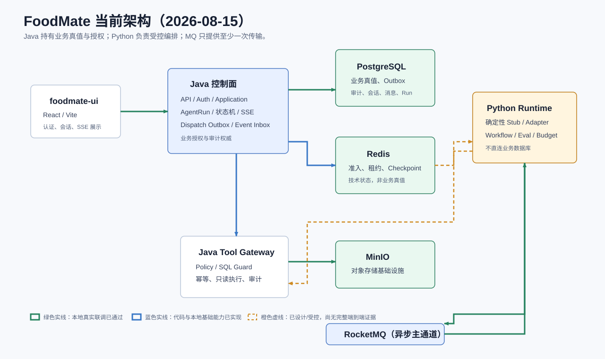
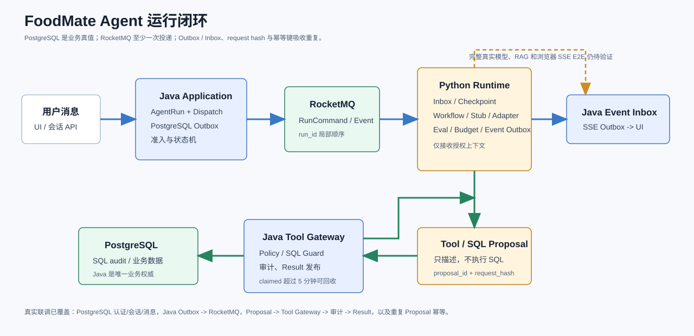

# FoodMate

FoodMate 是面向饮食记录、营养分析与备餐规划的任务型 Agent 产品。它不提供医疗诊断、治疗、处方或紧急健康决策；涉及高风险健康判断时，系统应安全降级并提示用户咨询医生或注册营养师。

## 项目架构



核心边界：

- `foodmate-ui` 负责用户界面、认证交互、SSE 展示以及追问/写确认状态。
- Java 控制面是用户、授权、饮食业务数据、工具执行、写确认和审计的唯一权威。
- Python `agent-runtime` 负责受控 Agent 编排、模型适配与结果组装，不能直连 FoodMate 业务数据库。
- PostgreSQL 是业务真值；Redis 保存协调、租约和 checkpoint 等技术状态；RocketMQ 提供至少一次异步传输。



完整的边界、状态机、预算、Eval、写确认与退回规则见：[架构总览](./docxs/架构/架构总览.md)、[Agent 运行架构](./docxs/架构/Agent运行架构.md)、[M1-5 实施方案](./docxs/项目/M1-5核心饮食业务与写确认实施方案.md)、[ADR-0005](./docxs/决策/ADR-0005-RocketMQ异步主通道.md)。

## 当前真实状态（2026-08-15）

以下仅记录已经运行验证的事实；“已实现”不等于已经完成完整生产闭环。

| 范围 | 已验证事实 |
|---|---|
| 本地基础设施 | Docker 中 PostgreSQL、Redis、MinIO、RocketMQ NameServer/Broker/Proxy 均可 healthy。 |
| M1-2/M1-3 基础链路 | PostgreSQL E2E 已验证注册、登录、Cookie/CSRF、会话创建、消息持久化和读取；Java -> Python deterministic stub -> Java -> SSE 最小闭环已验证。 |
| 异步传输 | Java PostgreSQL Outbox -> RocketMQ -> Consumer 的真实 E2E 已验证 envelope、`request_hash`、`dispatch_id` 与 `run_id`。 |
| Tool/SQL 闭环 | Proposal -> Java Tool Gateway -> 只读 SQL / 审计 -> Result 的真实 E2E 已验证；SQL 失败会记录 `SQL_EXECUTION_FAILED`，重复 Proposal 不重复执行。 |
| M1-5 饮食业务 | 饮食记录创建、查询、编辑、删除、恢复，today/7d/30d 分析，餐食计划生命周期和购物清单已接入 Java/SQL/API；5 条 approved 营养 seed 与 5 条 USDA foodPortions 单位换算规则的 matched/pending 分支已验证。 |
| M1-5 写确认 | `meal_plan.save_plan` 和 `food_log_writer` 的 create/update/delete/restore 已完成 Proposal -> Confirm -> Execute；reject、failed、superseded、revision 冲突、失败回滚/审计和幂等重放已通过真实 PostgreSQL HTTP/RocketMQ 回归。 |
| Agent 与 Eval | `run.eval_decided`、预算、checkpoint、continuation、追问和安全降级已进入运行路径；默认仍是 `deterministic:local`。真实云模型仅完成单次适配/Eval 验证，长时间稳定性和生产 RAG 仍未完成。 |
| 恢复与 M1-6 本地门禁 | 已验证 Runtime readiness、Redis AOF 探针恢复、RocketMQ 重启/Topic 初始化、双 JVM 有界读取和 Java 重启回读；完整 PostgreSQL/Outbox/Inbox/SSE 故障矩阵仍未完成。 |
| 前端 | G1-G6 页面代码边界、追问/确认/失败/取消/SSE 状态已完成；独立运行前端回归为 20 个测试文件、94/94，typecheck/build 已通过。真实管理详情、知识库/RAG 和部分业务接口仍有明确 mock/空态边界。 |
| Java 回归 | 最近一次 `mvnw.cmd verify` 执行 221 条测试、0 失败、0 错误和 48 条环境跳过；HTTP 与 RocketMQ writer 回归各 11/11，包含官方 foodPortions 换算 matched/pending 数据库断言。Spotless 全部通过。 |

当前不能宣称完成的内容：

- Python Runtime 的生产 RAG 与更完整 Tool/SQL 业务编排闭环。
- 单位换算、更广泛的营养目录和完整的业务 Tool/SQL 覆盖。
- 生产资源上的长时间压测、P95/P99 容量结论、跨节点故障切换、PostgreSQL 进程故障和持续业务 Agent 流量验证。
- 供应商正式价格表核准、账单抽样对账、人工 Eval 校准样本、成本异常告警和完整生产监控治理。
- 真实知识库导入、RAG 检索、管理端真实详情数据和生产浏览器兼容性验收。

## 本地启动

### 1. 启动基础设施

先参考 [`docker/.env.example`](./docker/.env.example) 补齐本地根目录 `.env`，尤其是 MinIO 管理员凭据；不要把真实云模型密钥提交到仓库。

```powershell
docker compose --env-file .env -f docker/compose.yml up -d
docker compose --env-file .env -f docker/compose.yml ps
```

`rocketmq-namesrv` 与 `rocketmq-broker` 分别是名称服务和消息存储/投递节点；`rocketmq-proxy` 是 Python RocketMQ 5.x gRPC 客户端使用的协议代理，不是额外的 Broker。

### 2. 启动 Java 控制面

```powershell
.\mvnw.cmd -pl foodmate-bootstrap -am package
& java -jar '.\foodmate-bootstrap\target\foodmate-bootstrap-0.1.0-SNAPSHOT.jar' '--spring.profiles.active=local'
```

`local` 连接本地真实 PostgreSQL 等基础设施；`local-stub` 只用于不依赖真实基础设施的兼容/开发场景。

```powershell
Invoke-WebRequest http://localhost:8080/actuator/health
```

### 3. 启动前端

```powershell
cd foodmate-ui
npm install
npm run dev
```

### 4. 运行已使用的验证命令

```powershell
.\mvnw.cmd verify
.\mvnw.cmd -pl foodmate-bootstrap -am '-Dfoodmate.local-e2e=true' '-Dtest=LocalPostgresE2ETest' '-Dsurefire.failIfNoSpecifiedTests=false' test
.\mvnw.cmd -pl foodmate-bootstrap -am '-Dfoodmate.local-mq-e2e=true' '-Dtest=M14RocketMqTransportE2ETest' '-Dsurefire.failIfNoSpecifiedTests=false' test
.\mvnw.cmd -pl foodmate-bootstrap -am '-Dfoodmate.local-mq-e2e=true' '-Dtest=M14ProposalResultE2ETest' '-Dsurefire.failIfNoSpecifiedTests=false' test
.\mvnw.cmd -pl foodmate-bootstrap -am '-Dfoodmate.local-e2e=true' '-Dtest=M14RuntimeCheckpointRecoveryE2ETest' '-Dsurefire.failIfNoSpecifiedTests=false' test
.\mvnw.cmd -pl foodmate-bootstrap -am '-Dfoodmate.local-mq-e2e=true' '-Dtest=M15FoodLogWriterHttpE2ETest,M15FoodLogWriterProposalResultE2ETest' '-Dsurefire.failIfNoSpecifiedTests=false' test
```

## 文档

[文档索引](./docxs/文档索引.md) 是唯一导航入口。发生冲突时，以实际代码、迁移和测试事实优先；内部 Java/Python 消息以[双运行时内部契约 V1](./docxs/契约/双运行时内部契约V1.md)为准。

## 2026-08-15 当前进度补充

- M1-5 的饮食记录、营养分析、餐食计划、购物清单和写确认核心范围已进入真实 Java/SQL/API 链路；`food_log_writer` 已覆盖 create/update/delete/restore，并完成 HTTP 与 RocketMQ 各 11/11 跨进程回归；5 条官方 foodPortions 换算规则已导入并校验。
- Agent 运行路径已支持 `run.eval_decided`、预算、checkpoint、continuation、追问和审批确认；写入仍由 Java 授权和执行，Python/模型不直连业务库。
- M1-6 已完成本地 Actuator/metrics 配置回归、Runtime readiness、Redis AOF 探针恢复、RocketMQ 重启恢复、双 JVM 有界读取和 Java 重启回读；生产故障矩阵和容量门禁仍待目标环境执行。
- Python 本地 Eval 当前记录为 `56 passed, 1 skipped`，前端独立回归为 `20` 个测试文件、`94/94`，typecheck/build 已通过；这些结果不等于生产人工校准、统一指标系统或长期稳定性结论。

## M1-5 / M1-6 收尾边界

已完成本地真实基础链路、跨进程 checkpoint 恢复、RocketMQ Proposal/Result、Eval Gate、饮食记录与餐食计划第一切片、写确认和 5 条官方食材级单位换算规则。当前仍不能宣称生产完成：更广泛营养目录和业务工具、生产资源长压与容量结论、队列防饥饿、多实例业务流量、PostgreSQL/完整 Outbox/Inbox/SSE 故障矩阵、真实云模型长时间稳定性、生产 RAG、正式价格/账单对账，以及人工校准驱动的生产 Eval 指标告警仍需在目标环境执行。
