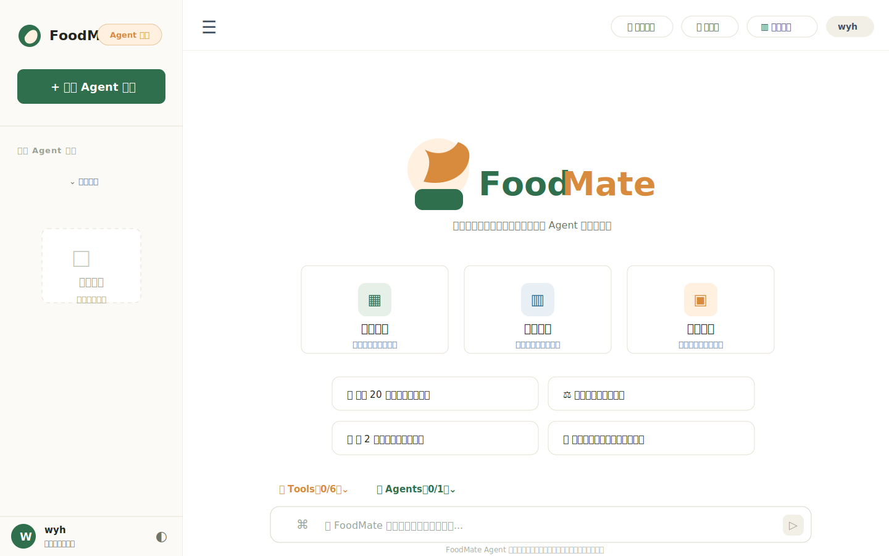
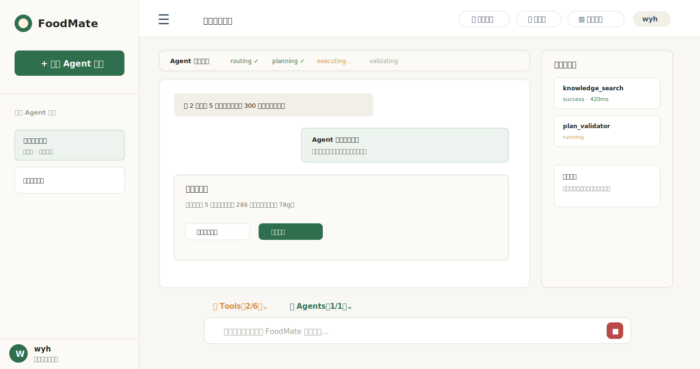
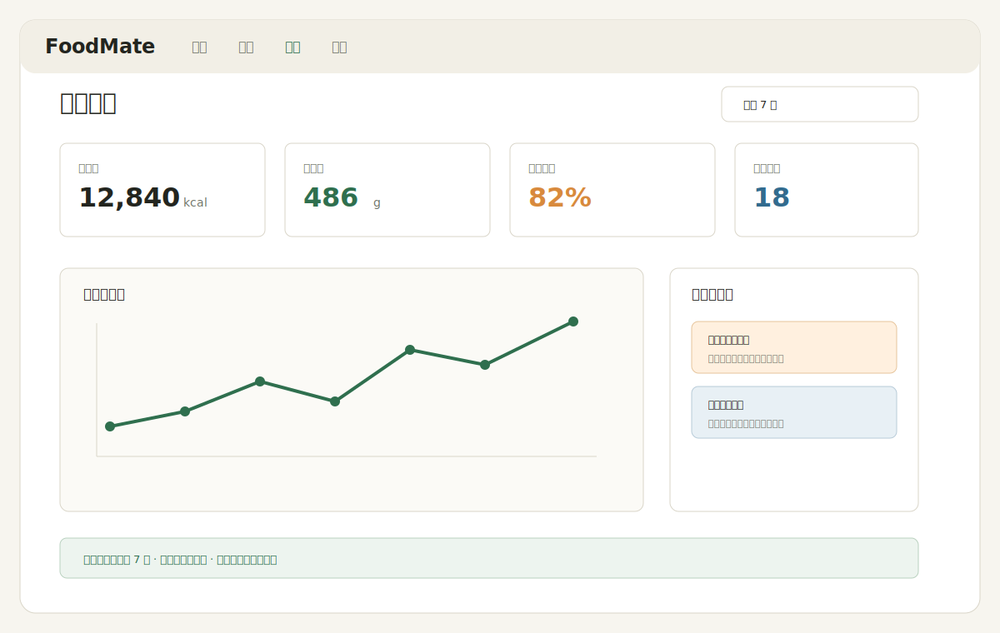
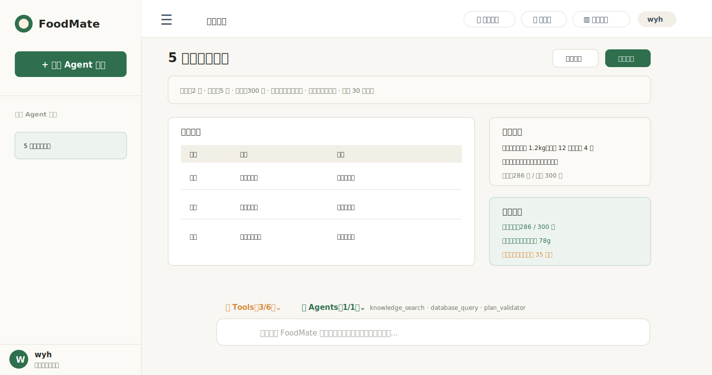
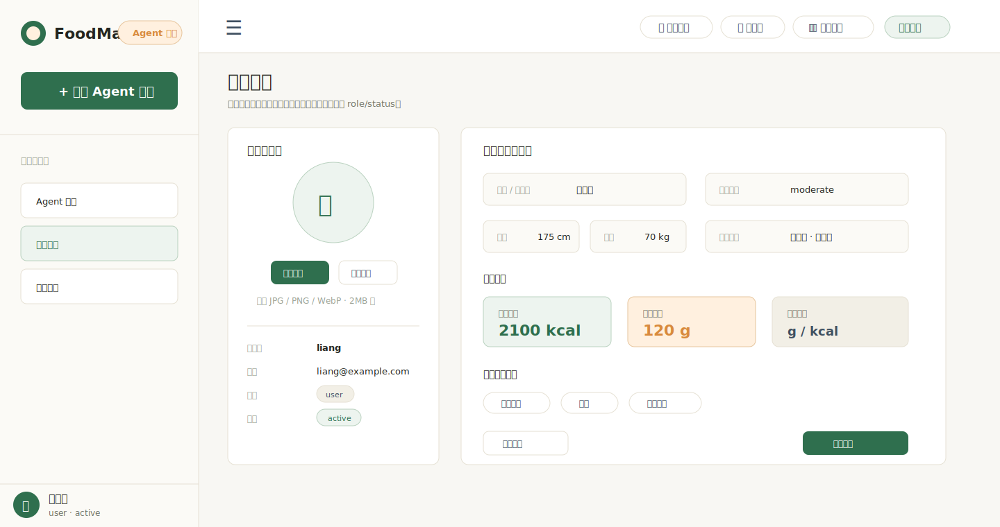
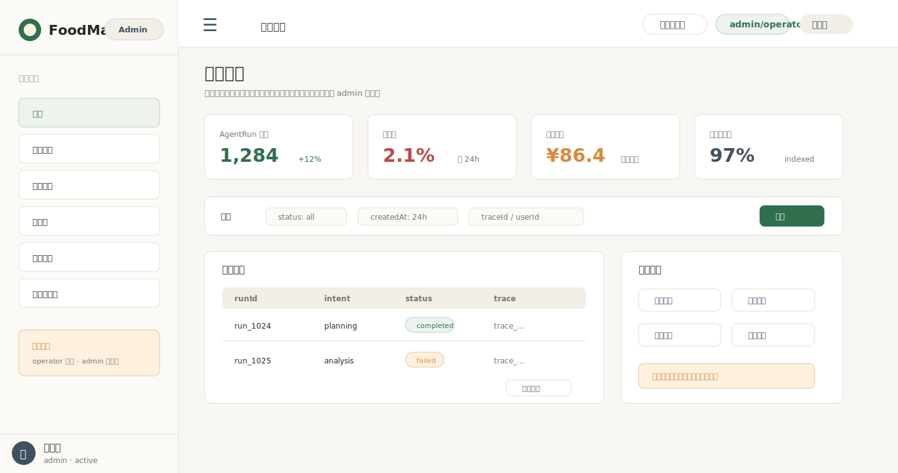

# FoodMate UI 设计文档

版本：v1.0  
状态：UI 工作流入口文档  
详细来源：`FoodMate-产品需求文档.md`、`FoodMate-实现附录.md`

## 1. 设计方向

FoodMate 应该像一个餐饮任务工作台：克制、清晰、温暖、重执行。它不是营销落地页，也不是只负责聊天的输入框，而是用户每天可以用来记录、分析和规划饮食的操作界面。

推荐方向：

- 信息密度适中，但必须易读。
- 采用 Arco Design 的清晰控件体系和 FoodMate 自定义浅色中性画布，搭配自然、食物相关的强调色。
- 明确展示 Agent、工具、引用、确认等执行状态。
- 卡片只用于重复项、结果、确认和紧凑工具，不把所有区域都做成卡片。
- 表格和图表优先服务扫读、比较和复盘。
- 首页空态优先采用“左侧会话栏 + 顶部模块入口 + 中央能力入口 + 推荐任务 + 底部输入区”的 Agent 工作台结构，让用户进入页面后立刻知道能做什么、从哪里开始。
- 桌面端原型以单屏工作台为目标，首屏必须同时露出侧栏、顶部导航、核心内容、Tools/Agents 状态和输入区。
- 允许 Arco Design 参与整体视觉优化，但不能直接套用通用后台模板。

## 2. 导航结构

主布局：

```text
+--------------------------------------------------------------------------------+
| 顶部栏：FoodMate / 模块切换 / 全局状态 / 用户入口                              |
+-------------------------+------------------------------------------------------+
| 左侧栏                  | 主工作区                                             |
| - 新建会话              | - 首页、会话、分析或规划页面                         |
| - 搜索会话              | - Agent 状态和工具轨迹                                |
| - 最近会话              | - 底部输入区                                          |
+-------------------------+------------------------------------------------------+
```

主模块：

| 模块 | 作用 |
|---|---|
| 首页 | 发起常用任务和继续会话 |
| 会话 | Agent 主执行工作区 |
| 分析 | 展示摄入、营养和趋势报告 |
| 规划 | 展示餐食计划、购物清单和校验结果 |
| 知识 | 后续可作为知识库或管理入口 |
| 个人资料 | 展示和修改昵称、头像、营养目标、忌口和单位偏好 |
| 管理后台 | 管理员和运营人员查看治理、审计、工具、知识库和用户状态 |

## 3. 原型图

下面的原型图是低保真布局稿，用来帮助开发者快速理解页面骨架、信息层级和核心状态。它们不是最终高保真视觉稿，真实实现时仍以本文件的组件、状态和视觉规范为准。

桌面原型统一采用 `1440 x 760` 的单屏工作台比例：不需要上下滚动就能看完整体结构。真实页面可以在消息流、表格、列表等局部区域内部滚动，但不能让用户进入页面后还要滚动才能看到底部输入区或关键操作。

### 3.1 首页原型



首页原型参考了常见 Agent 工作台的信息组织方式：左侧负责会话管理，顶部负责模块切换，中央负责展示核心能力和推荐任务，底部固定承载工具状态和自然语言输入。实现时可以参考这种清晰结构，但视觉风格、命名和能力文案必须保持 FoodMate 自身定位。

### 3.2 会话页原型



### 3.3 分析页原型



### 3.4 规划页原型



### 3.5 个人资料页原型



### 3.6 管理后台原型



## 3.7 Arco Design 视觉策略

现有 6 张 SVG 原型图是信息结构基准，不是逐像素高保真稿。实现时可以用 Arco Design 优化控件质感、间距、状态反馈和交互细节，但不能改变以下核心结构：

- 左侧会话栏、顶部模块入口、主工作区、底部 Composer 必须同时成立。
- Tools / Agents 是底部工作台状态入口，不是装饰信息。
- 会话页必须同时展示消息流、Agent 状态、工具轨迹、引用和输入区。
- 分析页和规划页必须保留摘要、明细、校验和下一步动作。
- 个人资料页必须保留头像、账号资料、饮食画像、安全设置和保存反馈。
- 管理后台必须保留角色权限提示、分页筛选、审计列表和高风险操作确认入口。

Arco 参与方式：

| Arco 组件 | FoodMate 使用方式 |
|---|---|
| `Button` | 发送、停止、确认、取消、重试、快捷任务操作 |
| `Input` / `Input.TextArea` | Composer、搜索会话、追问回复 |
| `Modal` | 高风险确认、保存计划、删除或恢复确认 |
| `Drawer` | 工具轨迹详情、引用详情、移动端侧栏 |
| `Tooltip` | 图标按钮、状态说明、工具解释 |
| `Tabs` | Tools / Agents 展开面板或后续管理视图 |
| `Table` | 餐食计划、分析明细、后续管理列表 |
| `Card` | 指标卡、任务卡、结果卡的基础容器 |
| `Tag` | Agent 状态、Tool 状态、风险等级 |
| `Progress` | Agent 阶段推进、校验进度 |
| `Skeleton` | 页面和局部加载态 |
| `Message` | 操作反馈和错误提示 |

FoodMate 必须自定义：

- 工作台布局。
- 左侧会话栏。
- 底部 Composer。
- Tools / Agents 状态区。
- 消息流、工具轨迹和引用区域。
- ResultCard、CitationBlock、ClarificationCard、ConfirmationCard。
- 背景、卡片层级、食物相关色彩和轻量动效。

禁止事项：

- 不直接套 Arco Pro 后台模板。
- 不让默认组件库蓝色成为唯一主视觉。
- 不把页面做成通用后台管理系统。
- 不为了组件库默认布局牺牲单屏工作台结构。

## 4. 页面规格

### 4.1 首页

目的：让用户快速开始任务或继续历史任务。

必备区域：

- 左侧栏：新建会话、搜索、置顶会话、最近会话。
- 顶部栏：折叠菜单、饮食管理、知识库、数据分析、用户入口。
- 主区域：FoodMate 品牌识别、核心能力卡片、推荐任务。
- 底部输入区：Tools/Agents 状态、自然语言输入、附件入口、发送按钮。
- 空态区域：无会话时明确显示“暂无会话”和新建入口。

线框：

```text
[左侧栏：FoodMate / Agent 模式 / + 新建 Agent 会话 / 最近会话 / 用户资料]
[顶部栏：折叠菜单 | 饮食管理 | 知识库 | 数据分析 | 用户]

主区域：
  FoodMate 品牌识别
  核心能力：
    [热量计算] [摄入分析] [复杂规划]
  推荐问题：
    “计算 20 克鸡胸肉的卡路里”
    “帮我记录今天的午餐”
    “为 2 人制定一周备餐计划”
    “分析豆腐和牛肉的蛋白质含量”

底部输入区：
  Tools（0/6） / Agents（0/1）
  [输入框：让 FoodMate 计算、分析、记录或规划...][附件][发送]
```

### 4.2 会话页

目的：执行任务，并让 Agent 行为可理解、可追踪。

必备区域：

- 消息流：用户消息、助手回答、结构化结果卡。
- Agent 运行条：routing、planning、retrieving、executing、validating、composing。
- 工具轨迹：工具名称、状态、耗时、错误、可展开输入输出摘要。
- 引用区域：检索命中的来源和片段。
- 追问卡：关键参数缺失时展示。
- 确认卡：写入记录、保存计划、修改偏好、删除操作前展示。
- 底部输入区：运行中展示停止按钮。

线框：

```text
[左侧会话] [运行状态：规划中 -> 检索中 -> 工具执行中]

消息流：
  用户消息
  Agent 进度条
  追问卡或最终回答
  结果卡：摘要 / 步骤 / 数据 / 风险 / 下一步

轨迹区域：
  工具调用
  引用来源
  当前假设

底部输入区：
  [输入框............................................][停止/发送]
```

### 4.3 分析页

目的：展示结构化摄入报告。

必备区域：

- 时间范围选择。
- 汇总指标：热量、蛋白质、脂肪、碳水、餐次数。
- 趋势图区域。
- 目标对比。
- 异常点和缺失数据提示。
- 后续导出入口占位。

### 4.4 规划页

目的：展示餐食计划和购物清单。

必备区域：

- 约束摘要：人数、天数、预算、目标、忌口。
- 多日菜单表。
- 按类别分组的购物清单。
- 预算估算。
- 计划校验结果。
- 确认保存动作。

### 4.5 个人资料页

目的：让用户管理自己的账号资料和饮食画像。

必备区域：

- 头像区：当前头像、上传、替换、删除和上传限制提示。
- 账号资料：用户名、邮箱、昵称、展示名、账号状态。
- 饮食画像：身高、体重、活动水平、营养目标、热量目标、蛋白质目标。
- 饮食偏好：忌口、过敏原、常用单位。
- 安全设置：修改密码入口、最近登录时间、登录状态提示。

约束：

- 用户不能修改自己的角色和账号状态。
- 头像上传必须有预览和失败反馈，不在未成功上传前伪装为已保存。
- 页面保持工作台式表单布局，不做营销型个人中心。

### 4.6 管理后台

目的：让 `admin/operator` 查看系统运行、审计和治理信息。

必备视图：

- 概览：AgentRun 数量、失败率、工具调用量、模型用量、知识库索引状态。
- 用户管理：用户列表、用户详情、启用、禁用、锁定、重置登录会话。
- 运行审计：AgentRun、ToolCall、SQLAudit、ModelUsage、Trace 查询。
- 知识库：文档列表、上传、下线、恢复、索引状态。
- 工具：工具注册表、版本、启停、风险等级和权限范围。
- 删除资源：查看软删除资源并恢复。

权限展示：

- 普通用户不能看到管理入口。
- `operator` 可进入只读管理视图，高风险按钮隐藏或禁用。
- `admin` 可看到完整操作，但高风险操作必须二次确认。

## 5. 核心组件

| 组件 | 行为要求 |
|---|---|
| 会话列表 `SidebarSessionList` | 支持搜索、最近会话、置顶状态、当前会话高亮 |
| 任务卡 `TaskCard` | 点击后带入预设任务模板 |
| 输入区 `Composer` | 文本输入、附件入口、发送、停止、禁用和加载状态 |
| Agent 状态条 `AgentStatusStrip` | 展示当前运行阶段和下一步状态 |
| 工具轨迹项 `ToolTraceItem` | 展示工具名、状态、耗时、重试次数、可展开摘要 |
| 结果卡 `ResultCard` | 展示摘要、结构化数据、步骤、风险、下一步动作 |
| 引用块 `CitationBlock` | 展示标题、片段、分数或来源元数据、可展开详情 |
| 追问卡 `ClarificationCard` | 展示 1 到 3 个短问题，有选项时支持快捷回复 |
| 确认卡 `ConfirmationCard` | 展示写入目标、数据预览、确认和取消 |
| 头像上传 `AvatarUploader` | 展示预览、上传限制、替换、删除和错误反馈 |
| 权限守卫 `AccessGuard` | 根据登录状态和角色展示受保护页面、403 或登录跳转 |
| 管理表格 `AdminDataTable` | 管理后台列表、筛选、分页和状态标签 |
| 空态 `EmptyState` | 给出任务入口，不写长篇介绍 |
| 错误态 `ErrorState` | 说明失败原因、是否可重试和可选降级路径 |

## 6. Tools / Agents 状态区

底部 `Tools` 和 `Agents` 是 Agent 工作台的核心状态入口，不只是装饰信息。

### 6.1 Tools

`Tools（x/6）` 表示当前会话中可用工具总数和本轮已使用工具数。`6` 来自 MVP P0 工具清单，`x` 来自当前 `AgentRun` 下已经开始或完成的 `ToolCall` 数量，不表示页面模块数量。它对应后端的工具系统：

- `ToolRegistry`：工具注册表，负责工具名称、版本、schema、权限、风险等级和启停状态。
- `ToolExecutor`：工具执行器，负责参数校验、执行、超时、重试和结果封装。
- `ToolCall`：工具调用记录，负责展示工具名称、状态、耗时、输入输出摘要和错误原因。

MVP 中 `Tools（0/6）` 的 6 个工具对应：

- `calculator`
- `time_parser`
- `knowledge_search`
- `database_query`
- `food_log_writer`
- `plan_validator`

原型计数口径：

| 页面/场景 | 展示 | 对应工具 |
|---|---|---|
| 首页空态 | `Tools（0/6）` | 尚未创建 `AgentRun` |
| 会话规划中 | `Tools（2/6）` | `knowledge_search`、`plan_validator` |
| 分析页 | `Tools（2/6）` | `time_parser`、`database_query` |
| 规划页 | `Tools（3/6）` | `knowledge_search`、`database_query`、`plan_validator` |

说明：购物清单在 MVP 阶段可以先由 `planJson` 聚合或由 `AnswerComposer` 结构化输出，不计入 P0 工具数量；后续如果实现 `shopping_list_generator`，再作为 P1 工具加入。

UI 行为：

- 点击 `Tools` 展开当前可用工具列表。
- 执行中显示工具状态，例如 running、success、failed、timeout。
- 工具失败时必须能看到错误原因和是否可重试。
- 高风险工具，例如 `food_log_writer`，必须展示“需要确认”。

### 6.2 Agents

`Agents（x/1）` 表示当前会话中参与执行的 Agent 数量。MVP 阶段先只有一个主 Agent，对应后端的 Agent 编排链路：

- `AgentRun`：一次用户消息触发的一轮运行。
- `Orchestrator`：总调度，负责路由、规划、执行、校验、组装。
- `IntentRouter`：意图识别。
- `TaskPlanner`：任务规划。
- `ExecutionEngine`：调用 RAG、Tool、SQL Agent 或 ModelService。
- `AnswerComposer`：组装最终答案。

UI 行为：

- 空态显示 `Agents（0/1）`。
- 运行中显示 `Agents（1/1）`。
- 展开后展示当前 AgentRun 状态，例如 routing、planning、retrieving、executing、validating、composing、completed、failed、cancelled。
- 后续如果增加多 Agent，可在这里展示 Planner Agent、Data Agent、Nutrition Agent 等角色，但 MVP 不做多 Agent 平台化。

前端展示状态与后端契约：

| UI 状态 | 后端状态或事件来源 | 展示含义 |
|---|---|---|
| `routing` | `run.routed` | 已完成意图识别，准备进入规划 |
| `planning` | `run.planned` 前后 | 正在拆解任务或生成执行计划 |
| `retrieving` | `run.retrieval_started` / `run.retrieval_finished` | 正在检索知识库或引用来源 |
| `executing_tools` | `run.tool_started` / `run.tool_finished` + `ToolCall.status` | 正在调用确定性工具、SQL Agent 或写入工具 |
| `validating` | `plan_validator` 或结果校验阶段 | 正在校验计划、预算、营养或输出结构 |
| `composing` | `run.answer_stream` | 正在组装和流式输出最终回答 |
| `waiting_user` | `run.clarification_requested` | 缺少关键参数，等待用户补充 |
| `completed` | `run.completed` | 本轮执行完成 |
| `failed` | `run.failed` | 本轮执行失败，需要展示原因和重试方式 |
| `cancelled` | `run.cancelled` 或 `AgentRun.status=cancelled` | 用户主动停止，不按系统失败处理 |

## 7. 页面状态

每个核心页面必须覆盖：

| 状态 | UI 要求 |
|---|---|
| 空态 | 展示可执行的起始动作，不展示假数据 |
| 加载中 | 使用骨架屏或进度条，避免布局跳动 |
| 执行中 | 展示 Agent 状态、当前工具和取消入口 |
| 追问中 | 展示缺失字段和聚焦回复路径 |
| 错误态 | 保留用户输入，说明失败原因和重试方式 |
| 完成态 | 展示结果、依据、下一步动作和执行轨迹入口 |

会话页需要额外覆盖：

- `routing`
- `planning`
- `retrieving`
- `executing_tools`
- `validating`
- `composing`
- `waiting_user`
- `completed`
- `failed`
- `cancelled`

## 8. 视觉规范

第一版 UI 原型推荐使用以下设计 token：

| Token | 值 |
|---|---|
| 背景色 | `#F7F5EF` |
| 表面色 | `#FFFFFF` |
| 主文字 | `#23251F` |
| 次级文字 | `#6F7468` |
| 边框 | `#D9D5C8` |
| 主色 | `#2F6F4E` |
| 深主色 | `#1F4F38` |
| 强调色 | `#D88A3D` |
| 危险色 | `#B94A48` |
| 信息色 | `#326B8E` |
| 圆角 | 卡片和控件统一 `8px` |
| 正文字体 | `Aptos`、`Noto Sans SC` 或项目选定的可读 UI 字体 |
| 数字字体 | 优先使用等宽或 tabular numeric 字体特性 |

交互规则：

- 发送、停止、搜索、置顶、展开、导出等命令优先使用图标按钮。
- 文本按钮只用于“确认保存”“重试”等明确命令。
- 不熟悉的图标需要 tooltip。
- 长文本换行，不通过撑开容器解决。
- 底部输入区在流式输出时高度保持稳定。
- Agent 进度更新不能造成消息列表明显跳动。

## 8.1 轻量动效策略

动效用于增强 Agent 工作台的“正在执行”和“可追踪”感，不用于炫技。

允许动效：

- 页面进入时的轻量 fade/slide。
- 首页任务卡 hover/focus 的轻微抬升和阴影变化。
- Agent 状态推进时的进度条、Tag 和当前阶段高亮过渡。
- 工具轨迹展开/收起时的透明度或高度过渡。
- 追问卡、确认卡出现时的轻量弹入。
- mock answer stream 的逐步文本输出。

性能边界：

- Phase 1-2 优先使用 CSS transition / animation。
- 不引入 Framer Motion 等额外动画库，除非后续明确需要。
- 动效不能阻塞首屏渲染。
- 输入区高度必须稳定，不因流式输出跳动。
- 支持 `prefers-reduced-motion`，用户减少动态时关闭非必要动效。

## 9. 响应式规则

| 宽度 | 行为 |
|---|---|
| `>= 1200px` | 单屏工作台布局，左侧栏、主工作区、底部输入区必须同时可见 |
| `768px - 1199px` | 左侧栏折叠为图标栏，轨迹面板变成抽屉 |
| `< 768px` | 单列布局，侧栏变成弹层，输入区固定底部 |

移动端必须保证：

- 消息内容可读。
- 发送和停止按钮容易点击。
- 工具轨迹默认折叠但可访问。
- 卡片不超出视口，只有表格允许明确的横向滚动。

桌面端实现要求：

- 不允许页面整体滚动后才能看到输入区。
- 消息流、会话列表、工具轨迹、表格可以作为局部滚动区域。
- 首页空态必须完整露出品牌、能力卡、推荐任务、Tools/Agents 和输入框。

## 10. 实现说明

- 第一轮前端实现优先做首页和会话页。
- 分析页和规划页第一阶段可以使用静态数据。
- 工具失败不能被隐藏，需要以用户可理解的方式展示。
- 不能展示原始内部 Prompt 或推理过程。
- API 事件名和运行状态应遵循 `FoodMate-接口与数据规范.md`。

## 11. 文档定位

本文是 UI 和交互入口。更完整的页面样例和实现细节仍以 `FoodMate-实现附录.md` 为准。
