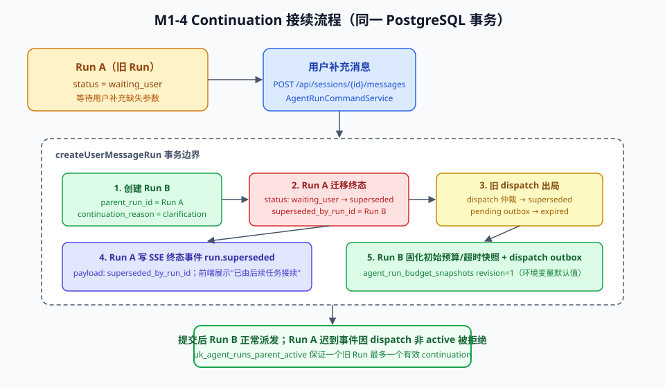

# M1-4-1 Continuation 接续与预算快照实现逻辑

> 本文档按[功能实现逻辑说明模板](./功能实现逻辑说明模板.md)记录 M1-4 阶段 B 已实现并验证的功能点。
> 只记录已验证事实；RocketMQ、LangGraph、真实模型和 Eval 等 M1-4 其余部分见后续文档。

## 1. 文档信息

| 项目 | 内容 |
|---|---|
| 功能名称 | Continuation 接续、superseded 终态与预算/超时快照 |
| 功能编号/阶段 | M1-4 阶段 B |
| 文档版本 | v1.0 |
| 实现日期 | 2026-07-26 |
| 适用环境 | local |
| 实现状态 | 已实现并通过本地 E2E；预算追加恢复入口已接入 |
| 关联方案或需求 | [M1-4 实施方案](../项目/M1-4%20Python%20Agent%20Runtime最小真实闭环实施方案.md) §3.2、§5.14；[Agent 运行架构](../架构/Agent运行架构.md) §11 |

## 2. 功能概述

### 2.1 功能目标

- 用户在 Run 进入 `waiting_user` 后发送补充消息时，创建 continuation Run 接续任务，旧 Run 迁移到 `superseded` 终态，不再占用 Session active 位。
- 每个新 Run 在创建事务中固化不可变的预算与超时快照（`RunBudgetSnapshot` 数据模型），供后续 Python Runtime 与预算追加使用。
- AgentRun 终态（completed/failed/cancelled/superseded）之后，迟到事件不得使状态回退。

### 2.2 适用范围

- 包含：数据库迁移 V5/R5、Java continuation 事务、初始预算快照、`run.superseded` SSE 事件、前端 superseded 状态展示、终态不回退保护。
- 不包含：工具审批恢复和 Python 侧完整 continuation 上下文消费；预算追加确认 API 已在 Java/前端接入并沿用原 Run + 新 dispatch attempt。

### 2.3 前置条件

- 已执行人工迁移 `script/sql/FoodMate/migration/V5__m1_4_continuation_and_budget.sql`（回滚：`rollback/R5__m1_4_continuation_and_budget.sql`）。
- 预算/超时默认值可用环境变量覆盖（见[配置指南](../项目/配置指南.md#54-token成本与预算追加)），未配置时使用文档默认值，不需要任何模型 API Key。

## 3. 接口清单

本阶段不新增 HTTP 接口；`POST /api/sessions/{session_id}/messages` 行为扩展，`GET /api/agent-runs/{run_id}` 与 SSE 流新增可见状态。

| 接口地址 | HTTP 方法 | 行为变化 | 是否需要登录 | 是否需要 CSRF |
|---|---|---|---|---|
| `/api/sessions/{session_id}/messages` | POST | 会话最新 Run 为 `waiting_user` 时自动创建 continuation Run 并接续旧 Run | 是 | 是 |
| `/api/agent-runs/{run_id}` | GET | `status` 可能返回 `superseded`（读取 `agent_runs.status` 权威投影） | 是 | 否 |
| `/api/agent-runs/{run_id}/stream` | GET(SSE) | 旧 Run 订阅方收到终态事件 `run.superseded`，payload 携带 `superseded_by_run_id` | 是 | 否 |

## 4. 实现逻辑

### 4.1 功能点：continuation 接续事务

- **代码入口**：`AgentRunCommandService.createUserMessageRun`（foodmate-application）。
- **主要步骤**：
  1. 查询该 Session 最新未删除且 `status='waiting_user'` 的 Run 作为 parent。
  2. 存在 parent 时，新 Run 落库携带 `parent_run_id` 与 `continuation_reason='clarification'`。
  3. `supersedeParentRun`：旧 Run `waiting_user -> superseded`（带状态条件的 UPDATE，命中 0 行抛 `RUNTIME_STATE_CONFLICT`）；`superseded_by_run_id` 回填；`admission_state='closed'`。
  4. 旧 Run 的 active dispatch 仲裁态迁移为 `superseded`，pending 状态的 dispatch outbox 置 `expired`，阻止 Relay 派发过期命令。
  5. 以 `agent_runs` 行锁（`FOR UPDATE`）自增 `sse_last_stream_seq`，向 `agent_run_sse_outbox` 写入 `run.superseded` 终态事件。
- **关键校验**：数据库唯一部分索引 `uk_agent_runs_parent_active` 保证一个旧 Run 最多一个有效 continuation；并发第二条消息会因唯一索引冲突回滚。
- **失败结果**：任何一步失败整个事务回滚，消息与 Run 均不落库。

### 4.2 功能点：初始预算与超时快照

- **代码入口**：`AgentRunBudgetDefaults`（环境变量解析与合法性校验）＋ `AgentRunCommandService.insertInitialBudgetSnapshot`。
- **主要步骤**：每个新 Run（含 continuation Run）在创建事务中插入 `agent_run_budget_snapshots` revision=1、source='initial' 的快照，字段包含 Token/成本上限、循环预算、四类超时和 `config_version`。
- **关键校验**：非法配置（非正数上限、负数重试）在 Spring 装配时直接抛异常，进程启动失败，符合"非法配置使 readiness 失败"的架构规则。
- **数据表**：`agent_run_budget_snapshots`（唯一键 `agent_run_id + revision`）；`agent_run_budget_extensions` 建表预留，本阶段无写入方。

### 4.3 功能点：终态不回退与权威状态读取

- **代码入口**：`V1RuntimeEventService`（foodmate-application）。
- **主要步骤**：
  - 事件投影 UPDATE 增加 `WHERE status NOT IN ('completed','failed','cancelled','superseded')`，终态后迟到事件不再改写状态。
  - `status(runId)` 优先读取 `agent_runs.status` 权威列（superseded 等 Java 侧终态没有对应 Python 事件，无法从事件历史派生）。
  - SSE 终态类型集合加入 `run.superseded`。

### 4.4 功能点：前端 superseded 展示

- **代码入口**：`foodmate-ui/src/services/agentRunService.ts`、`pages/ChatPage/ChatPage.tsx`、`components/agent/AgentStatusStrip.tsx`、`types/agent.ts`。
- **主要步骤**：SSE 订阅事件列表加入 `run.superseded` 与 `run.clarification_requested`；`AgentDisplayStatus` 增加 `superseded`；状态条以灰色 Tag 展示"已由后续任务接续"。

## 5. 涉及的数据库表

| 表 | 变化 |
|---|---|
| `agent_runs` | 新增 `parent_run_id`、`superseded_by_run_id`、`continuation_reason`、`result_type`；状态 CHECK 增加 `superseded`；约束 `chk_agent_runs_continuation_pair`、唯一部分索引 `uk_agent_runs_parent_active` |
| `agent_run_budget_snapshots` | 新表：预算与超时快照，`UNIQUE(agent_run_id, revision)`，extension 来源必须携带 `confirmation_digest` |
| `agent_run_budget_extensions` | 新表：预算追加确认记录（本阶段仅建表） |
| `agent_run_dispatches` / `runtime_dispatch_outbox` / `agent_run_sse_outbox` | 无结构变化，continuation 事务写入仲裁态/过期态/终态事件 |

## 6. 验收记录

| 验证项 | 方式 | 结果 |
|---|---|---|
| V5/R5 脚本结构 | `FlywayV5MigrationScriptTest`（foodmate-infra，默认套件） | 3 个测试通过 |
| continuation 接续、快照、SSE 事件、dispatch 出局 | `M14ContinuationE2ETest`（真实本地 PostgreSQL，`-Dfoodmate.local-e2e=true`） | 3 个测试通过 |
| 全量回归 | `mvnw test`（JDK 21） | 全部模块通过，5 个环境相关 E2E 按条件跳过 |
| 前端 | `npm run typecheck` + `npm test` | 通过（4 个测试） |
| V5 迁移实库执行 | 本地 Docker PostgreSQL 手工执行 | 成功，约束与索引就位 |

## 7. 已知限制和后续工作

- `continuation_reason='tool_approval'` 路径仍未实现；`budget_extension` 已由预算确认入口恢复原 Run 并创建新 dispatch attempt，仍需生产业务流量验证。
- Run B 目前不向 Python 传递 clarification 上下文（`unresolved_slots`、会话摘要），Python 仍是确定性 stub；属阶段 E/F。
- 预算快照尚未进入 RunCommand wire 契约，Python 侧感知预算属阶段 F。
- 取消与接续的并发（用户同时点取消并发消息）按数据库状态条件裁决：先到者生效，后到者收到 `RUNTIME_STATE_CONFLICT`。
