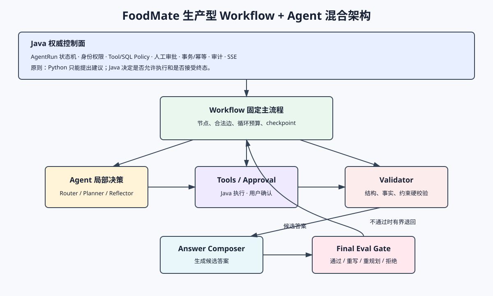
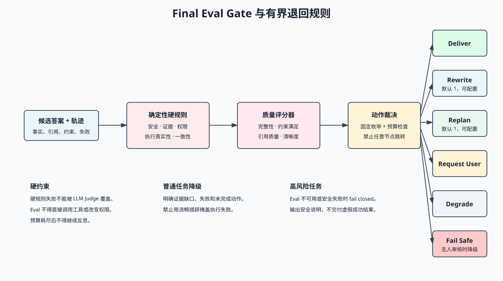

# FoodMate Agent 运行架构

版本：v1.0 目标设计  
维护基线：2026-07-25  
文档定位：本文是 Workflow、Agent 局部决策、人工审批、在线 Eval Gate 和退回规则的唯一架构依据。代码是否完成必须另查实现状态文档，不能根据本文推断。

## 1. 架构结论

FoodMate 采用生产型 `Workflow + Agent` 混合架构：

- Java 控制面维护 AgentRun 权威状态、权限、事务、副作用和审计。
- Python Workflow 固定主流程、节点契约、循环上限和恢复点。
- Agent 只在 Router、Planner、Reflector、Composer 等局部节点内做受约束决策。
- Tool、SQL 和业务写入只能由 Java 在策略校验后执行。
- Human Approval 是高风险动作的显式等待节点，不由模型代替用户确认。
- Validator 执行确定性硬校验；在线 Eval Gate 评价候选答案和执行轨迹。
- Eval 只能返回规定动作，不能直接执行工具、扩大权限或修改业务状态。



## 2. 三层状态

### 2.1 AgentRun 生命周期

Java 保存面向业务和前端的粗粒度权威状态：

`queued/routed/waiting_user/planning/retrieving/executing/validating/completed/failed/cancelled`。

该状态用于查询、SSE、取消和审计，不承担 Python 内部节点游标的职责。Java 必须按合法迁移矩阵拒绝状态回退和终态后事件。

### 2.2 Workflow 节点状态

Python checkpoint 保存当前 dispatch 的节点、计划版本、循环预算、待处理 proposal、已完成步骤和事件游标。节点状态不得覆盖 Java AgentRun，也不能被前端当作业务真值。

### 2.3 局部决策结果

模型节点只输出结构化决策，例如 `route`、`plan`、`next_action`、`candidate_answer` 和 `eval_verdict`。Workflow 校验 schema 和动作白名单后才选择下一条边；模型不得直接指定任意函数或跳转任意节点。

## 3. 内部编排图


### 3.1 固定主流程

1. `Intake` 校验命令、deadline、取消标记和授权上下文。
2. `Router` 输出意图、置信度、所需能力和缺失参数。
3. 缺少必要参数时进入 `Clarification`，由 Java 将 AgentRun 置为 `waiting_user`。
4. 简单且无工具任务可走 `Direct Compose`；复杂任务进入 `Planner`。
5. `Execution Engine` 按计划选择 RAG、Model 或向 Java 提交 Tool/SQL proposal。
6. 高风险 proposal 经 Java Policy 判定后进入 `Human Approval`。
7. 每个执行结果先经过 `Step Validator`，再由 `Reflector` 决定继续、有限重试、重规划或降级。
8. `Answer Composer` 只使用已验证事实、引用和明确失败信息生成候选答案。
9. `Final Eval Gate` 评价候选答案与轨迹，只有 `pass` 才允许完成。

### 3.2 简单任务快速路径

满足以下全部条件时允许跳过 Planner：

- Router 置信度达到配置阈值。
- 不缺必要参数。
- 不需要 Tool、SQL、RAG 或业务副作用。
- 不属于高风险营养或医疗表达。
- 输出仍必须经过 Composer、确定性检查和 Final Eval Gate。

### 3.3 有界循环

- 单步骤模型重试默认最多 2 次。
- 同一工具 invocation 不由 Python 重复执行；重试必须复用幂等键并由 Java 裁决。
- 重新规划默认最多 1 次。
- 最终答案重写默认最多 1 次。
- 总节点步数和总模型调用数由 RunCommand 策略限制。
- 任一预算耗尽都进入降级回答或 `failed`，禁止无限反思。

## 4. Validator 与 Eval Gate

### 4.1 Step Validator

Step Validator 是运行内硬门禁，优先使用确定性规则：

- schema、类型、单位、范围和必填字段。
- Tool/SQL 状态与结果摘要一致性。
- 引用是否存在、是否位于授权范围。
- 计划约束是否满足。
- 是否把拒绝、超时或未知结果伪装成成功。

硬校验失败不能由 LLM Judge 覆盖。

### 4.2 Final Eval Gate

Final Eval Gate 的输入必须包含：用户目标、约束、候选答案、已验证事实、引用、工具结果摘要、失败信息、计划完成情况和版本信息。

评测维度：

| 维度 | 检查内容 | 默认性质 |
|---|---|---|
| safety | 医疗营养风险、越权、敏感内容和危险建议 | 硬门禁 |
| groundedness | 陈述是否由工具结果、业务数据或引用支撑 | 硬门禁 |
| action_integrity | 是否虚构已执行、已保存或已审批 | 硬门禁 |
| constraint_satisfaction | 是否满足预算、人数、时间、禁忌等约束 | 任务相关时硬门禁 |
| completeness | 是否覆盖用户的主要请求 | 质量评分 |
| citation_quality | 引用是否相关、可追溯且未越权 | RAG 任务硬门禁 |
| consistency | 答案内部以及与执行轨迹是否一致 | 硬门禁 |
| clarity | 表达是否清楚、不过度冗长 | 质量评分 |

### 4.3 Eval 输出契约

```json
{
  "verdict": "pass",
  "scores": {
    "groundedness": 0.96,
    "completeness": 0.90,
    "constraint_satisfaction": 1.0,
    "clarity": 0.88
  },
  "hard_failures": [],
  "issues": [],
  "action": "deliver",
  "target_node": null,
  "reason_codes": [],
  "evaluator_version": "final-eval-v1",
  "rubric_version": "foodmate-rubric-v1"
}
```

`verdict` 只允许 `pass/revise/replan/degrade/reject`；`action` 只允许 `deliver/rewrite_answer/replan/retrieve_more/request_user/fail_safe`。Workflow 必须校验 `target_node` 与动作的固定映射。

### 4.4 判定方式

1. 先执行确定性规则；任何硬失败直接生成非通过结论。
2. 再按任务类型执行 LLM-as-judge 或专用评分器。
3. Judge 只能引用输入证据，不得补充新事实。
4. Eval 服务异常时，高风险任务 fail closed；普通只读问答可输出带明确限制的降级答案。
5. Eval 结果、Prompt/rubric 版本、分数和退回动作必须进入轨迹和指标。

## 5. 完整退回规则



| 发现位置 | 条件 | 目标节点 | 上限 | 终止策略 |
|---|---|---|---|---|
| Router | 缺必要参数 | Clarification | 每轮一次聚合追问 | `waiting_user` |
| Router | 低置信且无法安全降级 | Clarification | 1 | `waiting_user` |
| Step Validator | 结构或可修正参数错误 | 当前执行节点 | 2 | 降级或 `failed` |
| Java Policy | 需要用户确认 | Human Approval | 每个 proposal 1 次 | 拒绝则回 Reflector |
| Java Policy | 权限拒绝 | Reflector | 0 | 替代方案或透明失败 |
| Tool/SQL | retryable 技术失败 | 当前执行节点 | 由 Java 策略限制 | 降级或 `failed` |
| Tool/SQL | non-retryable/unknown | Reflector | 0 | 禁止自动重放副作用 |
| Reflector | 计划仍可修复 | Planner | 1 | 降级或 `failed` |
| Final Eval | 仅表达、遗漏或格式问题 | Composer | 1 | 降级或 `failed` |
| Final Eval | 证据不足但可检索 | Retrieval/Planner | 1，且受总预算约束 | 降级回答 |
| Final Eval | 缺用户专属信息 | Clarification | 1 | `waiting_user` |
| Final Eval | 安全、越权或虚构执行 | Fail-safe Composer | 0 | 安全拒绝或 `failed` |
| 任意节点 | 取消、deadline 或预算耗尽 | Terminal Arbiter | 0 | `cancelled/failed` |

退回时必须携带机器可读 `reason_code`、原节点、目标节点、剩余预算和相关证据 ID。不得只用自然语言让模型自行判断跳转。

## 6. Human Approval

- Java Policy 产生 `allow/deny/require_approval`，LLM 无权自报已批准。
- 审批请求必须冻结工具名、版本、规范化参数摘要、风险说明、幂等键和有效期。
- 用户批准后 Java 再校验当前身份、Run、版本、deadline 和参数摘要。
- 参数变化、审批过期或 dispatch 被替代时必须重新审批。
- 拒绝或超时作为观察结果返回 Reflector，不应被伪装成系统失败。
- `waiting_user` 的恢复协议必须区分“补充任务参数”和“批准既定动作”。

## 7. Final Output 与完成条件

只有同时满足以下条件，Workflow 才能建议 `run.completed`：

- 所有必需计划步骤已经成功、明确跳过或透明降级。
- 没有未决审批、未确认副作用或状态未知的 invocation。
- Step Validator 没有未解决硬错误。
- Final Eval Gate 返回 `pass + deliver`。
- Java 接受该事件且当前状态允许进入 `completed`。

前端可以流式展示候选文本，但在 Eval 通过前不得显示“已完成操作”的确定性成功状态。高风险任务应优先缓冲最终承诺性内容，Eval 通过后再交付。

## 8. 在线 Eval 与离线 Eval

- 在线 Eval Gate：服务单次运行，给出交付或有限退回决定。
- 离线 Regression Eval：使用冻结数据集比较模型、Prompt、工具和 rubric 版本，不修改线上 Run。
- 线上抽样审计：异步复评已交付结果，只用于告警、数据集沉淀和版本回滚，不回写历史答案。
- 发布门禁至少比较任务成功率、硬失败率、引用正确率、虚构执行率、平均循环次数、延迟和成本。

## 9. Java 与 Python 职责边界

| 决策 | Python | Java |
|---|---|---|
| 意图、计划、下一候选动作 | 建议 | 记录必要投影 |
| Workflow 节点和循环预算 | 执行并 checkpoint | 下发全局限制、裁决终态 |
| 工具/SQL proposal | 生成 | 授权、执行、幂等、审计 |
| 人工审批 | 等待结果 | 创建、校验和固化审批 |
| 结果质量 | Validator/Eval | 校验业务硬规则与状态迁移 |
| 最终答案 | 生成候选 | 接受事件、持久化并 SSE |
| AgentRun 状态 | 报告建议阶段 | 唯一权威 |

## 10. 实现门禁

- 编排图所有节点和边必须有单元测试。
- 每条退回边必须测试预算耗尽和终止行为。
- Eval schema、rubric、阈值和版本必须可追溯。
- 固定回归集必须覆盖直接回答、RAG、读工具、写工具、审批拒绝、缺参、超时、取消、证据不足和 Prompt Injection。
- 完整实现前，文档与 UI 必须明确标注当前仍是确定性 stub，不能把目标架构描述成已上线能力。
