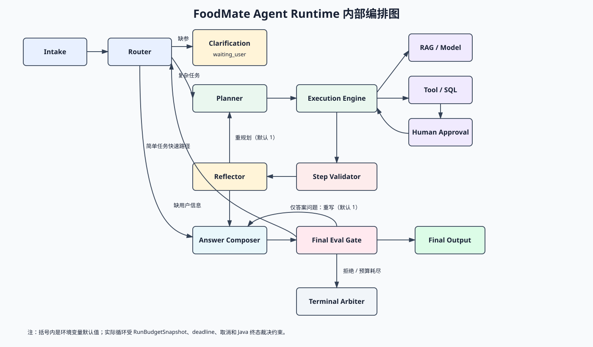
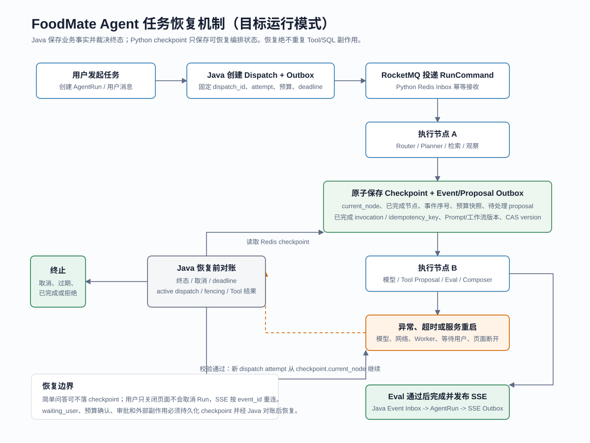

# FoodMate Python 智能体运行时设计

版本：v1.0 目标设计

维护基线：2026-07-26

对应架构：[架构总览](./架构总览.md)、[Agent 运行架构](./Agent运行架构.md)、[Java 控制面工程设计](./Java控制面工程设计.md)

对应契约：[双运行时内部契约 V1](../契约/双运行时内部契约V1.md)、[智能体行为与工具协议](../契约/智能体行为与工具协议.md)

文档定位：本文定义 Python Agent Runtime 的目标工程边界和实现结构。当前仓库已有 `agent-runtime/` 确定性 stub，但 Router、Planner、Execution、Validator、Composer 和 Evaluation 尚未实现；下述目标结构不代表当前实现。Workflow 节点、在线 Eval Gate、循环预算和退回矩阵以[Agent 运行架构](./Agent运行架构.md)为唯一依据。

## 1. 运行时定位

FoodMate 只有两个受控运行时：

- Java 业务控制面是业务数据、`AgentRun`、审计、工具注册与执行、SQL Guard 与 SQL 执行的唯一权威。
- Python Agent Runtime 只负责 Agent 推理与编排，包括 Router、Planner、Execution、RAG、Model、Composer 和 Evaluation。
- Python 不面向前端，不签发用户身份，不判断最终业务权限，不直接执行业务工具或 SQL。
- Python 不持有 PostgreSQL 等业务库的读写凭据；需要业务数据、授权知识范围、工具结果或 SQL 结果时，必须调用 Java 内部接口。

跨运行时契约统一使用 `run_id`。它在 Java 数据库中映射为 `agent_runs.agent_run_id`；`agent_run_id` 只作为现有 V1 数据库列名或外部业务 API 资源字段存在，不进入 Python 内部契约模型。

## 2. 目标目录

```text
agent-runtime/                         # 已有 M1-3 stub；下列为 M1-4 目标内部结构
  pyproject.toml
  src/foodmate_agent/
    main.py                            # FastAPI app 与生命周期
    api/
      dependencies.py                 # Service JWT、Trace、deadline
      exception_handlers.py           # RuntimeError 映射
      routes/
        runs.py                        # RunCommand
        cancellations.py              # CancelCommand
        health.py                      # live/ready
      schemas/                         # Pydantic v2 契约模型
        common.py
        run.py
        tool.py
        sql.py
        error.py
    graph/
      builder.py                       # LangGraph 图装配
      state.py                         # 图内技术状态，不替代 AgentRun
      routes.py                        # 白名单条件边
      checkpoint.py                    # Redis checkpoint 适配与 Java 对账
    nodes/
      router.py
      planner.py
      execution.py
      reflector.py
      validator.py
      composer.py
      eval_gate.py
    policies/
      admission.py                     # Redis 并发准入客户端/结果模型
      budget.py                        # Token、成本和循环预算
      timeout.py                       # TimeoutSnapshot 与 deadline
      model_routing.py                 # 确定性模型分层和 fallback
      degradation.py                   # 软/硬阈值降级动作
    rag/
      query_understanding.py
      retrieval.py
      rerank.py
      citations.py
    model/
      gateway.py
      routing.py
      structured_output.py
      usage.py
    evaluation/
      evaluators.py
      datasets.py
      regression.py
    context/
      builder.py
      summarizer.py
      memory_manager.py                # 短期上下文与长期记忆候选，不直接写业务库
    clients/
      java_control_plane.py
      memory_gateway.py                # 读取授权记忆、提交候选和失效对账
      tool_gateway.py
      sql_gateway.py
    prompts/
      loader.py
      manifest.py
    observability/
      logging.py
      tracing.py
      metrics.py
    config/
      settings.py
  prompts/
    system/
    router/
    planner/
    query-understanding/
    tool/
    sql-agent/
    validator/
    composer/
  tests/
    unit/
    contract/
    integration/
    evaluation/
```

目录只表达目标职责，不要求当前 stub 预建空包。首次创建正式编排工程时应保持单一 Python 部署单元，不预先拆分 RAG、模型或评测微服务。内部状态图固定使用 LangGraph，但 LangGraph checkpoint、事件和 memory 不能成为 Java 业务真值。

## 3. FastAPI 与 Pydantic 边界

### 3.1 内部 HTTP 入口

| 方法 | 路径 | 请求模型 | 成功语义 |
|---|---|---|---|
| `POST` | `/foodmate/internal/v1/runs` | `RunCommand` | 接受或幂等返回同一 `dispatch_id` |
| `POST` | `/foodmate/internal/v1/runs/{run_id}/cancel` | `CancelCommand` | 接受取消，随后以有序 `RunEvent` 确认 |
| `GET` | `/foodmate/internal/health/live` | 无 | 进程和事件循环存活 |
| `GET` | `/foodmate/internal/health/ready` | 无 | 配置、Prompt、模型适配和 Java 回调客户端可用 |

Python 通过 Java 的内部事件入口回传 `RunEvent`，并通过 Java Tool/SQL Gateway 提交 `ToolProposal` 或 `SqlProposal`、接收 `ToolResult` 或 `SqlResult`。具体字段以[双运行时内部契约 V1](../契约/双运行时内部契约V1.md)为唯一依据。

### 3.2 Pydantic v2 约束

- 所有跨运行时 DTO 使用 Pydantic v2 `BaseModel`，`extra="forbid"`；V1 不静默接收未知字段。
- 字段名固定为 `snake_case`，时间固定为带时区 RFC 3339 UTC，ID 在 JSON 中均为字符串。
- 命令、事件、Proposal、Result 和 RuntimeError 按内部契约规定的字段集执行 RFC 8785 JCS + SHA-256；`request_id/trace_id` 是传输追踪字段，不进入幂等摘要。
- `schema_version` 必须精确为受支持版本；不兼容时返回 `RUNTIME_VERSION_UNSUPPORTED`。
- `deadline_at` 在入站校验后立即比较当前 UTC 时间，过期命令不得启动新模型、工具或 SQL 调用。
- API 层只做认证、契约校验、deadline 和幂等入口，不承载规划或模型逻辑。
- OpenAPI 仅作为生成和联调产物；Java/Python 双端必须用同一组 JSON Schema golden fixtures 做契约测试。

### 3.3 服务身份

FastAPI dependency 必须校验短期 Service JWT 的签名、`iss`、`aud`、`exp`、`nbf` 和 service scope。Java 到 Python 固定 `iss=foodmate-control-plane`、`aud=foodmate-agent-runtime`；Python 回调 Java 使用相反方向。用户身份和 scope 由 Java 按 `run_id` 派生，Python 请求体中的同名字段不能成为授权依据。

## 4. 编排组件

| 组件 | 输入 | 输出 | 不允许做 |
|---|---|---|---|
| Router | 用户消息、授权上下文 | 意图、置信度、RAG/工具需求、缺失槽位 | 直接执行工具或写业务状态 |
| Planner | 目标、约束、Router 结果 | 最少必要步骤、依赖和终止条件 | 绕过确认或 Java Policy |
| Execution | 计划、checkpoint、外部结果 | 有序节点推进和 `RunEvent` | 直接访问业务库或把 proposal 当成功结果 |
| RAG | 授权知识范围、查询 | 改写、召回、rerank、引用 | 扩大 ACL 或把检索文本当系统指令 |
| Model | Prompt、结构化 schema | 模型输出、usage、latency、`model_call_id` | 保存业务真值或直接产生副作用 |
| Composer | 已校验事实、引用、执行结果 | 结构化最终回答 | 暴露内部推理或伪造失败结果 |
| Step Validator | 节点结果、计划约束、证据 | 硬校验结果和原因码 | 用模型评分覆盖硬规则 |
| Final Eval Gate | 用户目标、候选答案、已验证事实和完整轨迹 | `pass/revise/replan/degrade/reject` 与固定动作 | 直接调用工具、扩大权限或无限退回 |
| Context/Memory Manager | 当前消息、最近消息、Session 摘要、授权记忆 | 有来源 ID 的受限上下文、摘要或记忆候选 | 直接写 `user_memories`、把推测升级为长期事实 |
| Offline Evaluation | 数据集、轨迹、最终回答 | 离线指标和回归结果 | 改写线上业务状态 |

Execution 采用有界 Plan-Act-Observe-Reflect：每一步有明确输入、输出、终止条件和循环预算。最终候选答案必须通过在线 Eval Gate 后才能建议完成；退回只能沿固定边发生。模型输出、RAG 内容和第三方文本均为不可信输入；工具与 SQL 只能形成 proposal，实际授权、执行和审计由 Java 完成。



## 5. 状态、事件与恢复



### 5.1 任务恢复运行流程

恢复流程采用“`AgentRun` 不变、恢复 dispatch 新建”的模式：用户请求先由 Java 创建 `AgentRun + Dispatch + Outbox`，Python 消费命令后按节点推进。每个可恢复安全点将 `current_node` 和编排技术状态写入 Redis checkpoint；发生模型超时、服务重启、第三方异常或等待用户后，Java 先裁决业务真值，Python 才能按 checkpoint 从下一个未完成节点继续。

- 节点成功后保存 checkpoint，但简单直接问答可以跳过；多步骤、Tool/SQL、`waiting_user`、预算确认和 Eval 前后必须保存。
- checkpoint 必须记录 `current_node`、workflow/Prompt 版本、已完成节点、待处理 proposal、已完成 invocation、`idempotency_key`、最后已发 `event_seq`、预算快照、deadline 和 CAS version。
- 恢复前 Java 必须检查 Run 是否终态、是否取消、是否超过绝对 deadline、dispatch fencing 是否仍归属当前尝试，以及 Tool/SQL 是否已经完成。任一项不满足时不恢复，而是终止、重放已有结果或进入安全降级。
- 自动故障恢复和预算/审批恢复都创建新的 `dispatch_id + attempt`，但保留原 `AgentRun`、原预算快照和原 checkpoint。用户明显改变任务目标时创建新 AgentRun，不复用旧 checkpoint。
- 用户关闭页面只会断开 SSE，不会取消后台 Run；重新进入后由 Java SSE Outbox 按 `event_id/event_seq` 补发。用户主动取消才发布 CancelCommand。
- 外部副作用绝不依据 checkpoint 直接重放。Python 先读取 checkpoint 中的 invocation 事实，再由 Java Tool Gateway/SQL Guard 的 Inbox 和幂等键裁决是否返回已有 Result、允许继续或拒绝。

当前代码已具备 Redis checkpoint 的 CAS、TTL、加密和节点状态写入基础，并新增 Python 恢复契约校验：新 attempt 必须校验前一 dispatch、checkpoint version/digest、预算 revision、deadline 与已完成 invocation，且只允许从 `tool_wait/execution` 安全点恢复。Java 侧恢复命令生成、业务对账事实持久化及跨进程故障恢复 E2E 尚未完成，本节仍不能表述为完整恢复能力。

### 5.1 运行状态

Python 维护的是单次 dispatch 的技术执行状态，Java 维护 `AgentRun` 权威状态。Python 可以建议或报告阶段，但不能覆盖 Java 已接受的终态。V1 不存在 `cancelling`；取消确认后由 Java 决定是否把数据库状态推进为 `cancelled`。

### 5.2 Checkpoint

- checkpoint key 固定包含 `run_id`、`dispatch_id`、`attempt` 和节点名。
- checkpoint 至少保存计划版本、已完成节点、待处理 proposal、最后已发 `event_seq`、未确认事件的 `event_id/request_hash`、已消费运行内错误的 `error_id/request_hash`、Prompt 版本和模型调用引用。
- checkpoint 只能保存恢复编排所需的技术状态，不保存业务库凭据，不替代 `agent_runs`、`tool_calls`、`sql_query_audits` 或审计表。
- 恢复前必须向 Java 对账当前终态、取消请求和已完成 invocation；不能仅凭本地 checkpoint 重放副作用。
- checkpoint 配置必须与业务数据源完全分离，并设置保留期、加密和清理策略。
- 当前目标实现选择 Redis checkpoint namespace，并要求 AOF、版本 CAS、TTL、大小限制和敏感字段应用层加密；以后只有恢复规模出现明确证据时才评估独立技术 PostgreSQL。
- 简单直接回答可以不写 checkpoint；多步骤、Tool/SQL、waiting_user、预算确认和 Eval 退回必须在关键安全节点写 checkpoint。

### 5.3 事件发送

每个 `dispatch_id` 的 `event_seq` 从 1 开始严格递增 1。Python 在发送前持久化或可靠记录事件标识和 canonical request hash；重试重放保持原 `event_id/event_seq/occurred_at/event_type/payload/request_hash`。序号只能由单一 dispatch writer 分配，多个节点并发完成时先汇入有序事件出口。

### 5.4 Context、摘要与记忆

- Context Builder 固定保留最近 8 条有效原始消息；第 9 条有效消息写入后触发增量摘要。当前消息、安全规则和未解决槽位不可被摘要替代。
- Summarizer 输出结构化摘要、覆盖消息 ID 区间、来源数量、Prompt 版本和 digest。Python 只生成候选；Java 以版本/CAS 写入 `session_summaries`。
- 短期记忆只在当前 Session/Run 生效，来源是消息、Session 摘要、当前计划和 checkpoint 技术状态；不得跨用户或绕过 Java 授权复用。
- Memory Manager 只生成长期记忆候选。Java 校验来源、用户归属、敏感性、冲突、scope、置信度和过期时间后写入 `user_memories`。
- 模型推测、一次性参数、预算确认、工具审批和高风险健康推断不得自动写入长期记忆。用户删除或更正后，Python 缓存、摘要和 checkpoint 中的引用必须在恢复/下一次装配前失效。
- Context Builder 输出必须携带实际使用的 `message_id/summary_id/memory_id/citation_id`，用于 Eval、审计和删除传播；不得在 Trace 中复制完整隐私内容。

## 6. Tool、SQL 与模型调用

### 6.1 Tool

Python 只生成 `ToolProposal`。Java 根据 `run_id` 恢复可信用户上下文，校验工具版本、schema、scope、确认、deadline 和 `idempotency_key` 后执行。Python 必须把 `TOOL_POLICY_DENIED`、`TOOL_CONFIRMATION_REQUIRED` 和失败结果作为观察值继续编排，不能伪装为成功。

### 6.2 SQL

Python 只负责查询理解、授权 catalog 选择建议和只读 SQL proposal。Java 重新执行 Schema 授权、AST Guard、敏感字段、用户过滤、LIMIT、超时、执行和审计。Python 代码、环境变量和 Secret 模板中均禁止出现 JDBC URL、业务 PostgreSQL 用户名或密码。

### 6.3 Model

每次逻辑模型调用生成稳定且全局唯一的 `model_call_id`；每次供应商 attempt 生成唯一 `provider_attempt_id`，供应商返回的单次请求标识保存为 `provider_request_id`。供应商重试保持同一 `model_call_id`，但使用新的 `provider_attempt_id/provider_request_id`。

每个 attempt 结束后，Execution 通过标准 `RunEvent(event_type="run.model_usage")` 回传完整 usage、latency、cost、状态和三类模型 ID。`status` 只允许 `success/failed/timeout/cancelled`；未知 token/cost 写 null，不伪造为 0，`latency_ms` 始终记录 attempt 实际耗时。Java 在 `provider_attempt_id` 和非空 `provider_request_id` 去重后，按 `model_call_id` 聚合：token/cost 对已知值求和，latency 取所有 attempts 耗时之和，任一 success 则最终 success，否则取最新结束 attempt 状态。RunEvent envelope 的 `request_id` 只追踪 HTTP 传输，不能作为模型用量唯一键。该规则是 V2 目标设计，不表示当前 Python 工程或 V2 表已经存在。

Python 不读取 V1 `model_usage_logs` 来合成历史 `run.model_usage`，也不为 legacy 父行补造 provider attempt。历史是否可展开只由 Java/Flyway 按 V2 迁移证据规则判定；legacy expanded 子记录不参与线上父聚合。

## 7. Prompt 版本

- Prompt 文件不得写死在 Python 常量或放入 Java 工程。
- 每份 Prompt manifest 必须包含 `name`、`version`、`owner`、内容摘要哈希和兼容的输出 schema 版本。
- 一次 Run 在 dispatch 开始时解析并固定 Prompt 版本；恢复执行沿用原版本，除非 Java 明确发起新 dispatch。
- Prompt 发布采用不可变版本；回滚通过切换激活版本完成，不覆盖旧文件。
- `RunEvent` 的规划、模型和最终结果 payload 应能关联实际 Prompt 版本，便于回放和评测。

## 8. 配置与 Secret

目标配置仅允许包含：

- Runtime 监听地址、worker/并发和超时。
- Java 控制面 URL、Service JWT 签名/验证材料和 scope。
- 模型、Embedding、Rerank 供应商凭据。
- Milvus/对象存储的受限技术访问配置（仅在授权架构落地后启用）。
- checkpoint、Prompt、日志、Trace、指标和评测配置。
- Workflow 预算：`FOODMATE_AGENT_MAX_STEP_RETRIES`、`FOODMATE_AGENT_MAX_REPLANS`、`FOODMATE_AGENT_MAX_ANSWER_REWRITES`、`FOODMATE_AGENT_MAX_TOTAL_STEPS` 和 `FOODMATE_AGENT_MAX_MODEL_CALLS`。

Workflow 预算在 Runtime 启动时解析和校验，在接受 Run 时固化为不可变快照。checkpoint 必须保存该快照，恢复执行不得读取当前环境变量覆盖原值。默认值、单 Run 收紧规则和预算耗尽行为以[Agent 运行架构](./Agent运行架构.md)为准。

并发、排队、四类超时、Token/成本、预算追加、模型路由、Eval、上下文、checkpoint、Trace 和反馈的完整环境变量及默认值以[配置指南](../项目/配置指南.md)为唯一配置说明。环境变量在进程启动时解析；改变环境变量需要受控重启，只影响新 Run，不能热修改已有 Run 的快照。

明确禁止：

- 业务 PostgreSQL/MySQL JDBC/DSN、业务库用户名或密码。
- 可绕过 Java Tool Gateway 的业务服务凭据。
- 用户 Access/Refresh Token 或长期 Service JWT。
- 在日志、checkpoint 或错误详情中输出 Secret、完整 Prompt 敏感上下文或未脱敏工具结果。

启动时执行配置 denylist 校验；发现 `DB_PASSWORD`、业务 JDBC URL 或约定的业务数据源键时 readiness 失败并阻止接收 Run。

## 9. 健康检查

`live` 只验证进程、事件循环和基本线程池，不探测外部依赖。`ready` 验证：

- 配置和 Service JWT key set 可加载。
- Prompt manifest、版本和摘要完整。
- Java 控制面回调地址可解析，契约版本受支持。
- 必需模型适配器已配置；可选供应商失败时按降级策略报告。
- checkpoint backend 可用且 schema 兼容。
- 未检测到业务库凭据。

健康响应不得泄露 Secret、供应商 token 或内部网络凭据。依赖退化通过组件状态和错误码表达，不把 `live` 与 `ready` 混用。

## 10. 日志、Trace 与指标

- 入口读取 `X-Request-Id` 和 W3C `traceparent`；日志统一携带 `request_id`、`trace_id`、`run_id`、`dispatch_id`、`attempt`，涉及调用时再带 `invocation_id`、`model_call_id` 或 `provider_attempt_id`。
- 日志使用结构化 JSON，禁止把完整用户输入、Prompt、工具输出和 SQL 结果默认写入 INFO。
- Trace span 至少覆盖 Router、Planner、Execution 节点、RAG、模型、Java Tool/SQL 往返、checkpoint 和事件发送。
- 指标至少包含运行接受/拒绝、节点耗时、模型调用、proposal、取消延迟、事件重放、序号缺口和 Java 回调失败。
- `event_seq` 是业务协议顺序，不替代 Trace span 顺序；`trace_id` 也不是幂等键。

## 11. 失败与取消

- 已解析出真实 `run_id` 的运行内协议错误使用八类消息中的 `RuntimeError`；Python 作为消费端按 `(run_id,error_id)` 和 canonical digest 去重，同 ID 同 hash 只处理一次并记录到 checkpoint，同 ID 不同 hash 终止该交互并返回 `RUNTIME_ERROR_IDEMPOTENCY_CONFLICT`。恢复时先加载已消费 error key，避免重放错误重复改变编排状态。
- Service JWT 认证、契约版本、JSON 解析等尚未获得可信 `run_id` 的失败使用独立 HTTP `PreRunProtocolError`，不进入 checkpoint、AgentRun 或运行事件流。Python HTTP client 仅按 `request_id/error_id/error_hash` 识别同一响应并遵守服务端 7 天重试窗口；它不能把 pre-run 错误附着到某个 Run。
- deadline 失败若已验证真实 `run_id` 使用 RuntimeError；否则使用 PreRunProtocolError。
- 编排中的可报告失败使用 `run.failed` 事件，payload 引用统一错误码；已发送终态后不得再发另一个终态。
- 收到 `CancelCommand` 后停止创建新的模型、Tool 或 SQL invocation，尝试取消可中断任务，并按当前 dispatch 序列发 `run.cancel_acknowledged`。
- 已提交 Java 的 invocation 不能靠 Python 本地取消假定回滚；必须等待 Java 返回或对账。
- Java 是终态竞争的裁决者；Python 收到 Java 已终态响应后停止执行并清理 checkpoint。
- 取消后不再调用 Composer 或 LLM Eval；只根据 Java 已确认轨迹生成确定性部分摘要。已提交 Tool/SQL 必须继续对账，状态未知时禁止声称未执行。

## 11.1 并发与 Redis 协调

- PostgreSQL 保证每个 Session 最多一个 active Run。
- Redis 协调每用户活跃 Session 上限、全局 active Run 上限、队列和 expirable permit。
- Redis 不可用时新 Agent 请求 fail closed；不得退回进程内业务计数。
- Python worker pool 只保护当前进程资源，不定义系统业务并发上限。

## 11.2 Eval 前缓冲

生产环境禁止在 Final Eval 通过前发送候选答案正文。Python 只回传业务进度事件；候选答案在受限缓冲区内完成 Eval，通过后才转换为 `run.answer_stream`。高风险 `request_review` 在当前无人审核条件下固定进入安全降级，不产生 `waiting_review`。

## 12. RocketMQ 与 Python 技术持久化

### 12.1 消费 RunCommand

- 目标正式模式从 `foodmate-agent-command-v1` 消费 RunCommand/CancelCommand；HTTP endpoint 只保留兼容和契约测试用途。
- 使用 `run_id` 作为局部顺序键，消费并发不得让同 Run 的命令同时进入 LangGraph。
- 先在 Redis Inbox 持久化 `dispatch_id/request_hash`，再 ACK；同 ID 同 hash 为重投，同 ID 不同 hash 终止并报告冲突。
- Redis、契约校验器或 checkpoint repository 不可用时 readiness 失败并停止拉取新消息。

### 12.2 Event/Proposal Outbox

- LangGraph 节点不得直接裸发 RocketMQ；checkpoint 与 Event/Proposal Outbox 使用 Lua/Transaction/CAS 原子写入 Redis。
- Relay 发布到 event/proposal Topic，收到 Broker 持久化确认后标记 `published`。
- Relay 重试保持原 message ID、envelope、event seq 和 request hash。
- Inbox 与已发布 Outbox 默认保留 7 天；不得写入完整 Prompt、Chain-of-Thought 或默认原始模型响应。

### 12.3 回答事件

Eval 通过后才把候选答案切为 `run.answer_stream`。默认每 150ms 或累计 2048 字节生成一个分片，两个阈值均由环境变量配置。时间或大小满足其一即切片；不得把每个模型 Token 作为独立 MQ 消息。

### 12.4 SQL Agent

Python 只消费脱敏、版本化 Schema Catalog，生成 SqlProposal 并等待 Java SqlResult。Runtime 不配置 FoodMate PostgreSQL 凭据，不执行 SQL；未来若引入独立技术 PostgreSQL，也只能保存 Python Inbox、Outbox 和 checkpoint。

## 12. 测试与完成定义

Python 工程后续实现时至少需要：

1. Pydantic 单元测试：必填字段、枚举、未知字段、UTC 时间和 deadline。
2. 双端契约测试：八类消息 golden JSON 在 Java DTO 与 Pydantic 双向通过，并验证每类 canonical digest、稳定重放与同 ID 不同 hash 冲突。
3. 编排测试：追问、工具拒绝、SQL 拒绝、模型失败、重试、取消和终态竞争。
4. 事件测试：重复、乱序、缺口、断线重放、`event_seq` 单调性和 `run.model_usage` 多 attempt 幂等。
5. 安全测试：Service JWT issuer/audience/scope、Prompt Injection、日志脱敏和业务库凭据 denylist。
6. 恢复测试：checkpoint 恢复前与 Java 对账，不重复 Tool/SQL 副作用。
7. Evaluation 回归：固定数据集、Prompt 版本、结构化输出和引用准确性。

完成标准不是目录存在，而是 FastAPI/pytest 可在项目虚拟环境中启动和通过上述测试，并与 Java stub 完成 dispatch、事件、proposal、取消和错误闭环。
