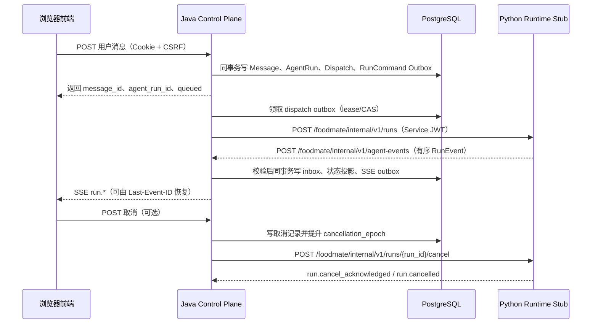

# M1-3 AgentRun 与真实 SSE 最小闭环实施方案

> 模板提示：后续 AI 阅读本文档时，必须按功能点拆分为独立小节，不能把多个功能写成一大段；不得把 M1-4 及以后真实模型、RAG、工具调用或业务写入提前标记为 M1-3 已完成。

> 后续演进说明（2026-07-26）：本文的 HTTP dispatch/event/cancel 是 M1-3 已验证历史实现，不是最终传输架构。M1-4 目标正式主通道已改为 RocketMQ；当前决策见[ADR-0005](../决策/ADR-0005-RocketMQ异步主通道.md)，不得据本文继续扩展 HTTP 为正式异步主链路。

## 1. 文档信息

| 项目 | 内容 |
|---|---|
| 功能编号/阶段 | M1-3 |
| 功能名称 | AgentRun、跨服务事件与真实 SSE 最小闭环 |
| 文档状态 | M1-3 最小真实闭环已完成，后续仅剩扩展能力和浏览器级补充验证 |
| 前置阶段 | M1-2 已完成真实认证、会话和用户消息持久化 |
| 方案日期 | 2026-07-25 |
| 关联权威文档 | `docxs/契约/双运行时内部契约V1.md`、`docxs/数据/V2双运行时迁移设计.md`、`docxs/实现/Java运行时客户端实现.md`、`docxs/实现/运行状态与事件接入.md` |

## 2. 目标与范围

### 2.1 本阶段目标

- 用户发送消息后，Java 在同一事务中保存用户消息、创建 `AgentRun`、创建 active dispatch 和 immutable RunCommand outbox。
- Java 在事务提交后将 RunCommand 发送给独立运行的 Python Runtime。
- Python Runtime 使用确定性 stub 产生固定顺序的运行事件和分段回复文本。
- Java 校验 Python 的服务身份、V1 契约、摘要、顺序和状态机；只接受合法事件。
- Java 将已接受事件、AgentRun 投影和前端 SSE outbox 同一事务持久化，再向浏览器推送 SSE。
- 前端展示运行中、分段回答、失败、取消与断线恢复后的最终状态。

### 2.2 本阶段不包含

- 不调用任何真实大模型供应商，不配置模型 API Key，不记录真实模型用量。
- 不实现 Router、Planner、RAG、Embedding、重排序、ToolProposal、SqlProposal 或业务写入。
- 不实现附件上传、知识库检索、工具执行确认或饮食日志写入。
- 不让浏览器直接访问 Python Runtime；浏览器只访问 Java API 与 Java SSE。
- 不把确定性 stub 的固定文本伪装成真实 AI 结论。

### 2.3 后续可替换点

- M1-3 的 Python Runtime 只在 `StubExecutionEngine` 内生成固定事件和文本。
- 后续接入真实模型时，只替换 Runtime 内部的执行器为 `ModelService`、Router、Planner 等模块。
- Java 的 AgentRun、dispatch outbox、事件入口、状态机、取消、SSE outbox 与前端消费协议保持不变。

## 3. 当前事实与改造原则

### 3.1 当前可复用事实

- M1-2 已有 Cookie 会话认证、CSRF 校验、会话归属校验、用户消息持久化和 `agent_runs` 基础表。
- `agent-runtime/` 已有 Python 标准库 HTTP stub、Ed25519 Service JWT 基础代码及单元测试。
- Java 已有旧 `RuntimeGatewayService`、`ChatController`、`RunStreamController` 和 Runtime Gateway Controller 占位实现。

### 3.2 当前实现不能作为 M1-3 主链路

- 旧 Java Runtime 代码使用 `runtime_runs`、`runtime_dispatches` 等旧表与进程内 listener，不满足 V2 的 active dispatch、fencing、事务 outbox 和 rejection audit 要求。
- 旧 Python stub 使用旧 `/internal/runtime/*` 路由和 `state` 字段，不符合 V1 `RunCommand`、`RunEvent` 的完整 envelope、`request_hash`、`attempt` 和 `event_type` 约束。
- 旧 SSE 用内存订阅和自增事件序号，进程重启或提交后发送失败时无法可靠恢复。
- M1-3 必须以 V1 契约和 V2 迁移设计为准重建主链路；旧接口只能在迁移期明确下线或改为兼容适配，不能继续扩展。

## 4. 目标执行链路

## 5. 功能点与执行方案

### 5.1 用户消息创建 AgentRun

- 改造 `POST /api/sessions/{session_id}/messages`：只接受 `role=user`，响应增加字符串 `agent_run_id` 和初始 `run_status=queued`。
- Controller 从 Cookie 会话获得用户 ID，验证会话归属、CSRF 和消息内容；不接受客户端提交 run ID、状态、dispatch ID 或权限上下文。
- Application Service 锁定会话并在一个数据库事务内依次写入用户消息、`agent_runs`、`agent_run_dispatches` 和 `runtime_dispatch_outbox`。
- RunCommand 在事务内一次性生成并固化：`run_id`、`dispatch_id`、`attempt=1`、绝对 `deadline_at`、消息快照、授权上下文、runtime options 和 JCS SHA-256 `request_hash`。
- 任一写入失败必须整体回滚；事务提交后才允许网络调用 Python。
- 代码职责：新增 `AgentRunCommandService`；收敛旧 `ChatController.createRun` 的重复创建逻辑；`SessionController` 只负责 HTTP 输入输出。

### 5.2 AgentRun 查询

- 新增 `GET /api/agent-runs/{agent_run_id}`，普通用户只能查询自己会话下的 run。
- 返回 `intent`、`status`、`plan_json`、已持久化的分段/最终回答、`error_code`、`trace_id`、创建和结束时间；所有 ID 以字符串返回。
- 查询只能读 Java 投影和 SSE/inbox 持久化数据，不能向 Python 实时反查状态。
- 终态为 `completed`、`failed` 或 `cancelled`；第一个通过状态机校验并提交的终态为权威结果。
- 工具调用、检索引用和模型用量在本阶段返回空集合或不返回，不伪造 placeholder 成已执行数据。

### 5.3 Java 到 Python 的可靠派发

- 新增 Runtime Client，目标端点固定为 `POST /foodmate/internal/v1/runs`。
- Client 只发送 outbox 中不可变的完整 RunCommand，禁止在发送时从最新会话、消息或配置重新拼装 payload。
- Worker 使用 `owner_token`、`lease_until` 和 CAS 领取 `pending` 或过期 lease 的 outbox；多实例同一时刻只有一个 owner。
- 发送前再次检查 deadline、active dispatch、admission epoch 和 fencing token；失效任务标记 `expired`，不调用 Python。
- 仅在身份、版本和 HTTP 语义均正确的 2xx 后把 outbox 标记为 `delivered`；发送后 ACK 丢失继续重发相同 payload。
- Runtime 不可用、连接超时或 5xx 不把 AgentRun 伪装成 Python 已失败；在 deadline 前按退避重试，deadline 后由 Java 以明确错误码收敛。

### 5.4 Python Runtime 确定性 stub

- 保留独立的 `agent-runtime/` 工程，但将现有 `runtime_server.py` 拆分为 HTTP 层、V1 schema/digest 校验、Service JWT、dispatch store、取消控制和 `StubExecutionEngine`。
- Runtime 接收 `POST /foodmate/internal/v1/runs`，验证 Java Service JWT、`X-Contract-Version: v1`、`X-Request-Id`、`traceparent`、RunCommand 结构和 `request_hash`。
- Runtime 以 `dispatch_id + request_hash` 持久化或可恢复地记录接受结果；同键同摘要返回原接受结果，不启动第二次执行；同键不同摘要返回 `RUNTIME_DISPATCH_IDEMPOTENCY_CONFLICT`。
- Stub 固定依次发出 `run.accepted`、`run.routed`、两个 `run.answer_stream` 和 `run.completed`；每个事件带递增 `event_seq`、稳定 `event_id`、UTC `occurred_at` 和重新计算的 `request_hash`。
- 生成文本必须明确为开发 stub，例如“运行链路已验证：已收到你的消息……”，不能输出营养建议、事实性结论或工具执行结果。
- Runtime 使用 `POST /foodmate/internal/v1/agent-events` 将 RunEvent 回传 Java；收到不可恢复的状态冲突后停止该 dispatch 的后续事件。

### 5.5 Java 事件接收、验证和状态机

- 新增内部 Controller：`POST /foodmate/internal/v1/agent-events`；该端点不使用用户 Cookie，而是只接受 Python Service JWT。
- 在开启数据库事务前验证 Ed25519 JWT 的 `iss`、`aud`、`scope=agent:event`、`kid`、`jti`、有效期，校验必需 Header、V1 schema 与 RunEvent 摘要。
- 没有可信 `run_id` 前的认证、版本或 JSON 错误写入 `protocol_error_audits`；不得创建或修改 AgentRun。
- 已有可信 `run_id` 后，事务内依次执行：按 `(agent_run_id,event_id)` 去重、锁定 AgentRun 与 dispatch、验证 active dispatch/attempt/fence、验证严格连续 `event_seq`、验证状态迁移。
- 仅合法连续事件写入 `runtime_event_inbox`，更新 `agent_runs`、dispatch 游标和必要审计；重复事件不得重复状态投影或 SSE。
- hash 冲突、旧 dispatch、旧序号、缺口、同序号不同事件、非法状态和终态后事件只写 `runtime_event_rejections`，返回稳定 RuntimeError，不能污染 canonical inbox。
- 状态机只使用 `queued/routed/waiting_user/planning/retrieving/executing/validating/completed/failed/cancelled`；禁止新增 `cancelling` 或任意回退状态。

### 5.6 取消与超时

- 新增 `POST /api/agent-runs/{agent_run_id}/cancel`，采用 Cookie、CSRF、run 归属校验；用户只能取消自己的非终态 run。
- Java 在锁定 AgentRun 的事务内按稳定 `cancel_id` 创建 `agent_run_cancellations`，首次取消才递增 `cancellation_epoch`，并关闭后续新 invocation admission。
- 事务提交后由 cancel outbox/worker 调用 `POST /foodmate/internal/v1/runs/{run_id}/cancel`；同一取消重试保持相同 `cancel_id` 与摘要。
- Runtime 接受取消后停止后续 stub 事件，并回传 `run.cancel_acknowledged` 与 `run.cancelled`。
- HTTP 接受取消不等于已经取消：若 `completed` 或 `failed` 先合法提交，Java 保留该终态，只把取消记录标为已处理。
- Java 到达 run deadline 时复用相同流程发送 `reason=deadline_exceeded` 的 CancelCommand，不能直接把 run 改成 completed。

### 5.7 可靠 SSE 与断线恢复

- 每个新接受且前端可见的 RunEvent，必须和 inbox、AgentRun 投影在同一个事务内写入一条 `agent_run_sse_outbox`。
- 为事件分配稳定 `sse_event_id` 与 run 内递增 `stream_seq`；以 `source_event_key` 防止同一 canonical event 重放生成第二条 SSE。
- SSE Publisher 在事务外以 lease/CAS 领取 outbox，成功后标记 sent；发送失败只重试投递，不回滚业务投影，也不重新应用事件。
- SSE 端点使用 `GET /api/agent-runs/{agent_run_id}/stream`，验证 run 归属，接受 `Last-Event-ID`，按持久化 cursor 补发同一 run 的后续事件。
- 事件名称沿用 `run.created`、`run.routed`、`run.answer_stream`、`run.completed`、`run.failed`、`run.cancelled`；SSE data 只包含脱敏后的产品事件。
- 前端按 `sse_event_id` 去重，持久化最新 cursor；网络重连时带上 Last-Event-ID，不依赖内存中的旧事件。

### 5.8 前端真实运行态接入

- 改造 `ChatPage` real 模式：发送消息后读取返回的 `agent_run_id`，立即显示 queued/running 状态，而非继续显示“本阶段不生成 AI 回复”。
- 新增 `agentRunService.ts`：查询 run、取消 run、建立 SSE、断线重连、事件去重与错误映射。
- 收到 `run.answer_stream` 时按事件顺序追加 assistant 临时文本；收到 `run.completed` 后用服务端最终结果固定展示。
- 收到 `run.failed` 显示用户可理解的失败消息和重试入口；收到 `run.cancelled` 结束 loading 并保留已接收文本。
- 用户切换会话或组件卸载时关闭 EventSource/请求；同一 run 重连不重复追加文本。
- stub 阶段 UI 必须显示“开发运行验证”标识，避免用户误以为得到真实 AI 服务。

### 5.9 服务认证、配置与健康检查

- Java 和 Python 分别持有自己的 Ed25519 私钥；双方只配置对方 X.509 公钥，绝不使用共享 Runtime Token。
- Service JWT 的 TTL 固定 60 秒，必须校验 `iss`、`aud`、`scope`、`exp`、`jti`、`kid` 与允许算法；密钥只来自环境变量或 Secret 引用，日志不得打印私钥、JWT 或完整授权 Header。
- Java Runtime Client 配置包含 base URL、契约版本、connect/read/run timeout、重试上限、退避和 feature flag。
- Python 只提供 `/foodmate/internal/health/live` 与 `/foodmate/internal/health/ready`；ready 表示能认证、接收和持久化 dispatch，不以单个 run 状态判断。
- Python Runtime 不配置 PostgreSQL 业务库写凭据，也不拥有用户、会话、AgentRun 或审计数据。

### 5.10 数据库迁移与发布顺序

- 先执行 V2 阶段 0：冻结 V1 checksum，建立空库和含代表数据的 PostgreSQL Testcontainers fixture。
- V2 阶段 1 只做前向追加：`agent_run_dispatches`、`runtime_dispatch_outbox`、`runtime_event_inbox`、`runtime_event_rejections`、`runtime_error_inbox`、`protocol_error_audits`、`agent_run_cancellations`、`agent_run_sse_outbox` 及 `agent_runs` 的 dispatch/epoch/SSE cursor 字段。
- 同一阶段还必须落地 V2 设计规定的 Tool/SQL invocation fence、lease 与 model attempt 兼容结构；即使 M1-3 stub 不调用它们，也不能绕开阶段 4 的硬门禁。
- V2 阶段 2 部署兼容 Java，并以 feature flag 关闭主链路；阶段 3 回填、对账、兼容 smoke test 通过后，才允许启用 M1-3 主链路。
- 发布顺序固定为：迁移 -> 兼容 Java -> Python Runtime -> 开启 dispatch/event/SSE feature flag -> 观察 -> 前端 real 模式。
- 回滚优先关闭 admission 和 feature flag，drain 或明确结束 outbox；V2 审计与 outbox 数据前向保留，不提供破坏性 down SQL。

## 6. 接口清单

| 接口 | 方法 | 调用方 | 认证 | 说明 |
|---|---|---|---|---|
| `/api/sessions/{session_id}/messages` | POST | 浏览器 | Cookie + CSRF | 保存用户消息并创建 AgentRun |
| `/api/agent-runs/{agent_run_id}` | GET | 浏览器 | Cookie | 查询当前用户的运行投影 |
| `/api/agent-runs/{agent_run_id}/cancel` | POST | 浏览器 | Cookie + CSRF | 请求取消非终态运行 |
| `/api/agent-runs/{agent_run_id}/stream` | GET | 浏览器 | Cookie | 订阅/恢复 SSE |
| `/foodmate/internal/v1/runs` | POST | Java -> Python | Java Service JWT | RunCommand 幂等接受 |
| `/foodmate/internal/v1/runs/{run_id}/cancel` | POST | Java -> Python | Java Service JWT | CancelCommand 幂等接受 |
| `/foodmate/internal/v1/agent-events` | POST | Python -> Java | Python Service JWT | RunEvent 校验、落库和投影 |

## 7. 验收分层

### 7.1 Python Runtime 单元测试

- V1 RunCommand/CancelCommand 结构、JCS digest、重复 dispatch、摘要冲突、取消、严格事件序列和 Service JWT 验证。
- stub 的同一输入必须产生相同类型、顺序和结构的事件；时间、request ID 等传输字段可以变化，但业务幂等字段不得变化。

### 7.2 Java 单元与 HTTP 测试

- 用户消息、AgentRun、dispatch outbox 在一个事务内提交或一起回滚。
- Runtime Client 只发送持久化 payload；2xx、超时、503、连接重置、409、426 与 deadline 的重试/收敛行为正确。
- JWT、版本、schema 和摘要失败正确分流为 PreRunProtocolError 或 RuntimeError。
- 重复、hash 冲突、乱序、gap、旧 dispatch、终态竞争和取消竞争不重复更新状态或发送 SSE。

### 7.3 PostgreSQL Testcontainers 测试

- Flyway V1 -> V2 迁移、旧 Java 兼容 smoke test、V2 约束和历史数据对账。
- dispatch/SSE outbox 的 lease 接管、发送后 ACK 丢失重放、多实例单领取、崩溃恢复。
- `Last-Event-ID` 恢复、稳定 SSE ID、至少一次投递和客户端去重。
- 真实数据库事务断言：inbox、AgentRun、dispatch cursor、取消记录和 SSE outbox 要么共同提交，要么共同回滚。

### 7.4 浏览器 E2E

- 登录后在真实会话发送消息，页面得到 `agent_run_id` 并看到 queued -> routed -> validating -> completed。
- 分段 stub 文本在 SSE 中逐步显示，刷新或断网重连后不重复、不丢失已持久化事件。
- 取消运行后不再追加后续文本；失败和 Runtime 不可用显示明确错误，不显示假成功。
- 用户 A 无法查询、取消或订阅用户 B 的 run。

## 8. 完成标准

- Java、Python、PostgreSQL 三者实际启动，不使用前端 mock 或 Java 本地假事件替代跨服务链路。
- Python stub 已按 V1 完整 envelope 回传事件，Java 已独立验证身份、摘要、顺序和状态。
- RunCommand 和 SSE 均使用持久化 outbox；进程重启、重复投递、ACK 丢失和断线恢复经过自动化验证。
- 前端 real 模式能实际显示运行、分段文本、完成、失败和取消。
- 所有未实施的模型、RAG、工具和业务写入能力仍在 UI 与文档中明确标注为后续工作。

## 9. 实施顺序

1. 冻结 V1/V2 契约基线，删除或隔离旧 Runtime 主链路入口，补充迁移前 fixture。
2. 完成 V2 阶段 1 数据迁移、约束、索引和 Testcontainers 基线。
3. 实现 Java AgentRun 创建、dispatch outbox、Runtime Client 与 publisher。
4. 按 V1 重构 Python Runtime 的认证、幂等接受、取消和确定性事件生成。
5. 实现 Java event inbox、rejection audit、状态机、取消与 deadline 收敛。
6. 实现 SSE transactional outbox、Publisher、Last-Event-ID 恢复与外部 run 查询接口。
7. 改造前端 ChatPage 与 agentRunService，接入真实 SSE 和运行状态。
8. 依次执行 Python、Java、PostgreSQL/Testcontainers、浏览器 E2E；全部通过后才打开 M1-3 feature flag。

## 10. 已知限制与后续工作

- M1-3 的确定性 stub 只验证系统链路，不能验证模型质量、提示词、成本、知识召回或工具执行。
- 真实大模型接入应在后续阶段新增 Python `ModelService` 适配器和 `run.model_usage` 生产，不替换 M1-3 的控制面链路。
- ToolProposal、SqlProposal、确认交互与业务副作用需要在后续阶段以 V1/V2 fence、lease 和审计能力为前提单独启用。

## 11. 本轮实现记录

### 11.1 已实现的小点

- Java 在保存用户消息的事务内创建 `AgentRun`、active dispatch 和 immutable `RunCommand` outbox。
- Java Runtime Client 使用 service JWT 调用 Python V1 dispatch 与 cancel 接口，并由定时 publisher 负责租约、重试和 deadline 收敛。
- Python Runtime 已切换到 V1 路由，确定性 stub 按固定顺序发送 `run.accepted`、`run.routed`、两段 `run.answer_stream` 和 `run.completed`。
- Java 已接入 V1 event inbox，校验 event id 幂等、event_seq 连续性、active dispatch 和 attempt，再投影 AgentRun 与 SSE outbox。
- Java 已提供 AgentRun 查询、取消和可使用 `Last-Event-ID` 恢复的 SSE 接口；SSE 使用稳定的 `sse_event_id`。
- 前端 ChatPage 已根据 `agent_run_id` 建立 EventSource，展示分段回复、完成、失败和取消状态。
- 已执行 `V4__m1_3_runtime_v2.sql`，数据库中已确认新增 dispatch、runtime outbox、event inbox v2、cancellation 和 SSE outbox 表及关键约束。

### 11.2 已验证的小点

- Java Shared、Application、API 和 Gateway 测试通过；本轮 API 27 个测试通过，Application 5 个测试通过。
- 前端 `npm run typecheck` 和 `npm run build` 通过。
- Python 临时虚拟环境中运行 `pytest agent-runtime/tests -q`，3 个测试通过。
- Python Runtime 在临时 9100 端口健康检查通过，取消路由 smoke test 返回 HTTP 202。

### 11.3 M1-3 最小闭环验证结果

- 主链路已真实验证：用户注册、创建会话、发送消息、创建 AgentRun、Java -> Python -> Java 回调和 SSE 返回均成功。
- 确定性 stub 已返回 5 个有序事件：`run.accepted`、`run.routed`、两段 `run.answer_stream` 和 `run.completed`。
- PostgreSQL 已确认成功 run 为 `completed`，对应 `runtime_event_inbox_v2` 有 5 条事件，`agent_run_sse_outbox` 有 5 条事件。
- 取消链路已真实验证：事件顺序为 `run.accepted`、`run.cancel_acknowledged`、`run.cancelled`，AgentRun 为 `cancelled`，取消记录为 `resolved`。
- SSE `Last-Event-ID` 断点恢复已验证：按持久化 `stream_seq` 继续发送，不重复发送已消费事件。
- 跨用户越权已验证：用户 B 查询、订阅和取消用户 A 的 run 均返回 HTTP 403。

### 11.4 后续工作（不阻塞 M1-3 完成）

- `runtime_event_inbox_v2` 与旧版 `runtime_event_inbox` 的统一迁移、历史数据对账和旧表清理，属于后续兼容收尾。
- 当前已完成 HTTP 等价联调；真正浏览器 Playwright E2E 仍可作为补充验收，不影响本阶段服务闭环结论。
- 真实大模型、RAG、工具调用、饮食业务写入和附件能力不属于 M1-3，后续替换确定性 stub 时再实现。
