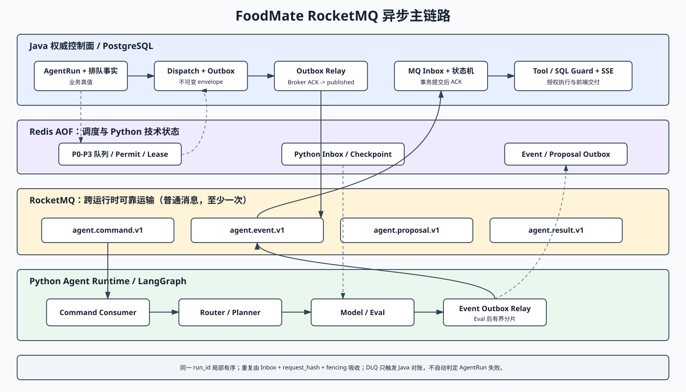

# M1-4 Python Agent Runtime 最小真实闭环实施方案

> 模板提示：后续 AI 阅读本文档时，必须按功能点拆分为独立小节，不能把多个功能写成一大段；必须区分“目标设计、正在实现、已验证”，不得把本文方案或一次模型调用伪装成 M1-4 已完成。

## 1. 文档信息

| 项目 | 内容 |
|---|---|
| 功能编号/阶段 | M1-4 |
| 功能名称 | Python Agent Runtime 最小真实模型闭环与生产治理基线 |
| 文档状态 | 架构决策已确认，待代码、迁移和验收 |
| 前置阶段 | M1-3 Java -> Python 确定性 stub -> Java -> SSE 已完成 |
| 方案日期 | 2026-07-26 |
| 架构依据 | `Agent运行架构.md`、`Python智能体运行时设计.md`、`ADR-0005-RocketMQ异步主通道.md`、`配置指南.md` |

## 2. 阶段目标

### 2.1 最小真实闭环

- 用受控模型调用替换确定性回答生成，但保留 M1-3 的 Java AgentRun、dispatch、事件与 SSE 权威链路。
- 使用 LangGraph 建立 Router、Planner、Execution、Validator、Composer、Final Eval 和终态裁决。
- 简单问答允许走短路径；复杂任务只能沿确定的图边执行，Agent 不得任意跳转。
- 候选答案通过 Final Eval 后才向前端发送正文。
- 使用 RocketMQ 作为 Java/Python 异步正式主通道；M1-3 HTTP 适配器只保留用于本地兼容切换、契约测试和诊断。

### 2.2 本阶段不包含

- 不实现完整 RAG 知识库、SQL Agent 或全部业务 Tool。
- 不建设账户余额、租户额度或供应商余额查询。
- 不建设人工审核工作台，也不新增 `waiting_review`。
- 不让 Python 直接访问 FoodMate PostgreSQL 业务库。
- 不把完整 M2 治理后台纳入 M1-4 完成门槛。

## 3. 实施前契约门禁

### 3.1 当前 V1 可复用内容

- 复用 RunCommand、RunEvent、RuntimeError、Service JWT 和 canonical digest。
- 复用 Java dispatch outbox、事件 inbox、AgentRun 状态投影和 SSE outbox。
- 复用现有取消、幂等、乱序拒绝和终态竞争规则。
- 复用既有消息 envelope 与 canonical digest，不创建 MQ 专用 DTO。

### 3.2 必须升级后才能使用的内容

- `superseded` AgentRun 终态。
- `parent_run_id`、`continuation_reason`。
- `RunBudgetSnapshot`、`TimeoutSnapshot` 和预算 revision。
- `result_type=safety_degraded` 的外部响应位置。
- 预算确认请求、确认摘要和追加结果契约。

上述能力必须先修改契约、Flyway、Java 状态机和前端映射，再进入代码主链路；V1 不得提前发送未知字段或状态。

## 4. 目标消息链路

```text
用户请求
  -> Java PostgreSQL：AgentRun + 排队事实
  -> Redis：P0-P3 调度 + 用户/全局 permit
  -> Java PostgreSQL：Dispatch + RunCommand Outbox
  -> Outbox Relay -> RocketMQ command topic
  -> Python Redis Inbox -> LangGraph
  -> Python Redis：checkpoint + Event/Proposal Outbox
  -> Event Relay -> RocketMQ event/proposal topic
  -> Java PostgreSQL Inbox + AgentRun 投影 + SSE Outbox
  -> SSE -> foodmate-ui
```

RocketMQ 只负责跨服务可靠运输；Redis 负责准入、优先级、lease 和 Python 技术状态；PostgreSQL 保存 Java 业务真值。任何组件不可用时不得自动切换为另一条业务派发通道。



## 5. 功能点实施方案

### 5.1 RocketMQ Topic 与普通消息

- 本地 Compose 增加单 NameServer + 单 Broker，不设计本阶段生产集群、TLS 或 ACL。
- Agent Topic 固定为 `foodmate-agent-command-v1`、`foodmate-agent-event-v1`、`foodmate-agent-proposal-v1` 和 `foodmate-agent-result-v1`。
- 后台域预留 knowledge、audit 和 notification Topic，但 M1-4 只实现所需 Agent Topic。
- 不使用 RocketMQ 事务消息；Java 使用 PostgreSQL Outbox/Inbox，Python 使用 Redis AOF Outbox/Inbox。
- 所有 Agent 消息使用 `run_id` 作为局部顺序键，不要求 Topic 全局有序。

### 5.2 Java Outbox Relay 与消费事务

- Java 获得 Redis permit 后，在 PostgreSQL 事务中创建 Dispatch 和不可变 RunCommand Outbox。
- Relay 使用 lease/CAS 领取 `pending` 消息，Broker 持久化确认后才标记 `published`。
- 重试保持原 `message_id/dispatch_id/attempt/request_hash/payload`；不得重新组装消息。
- Java 消费 RunEvent/Proposal 时，在 PostgreSQL 事务中完成 Inbox、状态机、审计和 SSE Outbox，提交后才 ACK。
- 数据库提交后、ACK 前崩溃由 MQ 重投，PostgreSQL Inbox 吸收重复。

### 5.3 Python Redis Inbox、Outbox 与 Relay

- Redis namespace 分离为 `foodmate:agent:mq:inbox:*`、`foodmate:agent:mq:outbox:*` 和 `foodmate:agent:checkpoint:*`。
- Python 消费 RunCommand 后先登记 `dispatch_id + request_hash`；同 ID 同 hash 为重投，不启动第二次执行。
- checkpoint 与 Event/Proposal Outbox 使用 Lua/Transaction/CAS 原子写入。
- Event Relay 收到 Broker 确认后将 Outbox 标为 `published`；Inbox 和已发布 Outbox 默认保留 7 天。
- Redis 不可用时 readiness 失败并停止消费，不在进程内降级保存。

### 5.4 LangGraph 图装配

- 在 `agent-runtime` 内建立 `graph`、`nodes`、`policies` 和 `context` 四类职责目录，不拆分新微服务。
- `builder` 只注册白名单节点和条件边；图状态只保存技术执行信息，不替代 Java AgentRun。
- 每次节点进入增加总步骤计数；重试、重规划和重写分别使用独立计数器。
- 超出任一循环预算后进入 Terminal Arbiter，不允许模型自行决定继续。

### 5.5 Router 与 Planner

- Router 输出结构化 intent、复杂度、风险级别、所需能力和缺失参数。
- 简单任务直接进入 Composer；复杂任务进入 Planner。
- Planner 生成有界步骤列表、每步输入输出、依赖、失败动作和预计预算。
- 缺少用户专属参数时进入 Clarification，不允许猜测过敏、疾病、预算等关键事实。

### 5.6 Execution 与 Step Validator

- Execution 首期只支持模型调用和明确允许的无副作用能力；Tool/SQL 仅生成 proposal。
- 每一步执行后由确定性 Step Validator 检查 schema、事实来源、完成状态和权限边界。
- 失败只能选择固定的 retry、replan、degrade 或 terminate 动作。
- Reflection 默认可执行一次，但达到预算阈值后优先关闭。

### 5.7 Composer、Final Eval 与回答分片

- Composer 只使用已验证事实、工具结果摘要和明确失败信息生成候选答案。
- 确定性硬规则对所有任务执行，不能被 LLM Judge 覆盖。
- 复杂、RAG 和高风险任务强制 LLM Judge；低风险任务默认 20% 抽样。
- Eval 通过前候选正文只存受限服务端缓冲，不产生 `run.answer_stream`。
- `request_review` 在无人审核条件下转安全降级，不交付被拦截候选答案。
- Eval 通过后按时间或大小切分 `run.answer_stream`，默认 150ms 或 2048 字节满足其一即生成事件；不得逐 Token 发布 MQ 消息。

### 5.8 模型适配与路由

- 定义 high、standard、economy、eval 四个逻辑模型别名，部署环境映射真实供应商模型。
- 模型选择由确定性 Model Routing Policy 完成，Agent 不能自选供应商。
- 记录逻辑调用、供应商 attempt、Token、估算成本、延迟和错误分类。
- timeout、rate limit 或供应商故障只能按配置走兼容 fallback；安全拒绝不得换模型绕过。

### 5.9 Token 与成本预算

- 新 Run 默认最多 30000 Token、估算成本 ¥0.50，实际值全部由环境变量配置。
- 70% 停止非必要 Reflection 并减少可选检索；85% 禁止重规划/重写并允许经济模型；100% 停止新调用。
- 100% 时返回可信部分结果或进入预算确认，前端必须显示追加 Token 和成本。
- 用户每次确认默认最多追加 30000 Token、¥1.00；每次追加生成新 BudgetSnapshot revision 和 dispatch attempt。

### 5.10 Redis 并发与队列

- PostgreSQL 保证同 Session 最多一个 active Run。
- Redis 保证同一用户默认最多 2 个活跃 Session、Runtime 全局默认最多 20 个 active Run。
- 全局队列默认最多 100，采用 P0 审批/预算恢复、P1 continuation、P2 普通请求、P3 后台任务。
- priority burst 和 aging 防止普通请求长期饥饿。
- Redis 不可用时新 Agent 请求 fail closed，返回 503 `RUNTIME_COORDINATION_UNAVAILABLE`，不退回进程内业务计数。
- 只有取得 permit 后才发布 RunCommand；不能让 Python 消费 MQ 后再反复抢 permit。

### 5.11 超时与 permit 释放

- queue timeout 默认 30 秒，execution timeout 120 秒，node timeout 30 秒。
- waiting_user timeout 默认 86400 秒，cancel drain timeout 10 秒。
- 排队时间不消耗 execution timeout，但必须服从请求级绝对 deadline。
- 完成、失败、取消、超时和进程异常后均需通过 owner token/CAS 可靠释放 permit。

### 5.12 Context Builder 与摘要

- 始终保留最近 8 条有效原始消息。
- 第 9 条有效消息写入后增量更新会话摘要，再继续保留最近 8 条。
- 上下文按系统安全指令、当前用户输入、近期消息、摘要和检索结果分配 Token。
- 摘要失败时保留近期消息并明确降级，不能使用不完整摘要伪造用户偏好。

### 5.13 Redis checkpoint

- 使用独立 namespace、AOF、CAS、TTL、大小限制和应用层加密。
- 简单直接问答不强制 checkpoint。
- 规划完成、工具结果确认、进入等待、预算确认和 Eval 前后保存安全恢复点。
- 恢复前必须与 Java 对账终态、取消、active dispatch 和已完成 Tool/SQL，禁止重复副作用。

### 5.14 continuation、取消与恢复

- 普通缺参补充创建新 AgentRun，并关联 `parent_run_id + continuation_reason`。
- 旧 Run 目标终态为 `superseded`，不再占用 Session active 位或 Redis permit。
- 工具审批和预算追加恢复原 Run，但创建新的 `dispatch_id + attempt`。
- 用户明显改变任务目标时创建普通新 Run，不恢复旧 checkpoint。
- 浏览器取消仍调用 Java HTTP；Java 落库后通过 command Topic 可靠发布 CancelCommand。
- Tool/SQL 审批和预算追加由 Java HTTP 接受并校验，再创建新 dispatch attempt 通过 MQ 发送。

### 5.15 Tool/SQL Proposal 与 Result

- Python 根据版本化 Schema Catalog 生成 ToolProposal 或 SqlProposal，通过 proposal Topic 发送。
- Java执行权限、确认、SQL AST、只读、白名单、用户过滤、限行、超时、脱敏和审计。
- Java 在业务事务中写 Tool/SQL Result Outbox，通过 result Topic 返回 Python。
- Python 不持有 FoodMate PostgreSQL 凭据，也不直接执行 SQL 或业务工具。

### 5.16 DLQ 与对账

- 可重试异常走 RocketMQ retry；schema、digest、权限和 fencing 错误直接 rejection，不无意义重试。
- 重试耗尽进入所属 consumer group 的 DLQ，不建立万能共享 DLQ。
- DLQ 不自动把 AgentRun 标记失败；Java Reconciler 对账 Run、dispatch、checkpoint 和事件后裁决。
- 重放必须保持原消息身份和摘要，不能借 DLQ 重放创建新业务操作。

### 5.17 Trace、反馈与隐私

- Trace 保存节点、模型、Token、成本、预算 revision、超时、Eval、错误和脱敏摘要。
- 默认不保存完整 Prompt、原始模型响应或 Chain-of-Thought。
- 用户反馈只进入待审核离线 Eval 数据，不直接修改 Prompt、记忆或模型路由。
- checkpoint、日志和错误响应不得包含 Secret、业务数据库凭据或未脱敏工具结果。

### 5.18 前端治理交互

- 503 协调故障显示友好的“系统暂时异常”，不暴露 Redis 细节。
- 70%/85% 显示预算状态，100% 展示预算追加确认卡。
- continuation 在 UI 中关联父任务；`superseded` 显示“已由后续任务接续”。
- 安全降级结果建议用户咨询医生或注册营养师，不显示虚假人工审核等待。

## 6. 实施顺序

1. 固化 ADR-0005、Topic、consumer group、消息 header 和传输无关 envelope。
2. 升级目标契约和 Flyway，补齐 MQ message/outbox 状态、`superseded`、父子 Run、快照和预算确认数据模型。
3. 在现有 Compose 增加本地单节点 RocketMQ和 Topic 初始化，验证 Broker 重启后消息保留。
4. Java 实现 admission、Redis 调度、PostgreSQL Outbox Relay、MQ consumer/Inbox 和 DLQ Reconciler。
5. Python 实现 Redis Inbox/Outbox Repository、MQ consumer/producer 和 checkpoint 原子写入。
6. Python 建立 LangGraph、模型适配、预算、Context Builder、Validator、Composer、Final Eval 和 Eval 前缓冲。
7. 接入 Proposal/Result Topic 与 Java Tool/SQL 控制面；M1-4 可只验证受控最小 proposal，不提前完成 M2 SQL Agent。
8. 前端接入 503、预算确认、continuation、`superseded` 和安全降级展示。
9. 完成单元、契约、PostgreSQL/Redis/RocketMQ 故障注入和浏览器 E2E。

## 7. 验收门槛

### 7.1 Python

- 项目 `.venv` 中 pytest 全部通过。
- LangGraph 所有边、循环预算、超时、取消、checkpoint 恢复和 Eval 退回均有测试。
- 真实模型调用产生可核对的 Token、成本和路由记录。
- Redis Inbox/Outbox、重复消费、Broker ACK 丢失和进程重启测试通过。

### 7.2 Java 与数据库

- PostgreSQL Testcontainers 证明 Session 单 active、continuation 事务、状态约束和预算 revision。
- Redis 故障、permit 过期接管、队列满、排队超时和取消释放均有自动化断言。
- V1 兼容与新契约双端 fixture、canonical digest 测试通过。
- Outbox 提交后崩溃、Broker 发布重试、消费提交后 ACK 前崩溃、局部顺序、DLQ 对账均有断言。

### 7.3 前端

- 浏览器实际验证真实模型回答只在 Eval 后出现。
- 503、预算 70%/85%/100%、追加确认、continuation、安全降级和取消摘要均有 E2E。
- 已有 `run_id` 的失败不会自动创建重复 Run。

### 7.4 完成判定

- “模型能返回文本”不等于 M1-4 完成。
- 代码、迁移、配置、自动化测试和浏览器验证全部具备证据后，才创建 `功能实现说明/M1-4-...实现逻辑.md`。
- 未实现的 RAG、Tool/SQL 和业务写入继续留在 M1-5/M2，不得包装为本阶段完成。
